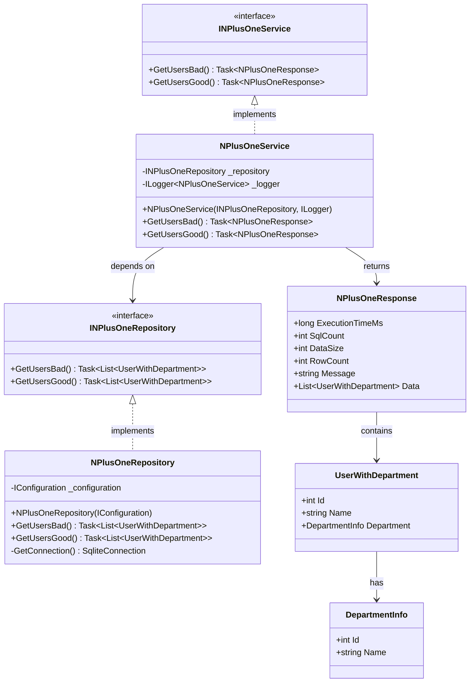
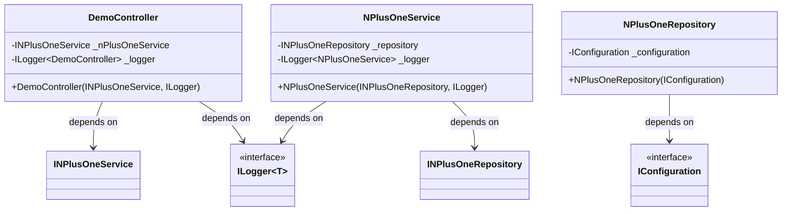
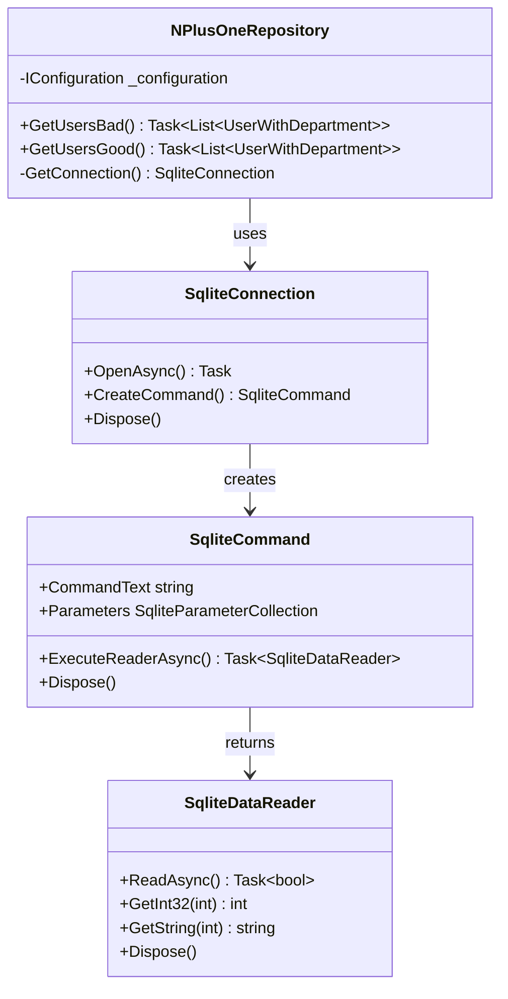

# クラス図

## 文書情報
- **作成日**: 2025-12-12
- **最終更新**: 2025-12-12
- **バージョン**: 1.0
- **ステータス**: 実装済み

---

## 1. システム全体のクラス構成

### 1.1 全体像

```mermaid
classDiagram
    namespace プレゼンテーション層 {
        class BaseController {
            <<abstract>>
            #ILogger _logger
            #HandleError(Exception) IActionResult
        }

        class DemoController {
            -INPlusOneService _nPlusOneService
            -ISelectStarService _selectStarService
            -ILikeSearchService _likeSearchService
            -IFullTableScanService _fullTableScanService
            +Performance() IActionResult
            +NPlusOneBad() Task~IActionResult~
            +NPlusOneGood() Task~IActionResult~
            +SelectStarBad() Task~IActionResult~
            +SelectStarGood() Task~IActionResult~
        }

        class HomeController {
            -ILogger _logger
            +Index() IActionResult
            +Privacy() IActionResult
        }

        class ExceptionHandlingMiddleware {
            -ILogger _logger
            +InvokeAsync(HttpContext, RequestDelegate) Task
        }
    }

    namespace ビジネスロジック層 {
        class INPlusOneService {
            <<interface>>
            +GetUsersBad() Task~NPlusOneResponse~
            +GetUsersGood() Task~NPlusOneResponse~
        }

        class NPlusOneService {
            -INPlusOneRepository _repository
            -ILogger _logger
            -int _sqlQueryCount
            +GetUsersBad() Task~NPlusOneResponse~
            +GetUsersGood() Task~NPlusOneResponse~
        }

        class ISelectStarService {
            <<interface>>
            +GetDataBad() Task~SelectStarResponse~
            +GetDataGood() Task~SelectStarResponse~
        }

        class SelectStarService {
            -ISelectStarRepository _repository
            -ILogger _logger
            +GetDataBad() Task~SelectStarResponse~
            +GetDataGood() Task~SelectStarResponse~
        }

        class ILikeSearchService {
            <<interface>>
            +SearchBad(string) Task~LikeSearchResponse~
            +SearchGood(string) Task~LikeSearchResponse~
        }

        class LikeSearchService {
            -ILikeSearchRepository _repository
            -ILogger _logger
            +SearchBad(string) Task~LikeSearchResponse~
            +SearchGood(string) Task~LikeSearchResponse~
        }

        class IFullTableScanService {
            <<interface>>
            +GetDataBad() Task~FullTableScanResponse~
            +GetDataGood() Task~FullTableScanResponse~
        }

        class FullTableScanService {
            -IFullTableScanRepository _repository
            -ILogger _logger
            +GetDataBad() Task~FullTableScanResponse~
            +GetDataGood() Task~FullTableScanResponse~
        }
    }

    namespace データアクセス層 {
        class INPlusOneRepository {
            <<interface>>
            +GetUsersBad() Task~List~UserWithDepartment~~
            +GetUsersGood() Task~List~UserWithDepartment~~
        }

        class NPlusOneRepository {
            -IConfiguration _configuration
            +GetUsersBad() Task~List~UserWithDepartment~~
            +GetUsersGood() Task~List~UserWithDepartment~~
            -GetConnection() SqliteConnection
        }

        class ISelectStarRepository {
            <<interface>>
            +GetDataBad() Task~List~Dictionary~string,object~~~
            +GetDataGood() Task~List~Dictionary~string,object~~~
        }

        class SelectStarRepository {
            -IConfiguration _configuration
            +GetDataBad() Task~List~Dictionary~string,object~~~
            +GetDataGood() Task~List~Dictionary~string,object~~~
            -GetConnection() SqliteConnection
        }

        class ILikeSearchRepository {
            <<interface>>
            +SearchBad(string) Task~List~Dictionary~string,object~~~
            +SearchGood(string) Task~List~Dictionary~string,object~~~
        }

        class LikeSearchRepository {
            -IConfiguration _configuration
            +SearchBad(string) Task~List~Dictionary~string,object~~~
            +SearchGood(string) Task~List~Dictionary~string,object~~~
            -GetConnection() SqliteConnection
        }

        class IFullTableScanRepository {
            <<interface>>
            +GetDataBad() Task~List~Dictionary~string,object~~~
            +GetDataGood() Task~List~Dictionary~string,object~~~
        }

        class FullTableScanRepository {
            -IConfiguration _configuration
            +GetDataBad() Task~List~Dictionary~string,object~~~
            +GetDataGood() Task~List~Dictionary~string,object~~~
            -GetConnection() SqliteConnection
        }
    }

    namespace DTO層 {
        class NPlusOneResponse {
            +long ExecutionTimeMs
            +int SqlCount
            +int DataSize
            +int RowCount
            +string Message
            +List~UserWithDepartment~ Data
        }

        class UserWithDepartment {
            +int Id
            +string Name
            +DepartmentInfo Department
        }

        class DepartmentInfo {
            +int Id
            +string Name
        }

        class SelectStarResponse {
            +long ExecutionTimeMs
            +int DataSize
            +int RowCount
            +string Message
            +List~Dictionary~string,object~~ Data
        }

        class LikeSearchResponse {
            +long ExecutionTimeMs
            +int RowCount
            +string Message
            +List~Dictionary~string,object~~ Data
        }

        class FullTableScanResponse {
            +long ExecutionTimeMs
            +int RowCount
            +string Message
            +List~Dictionary~string,object~~ Data
        }

        class ErrorResponse {
            +string Type
            +List~ValidationError~ Errors
            +DateTime Timestamp
        }

        class ValidationError {
            +string Field
            +string Message
        }
    }

    namespace データモデル層 {
        class AppDbContext {
            +DbSet~User~ Users
            +DbSet~Department~ Departments
            +AppDbContext(DbContextOptions)
            #OnModelCreating(ModelBuilder) void
        }

        class User {
            +int Id
            +string Name
            +string Email
            +int DepartmentId
            +Department Department
        }

        class Department {
            +int Id
            +string Name
            +List~User~ Users
        }
    }

    namespace 共通基盤_データアクセス {
        class IConfiguration {
            <<interface>>
            +GetConnectionString(string) string
            +GetSection(string) IConfigurationSection
        }

        class ILogger~T~ {
            <<interface>>
            +LogInformation(string, params object[])
            +LogError(Exception, string, params object[])
        }

        class SqliteConnection {
            +OpenAsync() Task
            +CreateCommand() SqliteCommand
        }

        class SqliteCommand {
            +CommandText string
            +Parameters SqliteParameterCollection
            +ExecuteReaderAsync() Task~SqliteDataReader~
        }
    }

    namespace 共通基盤_例外 {
        class ApplicationException {
            <<abstract>>
            +string ErrorCode
            +int StatusCode
            +Dictionary~string,object~ Details
        }

        class NotFoundException {
            +string ResourceType
            +string ResourceId
        }

        class ValidationException {
            +List~ValidationError~ Errors
        }

        class BusinessRuleException {
            +string RuleName
        }

        class InfrastructureException {
            +string Service
        }
    }

    %% 関係性
    BaseController <|-- DemoController
    BaseController <|-- HomeController
    DemoController --> INPlusOneService
    DemoController --> ISelectStarService
    DemoController --> ILikeSearchService
    DemoController --> IFullTableScanService
    INPlusOneService <|.. NPlusOneService
    ISelectStarService <|.. SelectStarService
    ILikeSearchService <|.. LikeSearchService
    IFullTableScanService <|.. FullTableScanService
    NPlusOneService --> INPlusOneRepository
    SelectStarService --> ISelectStarRepository
    LikeSearchService --> ILikeSearchRepository
    FullTableScanService --> IFullTableScanRepository
    INPlusOneRepository <|.. NPlusOneRepository
    ISelectStarRepository <|.. SelectStarRepository
    ILikeSearchRepository <|.. LikeSearchRepository
    IFullTableScanRepository <|.. FullTableScanRepository
    NPlusOneRepository --> IConfiguration
    SelectStarRepository --> IConfiguration
    LikeSearchRepository --> IConfiguration
    FullTableScanRepository --> IConfiguration
    NPlusOneRepository --> SqliteConnection
    SqliteConnection --> SqliteCommand
    AppDbContext --> User
    AppDbContext --> Department
    User --> Department
    NPlusOneService --> NPlusOneResponse
    SelectStarService --> SelectStarResponse
    LikeSearchService --> LikeSearchResponse
    FullTableScanService --> FullTableScanResponse
    NPlusOneResponse --> UserWithDepartment
    UserWithDepartment --> DepartmentInfo
    NPlusOneService --> ILogger~T~
    ExceptionHandlingMiddleware --> ApplicationException
    ApplicationException <|-- NotFoundException
    ApplicationException <|-- ValidationException
    ApplicationException <|-- BusinessRuleException
    ApplicationException <|-- InfrastructureException
    ValidationException --> ValidationError
    ErrorResponse --> ValidationError
```



---

## 1.2 フォルダ配置

```
src/BlazorApp/
├── Features/
│   ├── Demo/
│   │   ├── DemoController.cs               ← プレゼンテーション層
│   │   ├── DTOs/
│   │   │   ├── NPlusOneResponse.cs         ← DTO層
│   │   │   ├── SelectStarResponse.cs       ← DTO層
│   │   │   ├── LikeSearchResponse.cs       ← DTO層
│   │   │   └── FullTableScanResponse.cs    ← DTO層
│   │   ├── Services/
│   │   │   ├── INPlusOneService.cs         ← ビジネスロジック層（インターフェース）
│   │   │   ├── NPlusOneService.cs          ← ビジネスロジック層（実装）
│   │   │   ├── ISelectStarService.cs       ← ビジネスロジック層（インターフェース）
│   │   │   ├── SelectStarService.cs        ← ビジネスロジック層（実装）
│   │   │   ├── ILikeSearchService.cs       ← ビジネスロジック層（インターフェース）
│   │   │   ├── LikeSearchService.cs        ← ビジネスロジック層（実装）
│   │   │   ├── IFullTableScanService.cs    ← ビジネスロジック層（インターフェース）
│   │   │   └── FullTableScanService.cs     ← ビジネスロジック層（実装）
│   │   └── Repositories/
│   │       ├── INPlusOneRepository.cs      ← データアクセス層（インターフェース）
│   │       ├── NPlusOneRepository.cs       ← データアクセス層（実装）
│   │       ├── ISelectStarRepository.cs    ← データアクセス層（インターフェース）
│   │       ├── SelectStarRepository.cs     ← データアクセス層（実装）
│   │       ├── ILikeSearchRepository.cs    ← データアクセス層（インターフェース）
│   │       ├── LikeSearchRepository.cs     ← データアクセス層（実装）
│   │       ├── IFullTableScanRepository.cs ← データアクセス層（インターフェース）
│   │       └── FullTableScanRepository.cs  ← データアクセス層（実装）
│   └── Home/
│       └── HomeController.cs              ← プレゼンテーション層
├── Middleware/
│   └── ExceptionHandlingMiddleware.cs     ← プレゼンテーション層（横断処理）
├── Shared/
│   ├── Data/
│   │   ├── AppDbContext.cs                ← データモデル層（EF Core DbContext）
│   │   └── Entities/
│   │       ├── User.cs                    ← データモデル層（テーブル定義）
│   │       └── Department.cs              ← データモデル層（テーブル定義）
│   ├── Exceptions/
│   │   ├── ApplicationException.cs        ← 共通基盤（カスタム例外基底）
│   │   ├── NotFoundException.cs           ← 共通基盤
│   │   ├── ValidationException.cs         ← 共通基盤
│   │   ├── BusinessRuleException.cs       ← 共通基盤
│   │   └── InfrastructureException.cs     ← 共通基盤
│   └── DTOs/
│       ├── ErrorResponse.cs               ← DTO層（共通エラーレスポンス）
│       └── ValidationError.cs             ← DTO層
└── Program.cs                             ← DI登録・アプリ起動
```

**配置規約**:
- 機能単位で `Features/[機能名]/` フォルダを作成する
- DTOは `Features/[機能名]/DTOs/` に配置する
- サービスは `Features/[機能名]/Services/` に配置する
- Controllerは `Features/[機能名]/` 直下に配置する

---

## 1.3 層の役割

| 層 | 役割 | 含むクラス |
|----|------|-----------|
| **プレゼンテーション層** | HTTPリクエストの受付・レスポンスの返却。ビジネスロジックは持たない。エラーハンドリングはこの層で行う | `BaseController`, `DemoController`, `HomeController`, `ExceptionHandlingMiddleware` |
| **ビジネスロジック層** | 業務処理・データの加工を担う。DB接続は持たない。インターフェースで抽象化しDIで差し替え可能にする | `INPlusOneService`, `NPlusOneService`, `ISelectStarService`, `SelectStarService`, `ILikeSearchService`, `LikeSearchService`, `IFullTableScanService`, `FullTableScanService` |
| **データアクセス層** | SQLの実行・DB接続の管理を担う。`IConfiguration` 経由でのみ接続文字列にアクセスする（デモ機能はRaw SQL、基幹システム機能はEF Core） | `INPlusOneRepository`, `NPlusOneRepository`, `ISelectStarRepository`, `SelectStarRepository`, `ILikeSearchRepository`, `LikeSearchRepository`, `IFullTableScanRepository`, `FullTableScanRepository` |
| **データモデル層** | テーブル定義をC#クラスで管理。EF Coreの`Entity`クラスとして機能し、Raw SQLデモでも同じクラスを参照する（`FromSqlRaw`） | `AppDbContext`, `User`, `Department` |
| **DTO層** | 層をまたぐデータの受け渡し専用クラス。ロジックを持たない | `NPlusOneResponse`, `SelectStarResponse`, `LikeSearchResponse`, `FullTableScanResponse`, `UserWithDepartment`, `DepartmentInfo`, `ErrorResponse`, `ValidationError` |
| **共通基盤・データアクセス** | 設定・ログ・DB接続など横断的な機能を提供。ASP.NET Core標準またはMicrosoft.Data.Sqliteを使用 | `IConfiguration`, `ILogger<T>`, `SqliteConnection`, `SqliteCommand` |
| **共通基盤・例外** | カスタム例外クラス群。業務エラーを種別ごとに表現し、ErrorCode / StatusCode を統一する | `ApplicationException`, `NotFoundException`, `ValidationException`, `BusinessRuleException`, `InfrastructureException` |

---

## 1.3 クラス一覧

### プレゼンテーション層

| クラス名 | 種別 | 説明 |
|---------|------|------|
| `BaseController` | 抽象クラス | 全Controllerの基底クラス。エラーハンドリングの共通処理を提供 |
| `DemoController` | Controller | SQLアンチパターンのデモエンドポイントを提供 |
| `HomeController` | Controller | トップページ・プライバシーページを提供 |

### ビジネスロジック層

| クラス名 | 種別 | 説明 |
|---------|------|------|
| `INPlusOneService` | インターフェース | N+1問題デモのサービス契約 |
| `NPlusOneService` | サービス | N+1問題の発生パターン（Bad）と解決パターン（Good）を実装。DB接続は Repository に委譲 |
| `ISelectStarService` | インターフェース | SELECT *問題デモのサービス契約 |
| `SelectStarService` | サービス | SELECT *の問題パターン（Bad）と解決パターン（Good）を実装。DB接続は Repository に委譲 |
| `ILikeSearchService` | インターフェース | LIKE検索問題デモのサービス契約 |
| `LikeSearchService` | サービス | LIKE検索の前方一致（Good）と後方一致（Bad）を実装。DB接続は Repository に委譲 |
| `IFullTableScanService` | インターフェース | 全件取得問題デモのサービス契約 |
| `FullTableScanService` | サービス | 全件取得の問題パターン（Bad）とページング（Good）を実装。DB接続は Repository に委譲 |

### データアクセス層

| クラス名 | 種別 | 説明 |
|---------|------|------|
| `INPlusOneRepository` | インターフェース | N+1問題デモのデータアクセス契約 |
| `NPlusOneRepository` | リポジトリ | `IConfiguration` 経由で接続文字列を取得し、N+1デモ用SQLを実行 |
| `ISelectStarRepository` | インターフェース | SELECT *問題デモのデータアクセス契約 |
| `SelectStarRepository` | リポジトリ | `IConfiguration` 経由で接続文字列を取得し、SELECT *デモ用SQLを実行 |
| `ILikeSearchRepository` | インターフェース | LIKE検索問題デモのデータアクセス契約 |
| `LikeSearchRepository` | リポジトリ | `IConfiguration` 経由で接続文字列を取得し、LIKE検索デモ用SQLを実行 |
| `IFullTableScanRepository` | インターフェース | 全件取得問題デモのデータアクセス契約 |
| `FullTableScanRepository` | リポジトリ | `IConfiguration` 経由で接続文字列を取得し、全件取得デモ用SQLを実行 |

### DTO

| クラス名 | 種別 | 説明 |
|---------|------|------|
| `NPlusOneResponse` | レスポンスDTO | N+1デモの結果。実行時間・SQL発行数・取得データを含む |
| `UserWithDepartment` | エンティティDTO | ユーザー情報と所属部門を結合したDTO |
| `DepartmentInfo` | エンティティDTO | 部門情報のDTO |
| `SelectStarResponse` | レスポンスDTO | SELECT *デモの結果。実行時間・データサイズを含む |
| `LikeSearchResponse` | レスポンスDTO | LIKE検索デモの結果。実行時間・取得行数を含む |
| `FullTableScanResponse` | レスポンスDTO | 全件取得デモの結果。実行時間・取得行数を含む |
| `ErrorResponse` | 共通レスポンスDTO | バリデーション・エラー時の統一レスポンス形式（type / errors / timestamp） |
| `ValidationError` | 共通DTO | エラー詳細1件分（field / message）を表す |

### データモデル層

| クラス名 | 種別 | 説明 |
|---------|------|------|
| `AppDbContext` | DbContext（EF Core） | EF Coreの中心クラス。`DbSet<User>`・`DbSet<Department>`を保持し、テーブルへのアクセスを提供する。基幹システムのRepositoryにDIされる |
| `User` | Entityクラス | `Users`テーブルの定義。`Id`・`Name`・`Email`・`DepartmentId`と`Department`ナビゲーションプロパティを持つ |
| `Department` | Entityクラス | `Departments`テーブルの定義。`Id`・`Name`と`Users`ナビゲーションプロパティを持つ |

> **デモ機能での利用**: デモ機能のRepositoryはRaw SQLを使うが、テーブル定義は同じ`User`/`Department` EntityクラスをDTOとして参照する（`FromSqlRaw`）。

### 共通基盤・データアクセス

| クラス名 | 種別 | 説明 |
|---------|------|------|
| `IConfiguration` | インターフェース（ASP.NET Core標準） | 接続文字列などの設定値を提供 |
| `ILogger<T>` | インターフェース（ASP.NET Core標準） | 構造化ログの出力を提供 |
| `SqliteConnection` | データアクセス（Microsoft.Data.Sqlite） | SQLiteへの接続を管理 |
| `SqliteCommand` | データアクセス（Microsoft.Data.Sqlite） | SQLクエリの実行を管理 |

### 共通基盤・例外

| クラス名 | 種別 | 説明 |
|---------|------|------|
| `ApplicationException` | 抽象クラス（カスタム例外基底） | 全カスタム例外の基底クラス。ErrorCode / StatusCode / Details を保持 |
| `NotFoundException` | カスタム例外（404） | リソースが見つからない場合にスロー。ResourceType / ResourceId を保持 |
| `ValidationException` | カスタム例外（400） | バリデーションエラー時にスロー。エラーリスト（ValidationError）を保持 |
| `BusinessRuleException` | カスタム例外（400） | 業務ルール違反時にスロー。RuleName を保持 |
| `InfrastructureException` | カスタム例外（500） | 外部サービス障害時にスロー。Service 名を保持 |

---

## 2. 主要インターフェース

### 2.1 サービスインターフェース規約

すべての Service クラスは以下の規約に従います：

```csharp
/// <summary>
/// [機能名]サービスのインターフェース
/// </summary>
public interface I[Feature]Service
{
    /// <summary>
    /// [処理の概要]
    /// </summary>
    /// <param name="request">リクエストパラメータ</param>
    /// <returns>レスポンス</returns>
    Task<[Feature]Response> Do[Action](RequestDto request);
}
```

**命名規則**:
- インターフェース名: `I[Feature]Service`
- 実装クラス名: `[Feature]Service`
- メソッド名: `Do[Action]` または `Get[Resource]`
- 戻り値: `Task<[Feature]Response>`

---

### 2.2 実装例（N+1問題デモ）



**実装コード**:
```csharp
public interface INPlusOneService
{
    Task<NPlusOneResponse> GetUsersBad();
    Task<NPlusOneResponse> GetUsersGood();
}

public class NPlusOneService : INPlusOneService
{
    private readonly INPlusOneRepository _repository;
    private readonly ILogger<NPlusOneService> _logger;

    public NPlusOneService(INPlusOneRepository repository, ILogger<NPlusOneService> logger)
    {
        _repository = repository;
        _logger = logger;
    }

    public async Task<NPlusOneResponse> GetUsersBad() { /* ... */ }
    public async Task<NPlusOneResponse> GetUsersGood() { /* ... */ }
}

// DB接続はRepositoryが担う
public class NPlusOneRepository : INPlusOneRepository
{
    private readonly IConfiguration _configuration;

    public NPlusOneRepository(IConfiguration configuration)
    {
        _configuration = configuration;
    }

    public async Task<List<UserWithDepartment>> GetUsersBad() { /* Raw SQL */ }
    public async Task<List<UserWithDepartment>> GetUsersGood() { /* Raw SQL + JOIN */ }
    private SqliteConnection GetConnection() { /* ... */ }
}
```

---

## 3. DTO設計パターン

### 3.1 Request DTO

```csharp
/// <summary>
/// [機能名]リクエストパラメータ
/// </summary>
public class [Feature]Request
{
    /// <summary>
    /// [パラメータの説明]
    /// </summary>
    [Required]
    public int Id { get; set; }

    /// <summary>
    /// [パラメータの説明]
    /// </summary>
    [MaxLength(100)]
    public string Name { get; set; } = string.Empty;
}
```

**規約**:
- クラス名: `[Feature]Request`
- プロパティに Data Annotations を使用
- `string` 型は `= string.Empty` で初期化
- 必須項目には `[Required]` を付与

---

### 3.2 Response DTO

```csharp
/// <summary>
/// [機能名]レスポンス
/// </summary>
public class [Feature]Response
{
    /// <summary>
    /// 実行時間（ミリ秒）
    /// </summary>
    public long ExecutionTimeMs { get; set; }

    /// <summary>
    /// 処理結果メッセージ
    /// </summary>
    public string Message { get; set; } = string.Empty;

    /// <summary>
    /// データ
    /// </summary>
    public List<[Entity]> Data { get; set; } = new();
}
```

**規約**:
- クラス名: `[Feature]Response`
- 必ず `ExecutionTimeMs` を含める（パフォーマンス測定用）
- `Message` でユーザーへの説明を含める
- `List<T>` は `= new()` で初期化

---

### 3.3 Entity DTO

```csharp
/// <summary>
/// [エンティティの説明]
/// </summary>
public class [Entity]
{
    /// <summary>
    /// ID
    /// </summary>
    public int Id { get; set; }

    /// <summary>
    /// 名前
    /// </summary>
    public string Name { get; set; } = string.Empty;

    /// <summary>
    /// 関連エンティティ
    /// </summary>
    public [RelatedEntity]? RelatedEntity { get; set; }
}
```

**規約**:
- クラス名: `[Entity]` （複数形にしない）
- プロパティ名: PascalCase
- NULL許容型には `?` を付与
- ナビゲーションプロパティは nullable

---

## 4. 依存性注入（DI）パターン

### 4.1 サービス登録

```csharp
// Program.cs
var builder = WebApplication.CreateBuilder(args);

// EF Core DbContext（基幹システム機能で使用）
builder.Services.AddDbContext<AppDbContext>(options =>
    options.UseSqlite(builder.Configuration.GetConnectionString("DemoDatabase")));

// Feature-based Services
builder.Services.AddScoped<INPlusOneService, NPlusOneService>();
builder.Services.AddScoped<ISelectStarService, SelectStarService>();
builder.Services.AddScoped<ILikeSearchService, LikeSearchService>();
builder.Services.AddScoped<IFullTableScanService, FullTableScanService>();

// Feature-based Repositories（デモ機能：IConfiguration経由でRaw SQL）
builder.Services.AddScoped<INPlusOneRepository, NPlusOneRepository>();
builder.Services.AddScoped<ISelectStarRepository, SelectStarRepository>();
builder.Services.AddScoped<ILikeSearchRepository, LikeSearchRepository>();
builder.Services.AddScoped<IFullTableScanRepository, FullTableScanRepository>();
```

**ライフタイム規約**:
- **Scoped**: すべてのビジネスロジックサービス（リクエストごとに1インスタンス）
- **Singleton**: 設定、ログ、キャッシュ
- **Transient**: ステートレスなヘルパークラス

---

### 4.2 コンストラクタインジェクション



**実装例**:
```csharp
public class DemoController : Controller
{
    private readonly INPlusOneService _nPlusOneService;
    private readonly ILogger<DemoController> _logger;

    public DemoController(
        INPlusOneService nPlusOneService,
        ILogger<DemoController> logger)
    {
        _nPlusOneService = nPlusOneService;
        _logger = logger;
    }
}
```

**規約**:
- すべての依存関係をコンストラクタで注入
- フィールドは `private readonly` で宣言
- フィールド名は `_camelCase` (アンダースコア付き)

---

## 5. データアクセスパターン

### 5.1 Raw SQL パターン



**実装例**:
```csharp
private SqliteConnection GetConnection()
{
    var connectionString = _configuration.GetConnectionString("DemoDatabase");
    if (string.IsNullOrEmpty(connectionString))
    {
        throw new InvalidOperationException("Connection string 'DemoDatabase' not found");
    }
    return new SqliteConnection(connectionString);
}

public async Task<List<UserWithDepartment>> GetUsersGood()
{
    using var connection = GetConnection();
    await connection.OpenAsync();

    var sql = @"
        SELECT
            u.Id,
            u.Name,
            u.Email,
            d.Id AS DeptId,
            d.Name AS DeptName
        FROM Users u
        INNER JOIN Departments d ON u.DepartmentId = d.Id";

    using var command = new SqliteCommand(sql, connection);
    using var reader = await command.ExecuteReaderAsync();

    var users = new List<UserWithDepartment>();
    while (await reader.ReadAsync())
    {
        users.Add(new UserWithDepartment
        {
            Id = reader.GetInt32(0),
            Name = reader.GetString(1),
            Department = new DepartmentInfo
            {
                Id = reader.GetInt32(3),
                Name = reader.GetString(4)
            }
        });
    }

    return users;
}
```

---

### 5.2 パラメータ化クエリ（SQLインジェクション対策）

```csharp
var sql = "SELECT Id, Name FROM Departments WHERE Id = @DeptId";
using var command = new SqliteCommand(sql, connection);
command.Parameters.AddWithValue("@DeptId", departmentId);

using var reader = await command.ExecuteReaderAsync();
```

**規約**:
- ✅ 必ず `@ParameterName` でパラメータ化
- ❌ 文字列連結で SQL を生成しない（`$"... WHERE Id = {id}"` は禁止）

---

## 6. 命名規則

### 6.1 クラス命名規則

| 種類 | 規則 | 例 |
|------|------|-----|
| Controller | `[Feature]Controller` | `DemoController`, `HomeController` |
| Service Interface | `I[Feature]Service` | `INPlusOneService`, `ISelectStarService` |
| Service Class | `[Feature]Service` | `NPlusOneService`, `SelectStarService` |
| Repository Interface | `I[Feature]Repository` | `INPlusOneRepository`, `ISelectStarRepository` |
| Repository Class | `[Feature]Repository` | `NPlusOneRepository`, `SelectStarRepository` |
| DbContext | `AppDbContext` | `AppDbContext` |
| Entity（テーブル定義） | `[TableName単数形]` | `User`, `Department` |
| Request DTO | `[Feature]Request` | `NPlusOneRequest` |
| Response DTO | `[Feature]Response` | `NPlusOneResponse` |
| Entity DTO | `[EntityName]` | `UserWithDepartment`, `DepartmentInfo` |
| Middleware | `[Feature]Middleware` | `ExceptionHandlingMiddleware` |

---

### 6.2 メソッド命名規則

| 種類 | 規則 | 例 |
|------|------|-----|
| 取得系 | `Get[Resource]` | `GetUsers()`, `GetUserById(int id)` |
| 作成系 | `Create[Resource]` | `CreateUser(UserRequest request)` |
| 更新系 | `Update[Resource]` | `UpdateUser(int id, UserRequest request)` |
| 削除系 | `Delete[Resource]` | `DeleteUser(int id)` |
| ビジネスロジック | `Do[Action]` | `DoCalculation()` |
| 非同期メソッド | `[Method]Async` | `GetUsersAsync()` |

**規約**:
- すべてのメソッドは PascalCase
- 非同期メソッドは `Async` サフィックス（ただし Controller アクションは除く）
- private メソッドも PascalCase（`_camelCase` は使わない）

---

### 6.3 変数命名規則

| 種類 | 規則 | 例 |
|------|------|-----|
| private フィールド | `_camelCase` | `_logger`, `_configuration` |
| public プロパティ | `PascalCase` | `ExecutionTimeMs`, `Message` |
| ローカル変数 | `camelCase` | `users`, `connection` |
| 定数 | `PascalCase` | `MaxRetryCount` |
| パラメータ | `camelCase` | `request`, `userId` |

---

## 7. 例外処理パターン

### 7.1 Controller レベル

```csharp
[HttpGet("api/demo/n-plus-one/bad")]
public async Task<IActionResult> NPlusOneBad()
{
    try
    {
        var result = await _nPlusOneService.GetUsersBad();
        return Ok(result);
    }
    catch (SqliteException ex)
    {
        _logger.LogError(ex, "Database error in N+1 bad endpoint");
        return StatusCode(500, new
        {
            error = "Database connection failed",
            code = "DB_ERROR",
            timestamp = DateTime.UtcNow
        });
    }
    catch (Exception ex)
    {
        _logger.LogError(ex, "Unexpected error in N+1 bad endpoint");
        return StatusCode(500, new
        {
            error = "Internal server error",
            code = "INTERNAL_ERROR",
            timestamp = DateTime.UtcNow
        });
    }
}
```

---

### 7.2 Service レベル

```csharp
public async Task<NPlusOneResponse> GetUsersBad()
{
    // 引数検証は不要（Controller で実施済み）
    // データベース例外は Controller にスロー
    using var connection = GetConnection();
    await connection.OpenAsync();
    // ... 処理
}
```

**規約**:
- Service は例外をキャッチしない（Controller にスロー）
- ログ出力は Service 内で行う（`_logger.LogInformation` など）
- データベース例外は Controller でハンドリング

---

## 8. 参考

- [アーキテクチャ設計](architecture.md)
- [シーケンス図](sequence-diagram.md)
- [サンプル実装: N+1問題デモ](../features/n-plus-one-demo/code-example.cs)
- [ADR-001: Feature-based アーキテクチャ採用](../adr/001-feature-based-architecture.md)

### Microsoft Learn 公式リファレンス

| 内容 | URL |
|------|-----|
| ASP.NET Core の依存関係の挿入 | https://learn.microsoft.com/ja-jp/aspnet/core/fundamentals/dependency-injection |
| Entity Framework Core | https://learn.microsoft.com/ja-jp/ef/core/ |
| EF Core: DbContext | https://learn.microsoft.com/ja-jp/ef/core/dbcontext-configuration/ |
| Repository パターン（.NET マイクロサービス） | https://learn.microsoft.com/ja-jp/dotnet/architecture/microservices/microservice-ddd-cqrs-patterns/infrastructure-persistence-layer-design |
| Microsoft.Data.Sqlite | https://learn.microsoft.com/ja-jp/dotnet/standard/data/sqlite/ |
