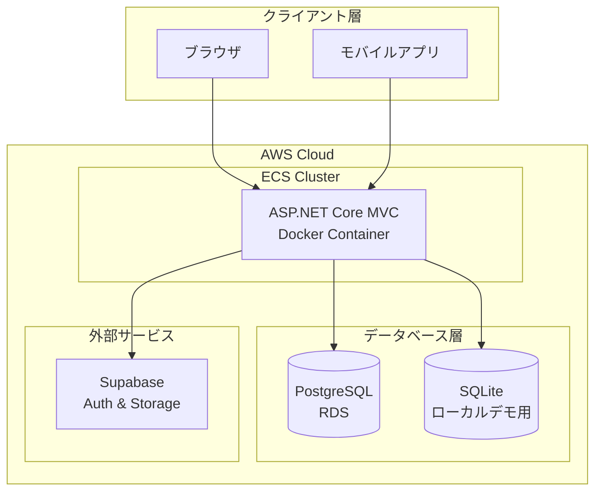
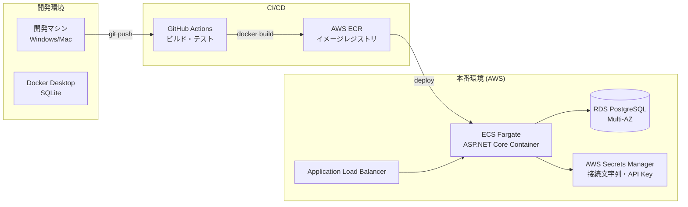
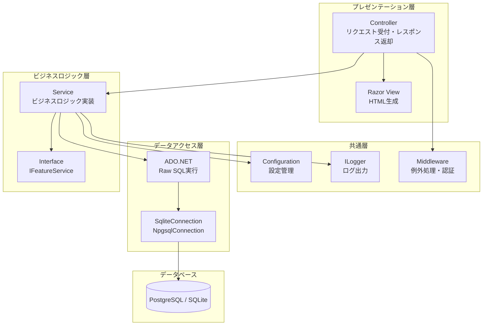
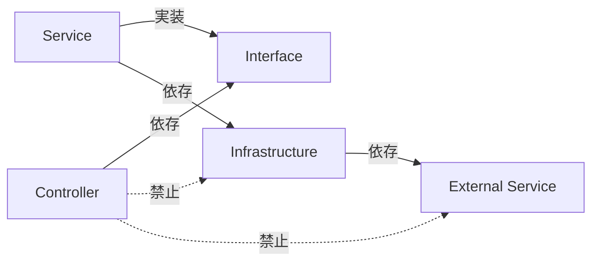
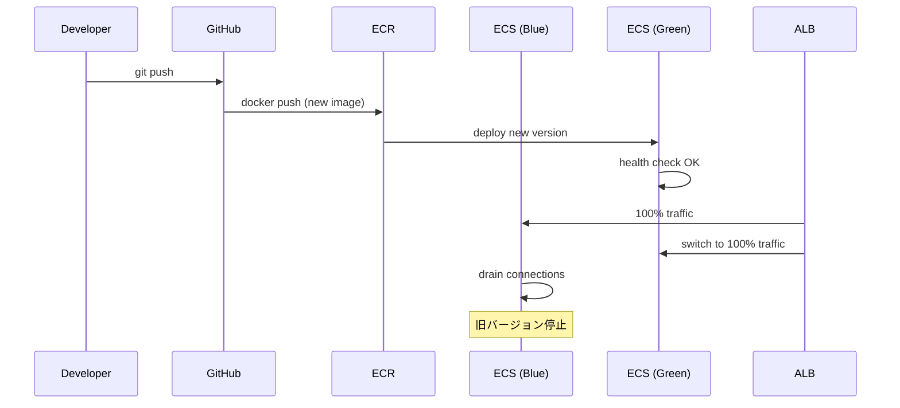
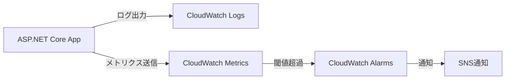

# アーキテクチャ設計

## 文書情報
- **作成日**: 2025-12-12
- **最終更新**: 2025-12-12
- **バージョン**: 1.0
- **ステータス**: 実装済み

---

## 1. システム構成図

### 1.1 全体アーキテクチャ



---

### 1.2 デプロイ構成図



**デプロイフロー**:
1. 開発者が `git push` でコードをプッシュ
2. GitHub Actions が自動ビルド・テスト実行
3. テスト成功後、Docker イメージを ECR にプッシュ
4. ECS が新しいイメージをデプロイ
5. ALB がトラフィックを新しいコンテナに切り替え

---

## 2. レイヤー構成

### 2.1 Feature-based アーキテクチャ

このプロジェクトは **Feature-based Architecture** を採用しています。



---

### 2.2 フォルダ構造

```
BlazorApp/
├── Features/               # 機能ごとに分類
│   ├── Demo/              # デモ機能（エンジニア教育用）
│   │   ├── Controllers/   # DemoController.cs
│   │   ├── Services/      # NPlusOneService.cs, etc.
│   │   ├── Models/        # DTO, Request, Response
│   │   └── Views/         # Razor Views
│   │
│   ├── Home/              # ホーム機能
│   │   ├── Controllers/   # HomeController.cs
│   │   └── Views/         # Index.cshtml
│   │
│   └── ReleaseNotes/      # リリースノート機能
│       ├── Controllers/   # ReleaseNotesController.cs
│       ├── Services/      # ReleaseNotesService.cs
│       └── Views/         # Index.cshtml
│
├── Shared/                # 共通コンポーネント
│   ├── Middleware/        # 例外処理、認証
│   ├── Filters/           # アクションフィルター
│   └── Extensions/        # 拡張メソッド
│
├── Infrastructure/        # インフラストラクチャ層
│   ├── Database/          # DB接続管理
│   └── External/          # 外部サービス連携
│
└── Program.cs             # エントリーポイント、DI設定
```

**設計原則**:
- 機能ごとにフォルダを分ける（Feature-based）
- 技術レイヤーごとに分けない（Controller/ Services/ Models/ を別フォルダにしない）
- 各機能は独立して開発・テスト可能

---

### 2.3 依存関係ルール



**ルール**:
1. **Controller は Service インターフェースにのみ依存**
   - ✅ `private readonly INPlusOneService _service;`
   - ❌ `new SqliteConnection()` を Controller で直接生成

2. **Service は Infrastructure 層を使用**
   - ✅ `GetConnection()` メソッドで接続取得
   - ❌ 接続文字列をハードコーディング

3. **循環依存を避ける**
   - Service → Infrastructure → External の一方向依存

---

## 3. 技術スタック

### 3.1 バックエンド

| レイヤー | 技術 | バージョン | 用途 |
|---------|------|----------|------|
| Framework | ASP.NET Core MVC | 8.0 | Webアプリケーション |
| Language | C# | 12.0 | プログラミング言語 |
| Database Access | ADO.NET (Raw SQL) | - | データベースアクセス |
| Database (本番) | PostgreSQL | 16.x | RDS on AWS |
| Database (デモ) | SQLite | 3.x | ローカルデモ用 |
| DI Container | Microsoft.Extensions.DependencyInjection | 8.0 | 依存性注入 |
| Logging | ILogger (Serilog) | - | ログ出力 |
| Configuration | appsettings.json + 環境変数 | - | 設定管理 |

**ADO.NET採用理由**: [ADR-002: ORMを使わず素のSQLを採用](../adr/002-avoid-orm-use-raw-sql.md)

---

### 3.2 フロントエンド

| 技術 | バージョン | 用途 |
|------|----------|------|
| Razor Pages | ASP.NET Core 8.0 | サーバーサイドレンダリング |
| Bootstrap | 5.3 | CSSフレームワーク |
| jQuery | 3.x | DOM操作・AJAX |

---

### 3.3 インフラストラクチャ

| サービス | 用途 | 環境 |
|---------|------|------|
| Docker | コンテナ化 | 開発・本番 |
| AWS ECS Fargate | コンテナオーケストレーション | 本番 |
| AWS RDS (PostgreSQL) | データベース | 本番 |
| AWS Secrets Manager | 秘密情報管理 | 本番 |
| GitHub Actions | CI/CD | 本番 |
| Supabase | 認証・ストレージ | 本番 |

---

### 3.4 開発ツール

| ツール | 用途 |
|-------|------|
| Visual Studio 2022 | IDE (Windows) |
| Visual Studio Code | IDE (Mac/Linux) |
| Docker Desktop | ローカル開発環境 |
| xUnit | 単体テスト |
| Playwright | E2Eテスト |
| GitHub Copilot | AI開発支援 |

---

## 4. 非機能要件

### 4.1 パフォーマンス

| 項目 | 目標値 | 測定方法 |
|------|--------|---------|
| API レスポンスタイム | < 200ms (95%ile) | Application Insights |
| ページ表示速度 | < 2秒 (初回) | Lighthouse |
| データベースクエリ | < 100ms (平均) | ログ分析 |

---

### 4.2 スケーラビリティ

- **水平スケーリング**: ECS Fargate タスク数を自動増減
- **データベース**: RDS Multi-AZ でレプリケーション
- **セッション管理**: ステートレス設計（外部セッションストア使用）

---

### 4.3 セキュリティ

| 対策 | 実装方法 |
|------|---------|
| SQLインジェクション対策 | パラメータ化クエリのみ使用 |
| XSS対策 | Razor View の自動エスケープ |
| CSRF対策 | `[ValidateAntiForgeryToken]` 使用 |
| 秘密情報管理 | AWS Secrets Manager |
| HTTPS強制 | ALB で SSL/TLS 終端 |
| 認証・認可 | Supabase Auth + ASP.NET Core Identity |

---

### 4.4 可用性

| 項目 | 目標値 | 実装 |
|------|--------|------|
| SLA | 99.9% (月間) | Multi-AZ構成 |
| RTO (Recovery Time Objective) | < 1時間 | 自動フェイルオーバー |
| RPO (Recovery Point Objective) | < 5分 | RDS自動バックアップ |

---

## 5. デプロイ戦略

### 5.1 Blue-Green デプロイ



**メリット**:
- ダウンタイムなしでデプロイ
- 問題発生時に即座にロールバック可能

---

### 5.2 環境分離

| 環境 | 用途 | デプロイ頻度 |
|------|------|------------|
| Development | ローカル開発 | 常時 |
| Staging | 本番前検証 | 週1回 |
| Production | 本番環境 | 月2回 |

---

## 6. 監視・ログ

### 6.1 ログレベル

| レベル | 用途 | 例 |
|--------|------|-----|
| Error | エラー発生時 | DB接続失敗、例外発生 |
| Warning | 警告事項 | リトライ実行、タイムアウト |
| Information | 重要な処理 | API呼び出し、SQL実行時間 |
| Debug | デバッグ情報 | 変数の値、条件分岐 |

---

### 6.2 メトリクス監視



**監視項目**:
- CPU使用率 (> 80%)
- メモリ使用率 (> 80%)
- エラーレート (> 1%)
- レスポンスタイム (> 500ms)

---

## 7. 参考

- [クラス図](class-diagram.md)
- [シーケンス図](sequence-diagram.md)
- [ADR-001: Feature-based アーキテクチャ採用](../adr/001-feature-based-architecture.md)
- [ADR-002: ORMを使わず素のSQLを採用](../adr/002-avoid-orm-use-raw-sql.md)
