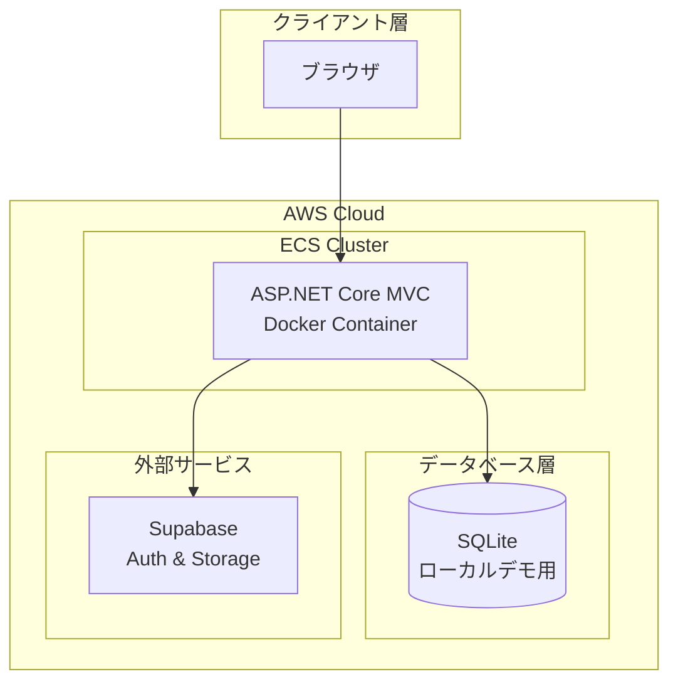
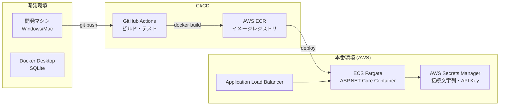
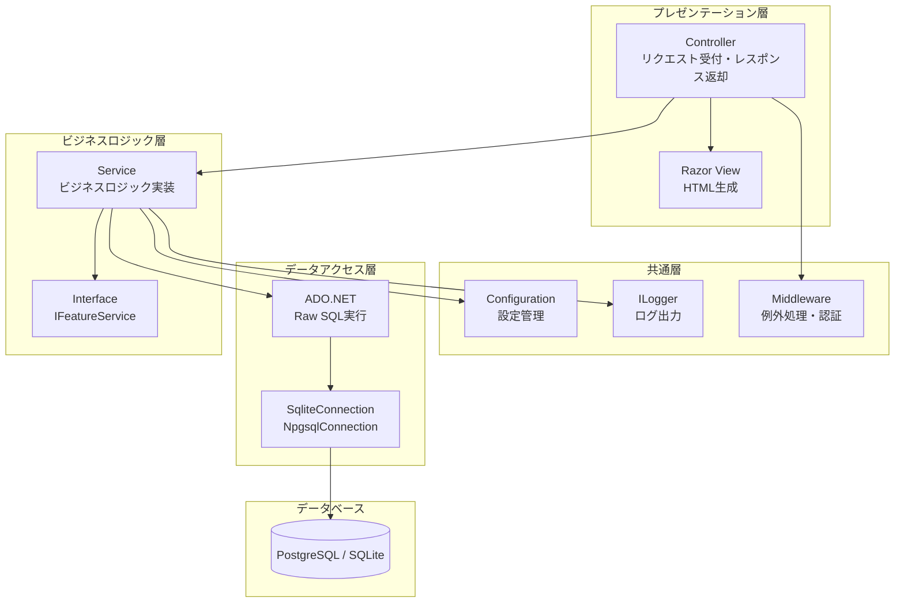
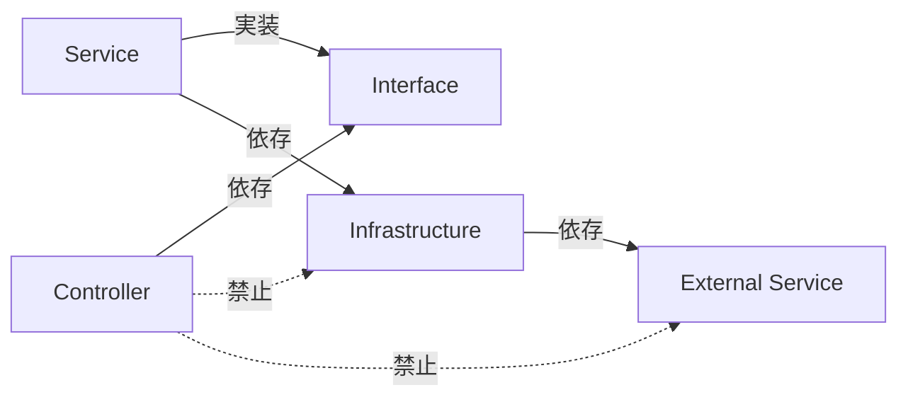

# アーキテクチャ設計

## 文書情報
- **作成日**: 2025-12-12
- **最終更新**: 2026-01-06
- **バージョン**: 1.2
- **ステータス**: 実装済み

## 変更履歴

| 日付 | バージョン | 変更内容 |
|------|----------|----------|
| 2025-12-12 | 1.0 | 初版作成 |
| 2026-01-06 | 1.1 | レビュー指摘事項を反映（フォルダ構造修正、実装状況明記） |
| 2026-01-06 | 1.2 | アーキテクチャ設計に集中、詳細は各設計書へ委譲 |

---

## 1. システム構成図

### 1.1 全体アーキテクチャ



**Supabase の使用用途:**
- **認証（Auth）**: ユーザー認証・認可（計画中）
- **ストレージ**: ファイルアップロード（計画中）
- **リアルタイムDB**: 将来的に検討

**実装状況:**
- [x] SupabaseService: 実装済み（`Features/Supabase/`）
- [ ] 認証統合: 未実装
- [ ] ストレージ統合: 未実装

---

### 1.2 デプロイ構成図



**デプロイフロー**:
1. 開発者が `git push` でコードをプッシュ
2. GitHub Actions が自動ビルド・テスト実行
3. テスト成功後、Docker イメージを ECR にプッシュ
4. ECS が新しいイメージをデプロイ
5. ALB がトラフィックを新しいコンテナに切り替え

---

## 2. レイヤー構成

### 2.1 Feature-based アーキテクチャ

このプロジェクトは **Feature-based Architecture** を採用しています。



---

### 2.2 設計原則

**Feature-based Architecture の特徴:**
- 機能ごとにフォルダを分ける
- 技術レイヤーごとに分けない（Controllers/, Services/, Models/ を別フォルダにしない）
- 各機能は独立して開発・テスト可能

**フォルダ構造の例:**
```
Features/
├── Demo/              # デモ機能
│   ├── DemoController.cs
│   ├── Services/
│   ├── Models/
│   └── Views/
├── Home/              # ホーム機能
└── Orders/            # 注文機能
```

> **詳細:** [内部設計 - ディレクトリ構造](../internal-design/README.md)

---

### 2.3 依存関係ルール



**ルール**:
1. **Controller は Service インターフェースにのみ依存**
   - ✅ `private readonly INPlusOneService _service;`
   - ❌ `new SqliteConnection()` を Controller で直接生成

2. **Service は Infrastructure 層を使用**
   - ✅ `GetConnection()` メソッドで接続取得
   - ❌ 接続文字列をハードコーディング

3. **循環依存を避ける**
   - Service → Infrastructure → External の一方向依存

---

## 3. 技術スタック

### 3.1 バックエンド

| レイヤー | 技術 | バージョン | 用途 |
|---------|------|----------|------|
| Framework | ASP.NET Core MVC | 8.0 | Webアプリケーション |
| Language | C# | 12.0 | プログラミング言語 |
| Database Access | ADO.NET (Raw SQL) | - | データベースアクセス |
| Database (本番) | PostgreSQL | 16.x | RDS on AWS |
| Database (デモ) | SQLite | 3.x | ローカルデモ用 |
| DI Container | Microsoft.Extensions.DependencyInjection | 8.0 | 依存性注入 |
| Logging | ILogger (Serilog) | - | ログ出力 |
| Configuration | appsettings.json + 環境変数 | - | 設定管理 |

**ADO.NET採用理由**: [ADR-002: ORMを使わず素のSQLを採用](../adr/002-avoid-orm-use-raw-sql.md)

---

### データベース選定

| 環境 | DB | 用途 | ADR | 実装状況 |
|------|-----|------|-----|----------|
| 本番 | PostgreSQL (RDS) | 基幹システム | - | 🚧 計画中 |
| デモ | SQLite | 教育用デモ（N+1問題等） | [ADR-001](../adr/001-use-sqlite-for-education.md) | ✅ 実装済み |

**切り替え方法:**
- `appsettings.json` の `ConnectionStrings` で管理
- 環境変数 `ASPNETCORE_ENVIRONMENT` で自動切り替え
- デモ機能は常にSQLiteを使用（`demo.db`）
- 基幹システム機能はPostgreSQLを使用予定

---

### 3.2 フロントエンド

| 技術 | バージョン | 用途 |
|------|----------|------|
| Razor Pages | ASP.NET Core 8.0 | サーバーサイドレンダリング |
| Bootstrap | 5.3 | CSSフレームワーク |
| jQuery | 3.x | DOM操作・AJAX |

---

### 3.3 インフラストラクチャ

| サービス | 用途 | 環境 |
|---------|------|------|
| Docker | コンテナ化 | 開発・本番 |
| AWS ECS Fargate | コンテナオーケストレーション | 本番 |
| AWS RDS (PostgreSQL) | データベース | 本番 |
| AWS Secrets Manager | 秘密情報管理 | 本番 |
| GitHub Actions | CI/CD | 本番 |
| Supabase | 認証・ストレージ | 本番 |

---

### 3.4 開発ツール

| ツール | 用途 |
|-------|------|
| Visual Studio 2022 | IDE (Windows) |
| Visual Studio Code | IDE (Mac/Linux) |
| Docker Desktop | ローカル開発環境 |
| xUnit | 単体テスト |
| Playwright | E2Eテスト |
| DocFx | APIドキュメント自動生成 |
| GitHub Copilot | AI開発支援 |

---

## 4. 非機能要件

### 4.1 パフォーマンス

| 項目 | 目標値 | 測定方法 |
|------|--------|---------|
| API レスポンスタイム | < 200ms (95%ile) | Application Insights |
| ページ表示速度 | < 2秒 (初回) | Lighthouse |
| データベースクエリ | < 100ms (平均) | ログ分析 |

---

### 4.2 スケーラビリティ

- **水平スケーリング**: ECS Fargate タスク数を自動増減
- **データベース**: RDS Multi-AZ でレプリケーション
- **セッション管理**: ステートレス設計（外部セッションストア使用）

---

### 4.3 セキュリティ

| 対策 | 実装方法 |
|------|---------|
| SQLインジェクション対策 | パラメータ化クエリのみ使用 |
| XSS対策 | Razor View の自動エスケープ |
| CSRF対策 | `[ValidateAntiForgeryToken]` 使用 |
| 秘密情報管理 | AWS Secrets Manager |
| HTTPS強制 | ALB で SSL/TLS 終端 |
| 認証・認可 | Supabase Auth + ASP.NET Core Identity |

---

### 4.4 可用性

| 項目 | 目標値 | 実装 |
|------|--------|------|
| SLA | 99.9% (月間) | Multi-AZ構成 |
| RTO (Recovery Time Objective) | < 1時間 | 自動フェイルオーバー |
| RPO (Recovery Point Objective) | < 5分 | RDS自動バックアップ |

---

## 5. デプロイ戦略

### 5.1 
なし
---

### 5.2 環境分離

| 環境 | 用途 | デプロイ頻度 |
|------|------|------------|
| Development | ローカル開発 | 常時 |
| Production | 本番環境 | 月2回 |

---

## 6. 監視・ログ（概要）

### 6.1 ログ戦略

- **ログレベル**: Error, Warning, Information, Debug
- **出力先**: CloudWatch Logs
- **構造化ログ**: Serilog を使用

> **詳細:** [共通設計 - ログ設計](logging.md)

---

### 6.2 監視戦略

**実装済み:**
- CloudWatch Logs (タスクログ自動収集)

**計画中:**
- カスタムメトリクス（CPU, メモリ, レスポンスタイム）
- CloudWatch Alarms
- SNS 通知

> **詳細:** [運用設計 - 監視](../operations/monitoring/README.md)

---

## 7. 参考

### 設計書
- [クラス図](class-diagram.md)
- [シーケンス図](sequence-diagram.md)
- [エラーハンドリング設計](error-handling.md)
- [セキュリティ設計](security.md)
- [ログ設計](logging.md)
- [DB接続管理](database-connection.md)

### ADR
- [ADR-001: SQLiteを教育用デモに採用](../adr/001-use-sqlite-for-education.md)
- [ADR-002: ORMを使わず素のSQLを採用](../adr/002-avoid-orm-use-raw-sql.md)

### その他
- [機能別設計書一覧](../features/README.md)
- [GitHub Copilot Custom Instructions](../../copilot-instructions.md)
- [DB接続管理](database-connection.md)

### ADR
- [ADR-001: SQLiteを教育用デモに採用](../adr/001-use-sqlite-for-education.md)
- [ADR-002: ORMを使わず素のSQLを採用](../adr/002-avoid-orm-use-raw-sql.md)

### その他
- [機能別設計書一覧](../features/README.md)
- [GitHub Copilot Custom Instructions](../../copilot-instructions.md)
