# アーキテクチャ設計

## 文書情報
- **作成日**: 2025-12-12
- **最終更新**: 2026-01-06
- **バージョン**: 1.1
- **ステータス**: 実装済み

## 変更履歴

| 日付 | バージョン | 変更者 | 変更内容 |
|------|----------|--------|----------|
| 2025-12-12 | 1.0 | - | 初版作成 |
| 2026-01-06 | 1.1 | - | レビュー指摘事項を反映（フォルダ構造修正、実装状況明記） |

---

## 1. システム構成図

### 1.1 全体アーキテクチャ

```mermaid
graph TB
    subgraph "クライアント層"
        Browser[ブラウザ]
    end

    subgraph "AWS Cloud"
        subgraph "ECS Cluster"
            WebApp[ASP.NET Core MVC<br/>Docker Container]
        end

        subgraph "データベース層"
            SQLite[(SQLite<br/>ローカルデモ用)]
        end

        subgraph "外部サービス"
            Supabase[Supabase<br/>Auth & Storage]
        end
    end

    Browser --> WebApp
    WebApp --> SQLite
    WebApp --> Supabase
```



**Supabase の使用用途:**
- **認証（Auth）**: ユーザー認証・認可（計画中）
- **ストレージ**: ファイルアップロード（計画中）
- **リアルタイムDB**: 将来的に検討

**実装状況:**
- [x] SupabaseService: 実装済み（`Features/Supabase/`）
- [ ] 認証統合: 未実装
- [ ] ストレージ統合: 未実装

---

### 1.2 デプロイ構成図

```mermaid
graph LR
    subgraph "開発環境"
        DevMachine[開発マシン<br/>Windows/Mac]
        DevDocker[Docker Desktop<br/>SQLite]
    end

    subgraph "CI/CD"
        GitHub[GitHub Actions<br/>ビルド・テスト]
        ECR[AWS ECR<br/>イメージレジストリ]
    end

    subgraph "本番環境 (AWS)"
        ALB[Application Load Balancer]
        ECS[ECS Fargate<br/>ASP.NET Core Container]
        SecretsManager[AWS Secrets Manager<br/>接続文字列・API Key]
    end

    DevMachine -->|git push| GitHub
    GitHub -->|docker build| ECR
    ECR -->|deploy| ECS
    ALB --> ECS
    ECS --> SecretsManager
```



**デプロイフロー**:
1. 開発者が `git push` でコードをプッシュ
2. GitHub Actions が自動ビルド・テスト実行
3. テスト成功後、Docker イメージを ECR にプッシュ
4. ECS が新しいイメージをデプロイ
5. ALB がトラフィックを新しいコンテナに切り替え

---

## 2. レイヤー構成

### 2.1 Feature-based アーキテクチャ

このプロジェクトは **Feature-based Architecture** を採用しています。

```mermaid
graph TD
    subgraph "プレゼンテーション層"
        Controller[Controller<br/>リクエスト受付・レスポンス返却]
        View[Razor View<br/>HTML生成]
    end

    subgraph "ビジネスロジック層"
        Service[Service<br/>ビジネスロジック実装]
        Interface[Interface<br/>IFeatureService]
    end

    subgraph "データアクセス層"
        ADO[ADO.NET<br/>Raw SQL実行]
        Connection[SqliteConnection<br/>NpgsqlConnection]
    end

    subgraph "データベース"
        DB[(PostgreSQL / SQLite)]
    end

    subgraph "共通層"
        Config[Configuration<br/>設定管理]
        Logger[ILogger<br/>ログ出力]
        Middleware[Middleware<br/>例外処理・認証]
    end

    Controller --> Service
    Controller --> View
    Service --> Interface
    Service --> ADO
    ADO --> Connection
    Connection --> DB
    Service --> Config
    Service --> Logger
    Controller --> Middleware
```



---

### 2.2 フォルダ構造

> **注意:** プロジェクト名は `BlazorApp` ですが、実際は ASP.NET Core MVC アプリケーションです（歴史的経緯による名称）。

```
src/BlazorApp/
├── Features/               # 機能ごとに分類（Feature-based Architecture）
│   ├── Demo/              # デモ機能（エンジニア教育用）
│   │   ├── DemoController.cs    # Controller（Controllersフォルダは使用しない）
│   │   ├── Services/            # NPlusOneService.cs, SelectStarService.cs, etc.
│   │   ├── Models/              # DTO, Request, Response
│   │   └── Views/               # Razor Views
│   │
│   ├── Home/              # ホーム機能
│   │   ├── HomeController.cs    # Controller
│   │   └── Views/               # Index.cshtml
│   │
│   ├── ReleaseNotes/      # リリースノート機能
│   │   ├── ReleaseNotesController.cs  # Controller
│   │   ├── Services/            # ReleaseNotesService.cs
│   │   └── Views/               # Index.cshtml
│   │
│   ├── Calculator/        # 計算機能
│   │   ├── CalculatorController.cs
│   │   ├── CalculatorService.cs
│   │   └── Views/
│   │
│   ├── Orders/            # 注文機能
│   │   ├── OrdersController.cs
│   │   ├── OrderService.cs
│   │   └── Views/
│   │
│   └── Supabase/          # Supabase連携
│       ├── SupabaseService.cs
│       └── ISupabaseService.cs
│
├── Shared/                # 共通コンポーネント
│   ├── Middleware/        # 例外処理、認証
│   ├── Filters/           # アクションフィルター
│   └── Extensions/        # 拡張メソッド
│
├── Infrastructure/        # インフラストラクチャ層
│   ├── Database/          # DB接続管理
│   └── External/          # 外部サービス連携
│
└── Program.cs             # エントリーポイント、DI設定
```

**設計原則**:
- 機能ごとにフォルダを分ける（Feature-based）
- 技術レイヤーごとに分けない（Controller/ Services/ Models/ を別フォルダにしない）
- 各機能は独立して開発・テスト可能

---

### 2.3 依存関係ルール

```mermaid
graph LR
    Controller[Controller]
    Service[Service]
    Interface[Interface]
    Infrastructure[Infrastructure]
    External[External Service]

    Controller -->|依存| Interface
    Service -->|実装| Interface
    Service -->|依存| Infrastructure
    Infrastructure -->|依存| External
    Controller -.->|禁止| Infrastructure
    Controller -.->|禁止| External
```



**ルール**:
1. **Controller は Service インターフェースにのみ依存**
   - ✅ `private readonly INPlusOneService _service;`
   - ❌ `new SqliteConnection()` を Controller で直接生成

2. **Service は Infrastructure 層を使用**
   - ✅ `GetConnection()` メソッドで接続取得
   - ❌ 接続文字列をハードコーディング

3. **循環依存を避ける**
   - Service → Infrastructure → External の一方向依存

---

## 3. 技術スタック

### 3.1 バックエンド

| レイヤー | 技術 | バージョン | 用途 |
|---------|------|----------|------|
| Framework | ASP.NET Core MVC | 8.0 | Webアプリケーション |
| Language | C# | 12.0 | プログラミング言語 |
| Database Access | ADO.NET (Raw SQL) | - | データベースアクセス |
| Database (本番) | PostgreSQL | 16.x | RDS on AWS |
| Database (デモ) | SQLite | 3.x | ローカルデモ用 |
| DI Container | Microsoft.Extensions.DependencyInjection | 8.0 | 依存性注入 |
| Logging | ILogger (Serilog) | - | ログ出力 |
| Configuration | appsettings.json + 環境変数 | - | 設定管理 |

**ADO.NET採用理由**: [ADR-002: ORMを使わず素のSQLを採用](../adr/002-avoid-orm-use-raw-sql.md)

---

### データベース選定

| 環境 | DB | 用途 | ADR | 実装状況 |
|------|-----|------|-----|----------|
| 本番 | PostgreSQL (RDS) | 基幹システム | - | 🚧 計画中 |
| デモ | SQLite | 教育用デモ（N+1問題等） | [ADR-001](../adr/001-use-sqlite-for-education.md) | ✅ 実装済み |

**切り替え方法:**
- `appsettings.json` の `ConnectionStrings` で管理
- 環境変数 `ASPNETCORE_ENVIRONMENT` で自動切り替え
- デモ機能は常にSQLiteを使用（`demo.db`）
- 基幹システム機能はPostgreSQLを使用予定

---

### 3.2 フロントエンド

| 技術 | バージョン | 用途 |
|------|----------|------|
| Razor Pages | ASP.NET Core 8.0 | サーバーサイドレンダリング |
| Bootstrap | 5.3 | CSSフレームワーク |
| jQuery | 3.x | DOM操作・AJAX |

---

### 3.3 インフラストラクチャ

| サービス | 用途 | 環境 |
|---------|------|------|
| Docker | コンテナ化 | 開発・本番 |
| AWS ECS Fargate | コンテナオーケストレーション | 本番 |
| AWS RDS (PostgreSQL) | データベース | 本番 |
| AWS Secrets Manager | 秘密情報管理 | 本番 |
| GitHub Actions | CI/CD | 本番 |
| Supabase | 認証・ストレージ | 本番 |

---

### 3.4 開発ツール

| ツール | 用途 |
|-------|------|
| Visual Studio 2022 | IDE (Windows) |
| Visual Studio Code | IDE (Mac/Linux) |
| Docker Desktop | ローカル開発環境 |
| xUnit | 単体テスト |
| Playwright | E2Eテスト |
| DocFx | APIドキュメント自動生成 |
| GitHub Copilot | AI開発支援 |

---

## 4. 非機能要件

### 4.1 パフォーマンス

| 項目 | 目標値 | 測定方法 |
|------|--------|---------|
| API レスポンスタイム | < 200ms (95%ile) | Application Insights |
| ページ表示速度 | < 2秒 (初回) | Lighthouse |
| データベースクエリ | < 100ms (平均) | ログ分析 |

---

### 4.2 スケーラビリティ

- **水平スケーリング**: ECS Fargate タスク数を自動増減
- **データベース**: RDS Multi-AZ でレプリケーション
- **セッション管理**: ステートレス設計（外部セッションストア使用）

---

### 4.3 セキュリティ

| 対策 | 実装方法 |
|------|---------|
| SQLインジェクション対策 | パラメータ化クエリのみ使用 |
| XSS対策 | Razor View の自動エスケープ |
| CSRF対策 | `[ValidateAntiForgeryToken]` 使用 |
| 秘密情報管理 | AWS Secrets Manager |
| HTTPS強制 | ALB で SSL/TLS 終端 |
| 認証・認可 | Supabase Auth + ASP.NET Core Identity |

---

### 4.4 可用性

| 項目 | 目標値 | 実装 |
|------|--------|------|
| SLA | 99.9% (月間) | Multi-AZ構成 |
| RTO (Recovery Time Objective) | < 1時間 | 自動フェイルオーバー |
| RPO (Recovery Point Objective) | < 5分 | RDS自動バックアップ |

---

## 5. デプロイ戦略

### 5.1 
なし
---

### 5.2 環境分離

| 環境 | 用途 | デプロイ頻度 |
|------|------|------------|
| Development | ローカル開発 | 常時 |
| Production | 本番環境 | 月2回 |

---

## 6. 監視・ログ

### 6.1 ログレベル

| レベル | 用途 | 例 |
|--------|------|-----|
| Error | エラー発生時 | DB接続失敗、例外発生 |
| Warning | 警告事項 | リトライ実行、タイムアウト |
| Information | 重要な処理 | API呼び出し、SQL実行時間 |
| Debug | デバッグ情報 | 変数の値、条件分岐 |

---

### 6.2 メトリクス監視

**実装状況:**
- [x] CloudWatch Logs: 実装済み（ECSタスクログ自動収集）
- [ ] CloudWatch Metrics（カスタム）: 未実装
- [ ] CloudWatch Alarms: 未実装
- [ ] SNS通知: 未実装

**Phase 1（実装済み）:**

```mermaid
graph LR
    App[ASP.NET Core App]
    CloudWatch[CloudWatch Logs]

    App -->|ログ出力| CloudWatch
```



- ECS タスクログ → CloudWatch Logs Group
- ログレベル: Error, Warning, Information, Debug
- ログの保持期間: 7日間

**Phase 2（計画中）:**

```mermaid
graph LR
    App[ASP.NET Core App]
    CloudWatch[CloudWatch Logs]
    Metrics[CloudWatch Metrics]
    Alarm[CloudWatch Alarms]
    SNS[SNS通知]

    App -->|ログ出力| CloudWatch
    App -->|メトリクス送信| Metrics
    Metrics -->|閾値超過| Alarm
    Alarm -->|通知| SNS
```



**監視項目（計画）:**
- CPU使用率 (> 80%)
- メモリ使用率 (> 80%)
- エラーレート (> 1%)
- レスポンスタイム (> 500ms)
- SQLクエリ実行時間 (> 100ms)
- API呼び出し回数

---

## 7. 参考

### 設計書
- [クラス図](class-diagram.md)
- [シーケンス図](sequence-diagram.md)
- [エラーハンドリング設計](error-handling.md)
- [セキュリティ設計](security.md)
- [ログ設計](logging.md)
- [DB接続管理](database-connection.md)

### ADR
- [ADR-001: SQLiteを教育用デモに採用](../adr/001-use-sqlite-for-education.md)
- [ADR-002: ORMを使わず素のSQLを採用](../adr/002-avoid-orm-use-raw-sql.md)

### その他
- [機能別設計書一覧](../features/README.md)
- [GitHub Copilot Custom Instructions](../../copilot-instructions.md)
- [DB接続管理](database-connection.md)

### ADR
- [ADR-001: SQLiteを教育用デモに採用](../adr/001-use-sqlite-for-education.md)
- [ADR-002: ORMを使わず素のSQLを採用](../adr/002-avoid-orm-use-raw-sql.md)

### その他
- [機能別設計書一覧](../features/README.md)
- [GitHub Copilot Custom Instructions](../../copilot-instructions.md)
