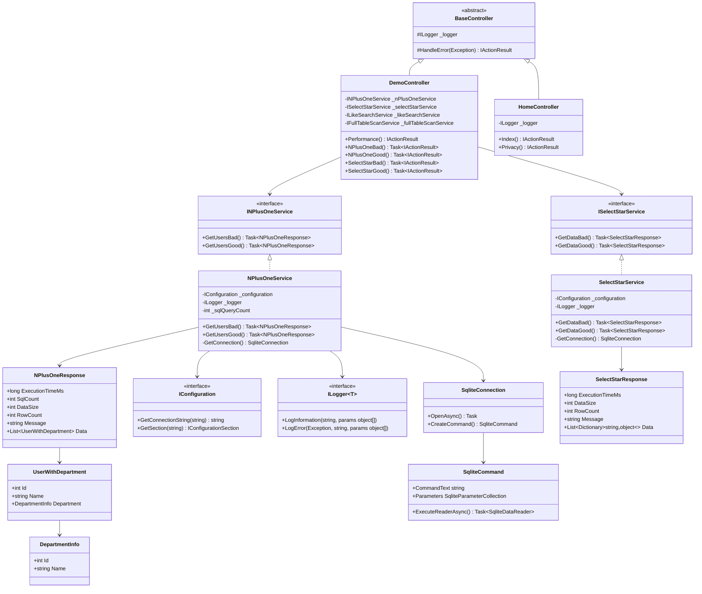
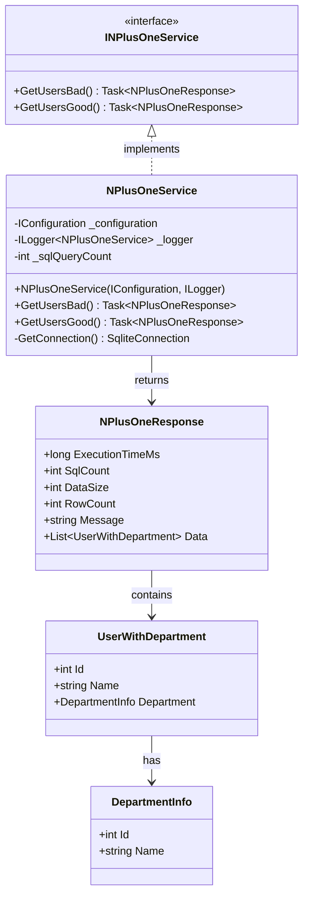
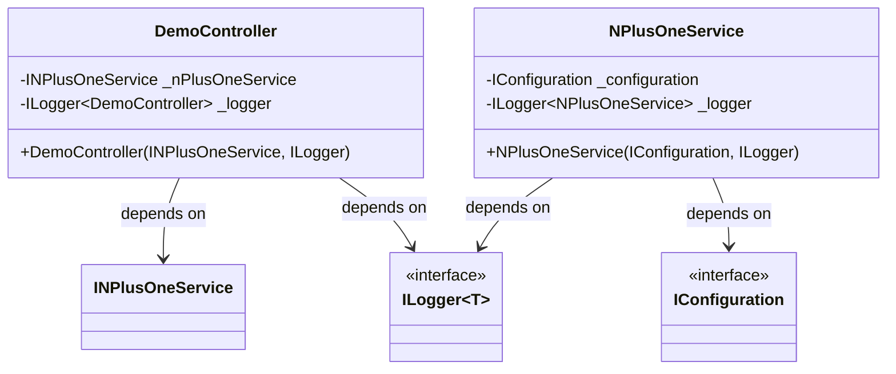
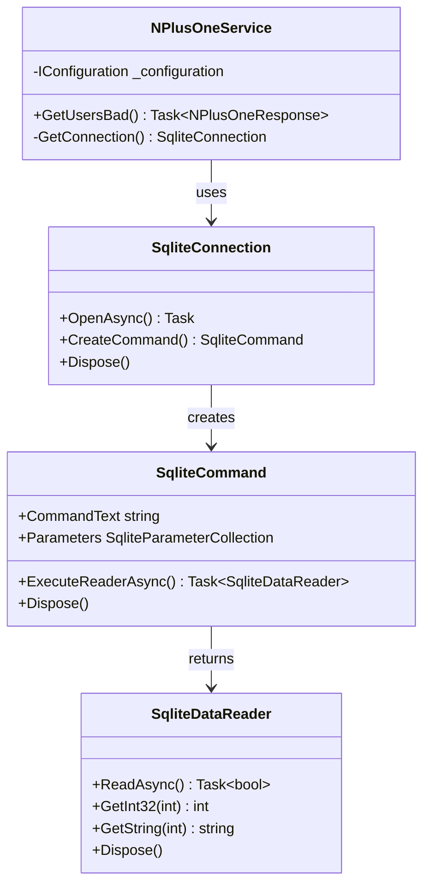

# クラス図

## 文書情報
- **作成日**: 2025-12-12
- **最終更新**: 2025-12-12
- **バージョン**: 1.0
- **ステータス**: 実装済み

---

## 1. システム全体のクラス構成

### 1.1 全体像



---

## 2. 主要インターフェース

### 2.1 サービスインターフェース規約

すべての Service クラスは以下の規約に従います：

```csharp
/// <summary>
/// [機能名]サービスのインターフェース
/// </summary>
public interface I[Feature]Service
{
    /// <summary>
    /// [処理の概要]
    /// </summary>
    /// <param name="request">リクエストパラメータ</param>
    /// <returns>レスポンス</returns>
    Task<[Feature]Response> Do[Action](RequestDto request);
}
```

**命名規則**:
- インターフェース名: `I[Feature]Service`
- 実装クラス名: `[Feature]Service`
- メソッド名: `Do[Action]` または `Get[Resource]`
- 戻り値: `Task<[Feature]Response>`

---

### 2.2 実装例（N+1問題デモ）



**実装コード**:
```csharp
public interface INPlusOneService
{
    Task<NPlusOneResponse> GetUsersBad();
    Task<NPlusOneResponse> GetUsersGood();
}

public class NPlusOneService : INPlusOneService
{
    private readonly IConfiguration _configuration;
    private readonly ILogger<NPlusOneService> _logger;
    private int _sqlQueryCount = 0;

    public NPlusOneService(IConfiguration configuration, ILogger<NPlusOneService> logger)
    {
        _configuration = configuration;
        _logger = logger;
    }

    public async Task<NPlusOneResponse> GetUsersBad() { /* ... */ }
    public async Task<NPlusOneResponse> GetUsersGood() { /* ... */ }
    private SqliteConnection GetConnection() { /* ... */ }
}
```

---

## 3. DTO設計パターン

### 3.1 Request DTO

```csharp
/// <summary>
/// [機能名]リクエストパラメータ
/// </summary>
public class [Feature]Request
{
    /// <summary>
    /// [パラメータの説明]
    /// </summary>
    [Required]
    public int Id { get; set; }

    /// <summary>
    /// [パラメータの説明]
    /// </summary>
    [MaxLength(100)]
    public string Name { get; set; } = string.Empty;
}
```

**規約**:
- クラス名: `[Feature]Request`
- プロパティに Data Annotations を使用
- `string` 型は `= string.Empty` で初期化
- 必須項目には `[Required]` を付与

---

### 3.2 Response DTO

```csharp
/// <summary>
/// [機能名]レスポンス
/// </summary>
public class [Feature]Response
{
    /// <summary>
    /// 実行時間（ミリ秒）
    /// </summary>
    public long ExecutionTimeMs { get; set; }

    /// <summary>
    /// 処理結果メッセージ
    /// </summary>
    public string Message { get; set; } = string.Empty;

    /// <summary>
    /// データ
    /// </summary>
    public List<[Entity]> Data { get; set; } = new();
}
```

**規約**:
- クラス名: `[Feature]Response`
- 必ず `ExecutionTimeMs` を含める（パフォーマンス測定用）
- `Message` でユーザーへの説明を含める
- `List<T>` は `= new()` で初期化

---

### 3.3 Entity DTO

```csharp
/// <summary>
/// [エンティティの説明]
/// </summary>
public class [Entity]
{
    /// <summary>
    /// ID
    /// </summary>
    public int Id { get; set; }

    /// <summary>
    /// 名前
    /// </summary>
    public string Name { get; set; } = string.Empty;

    /// <summary>
    /// 関連エンティティ
    /// </summary>
    public [RelatedEntity]? RelatedEntity { get; set; }
}
```

**規約**:
- クラス名: `[Entity]` （複数形にしない）
- プロパティ名: PascalCase
- NULL許容型には `?` を付与
- ナビゲーションプロパティは nullable

---

## 4. 依存性注入（DI）パターン

### 4.1 サービス登録

```csharp
// Program.cs
var builder = WebApplication.CreateBuilder(args);

// Feature-based Services
builder.Services.AddScoped<INPlusOneService, NPlusOneService>();
builder.Services.AddScoped<ISelectStarService, SelectStarService>();
builder.Services.AddScoped<ILikeSearchService, LikeSearchService>();
builder.Services.AddScoped<IFullTableScanService, FullTableScanService>();
```

**ライフタイム規約**:
- **Scoped**: すべてのビジネスロジックサービス（リクエストごとに1インスタンス）
- **Singleton**: 設定、ログ、キャッシュ
- **Transient**: ステートレスなヘルパークラス

---

### 4.2 コンストラクタインジェクション



**実装例**:
```csharp
public class DemoController : Controller
{
    private readonly INPlusOneService _nPlusOneService;
    private readonly ILogger<DemoController> _logger;

    public DemoController(
        INPlusOneService nPlusOneService,
        ILogger<DemoController> logger)
    {
        _nPlusOneService = nPlusOneService;
        _logger = logger;
    }
}
```

**規約**:
- すべての依存関係をコンストラクタで注入
- フィールドは `private readonly` で宣言
- フィールド名は `_camelCase` (アンダースコア付き)

---

## 5. データアクセスパターン

### 5.1 Raw SQL パターン



**実装例**:
```csharp
private SqliteConnection GetConnection()
{
    var connectionString = _configuration.GetConnectionString("DemoDatabase");
    if (string.IsNullOrEmpty(connectionString))
    {
        throw new InvalidOperationException("Connection string 'DemoDatabase' not found");
    }
    return new SqliteConnection(connectionString);
}

public async Task<NPlusOneResponse> GetUsersGood()
{
    using var connection = GetConnection();
    await connection.OpenAsync();

    var sql = @"
        SELECT
            u.Id,
            u.Name,
            u.Email,
            d.Id AS DeptId,
            d.Name AS DeptName
        FROM Users u
        INNER JOIN Departments d ON u.DepartmentId = d.Id";

    using var command = new SqliteCommand(sql, connection);
    using var reader = await command.ExecuteReaderAsync();

    var users = new List<UserWithDepartment>();
    while (await reader.ReadAsync())
    {
        users.Add(new UserWithDepartment
        {
            Id = reader.GetInt32(0),
            Name = reader.GetString(1),
            Department = new DepartmentInfo
            {
                Id = reader.GetInt32(3),
                Name = reader.GetString(4)
            }
        });
    }

    return new NPlusOneResponse
    {
        Data = users,
        RowCount = users.Count
    };
}
```

---

### 5.2 パラメータ化クエリ（SQLインジェクション対策）

```csharp
var sql = "SELECT Id, Name FROM Departments WHERE Id = @DeptId";
using var command = new SqliteCommand(sql, connection);
command.Parameters.AddWithValue("@DeptId", departmentId);

using var reader = await command.ExecuteReaderAsync();
```

**規約**:
- ✅ 必ず `@ParameterName` でパラメータ化
- ❌ 文字列連結で SQL を生成しない（`$"... WHERE Id = {id}"` は禁止）

---

## 6. 命名規則

### 6.1 クラス命名規則

| 種類 | 規則 | 例 |
|------|------|-----|
| Controller | `[Feature]Controller` | `DemoController`, `HomeController` |
| Service Interface | `I[Feature]Service` | `INPlusOneService`, `ISelectStarService` |
| Service Class | `[Feature]Service` | `NPlusOneService`, `SelectStarService` |
| Request DTO | `[Feature]Request` | `NPlusOneRequest` |
| Response DTO | `[Feature]Response` | `NPlusOneResponse` |
| Entity DTO | `[EntityName]` | `UserWithDepartment`, `DepartmentInfo` |
| Middleware | `[Feature]Middleware` | `ExceptionHandlingMiddleware` |

---

### 6.2 メソッド命名規則

| 種類 | 規則 | 例 |
|------|------|-----|
| 取得系 | `Get[Resource]` | `GetUsers()`, `GetUserById(int id)` |
| 作成系 | `Create[Resource]` | `CreateUser(UserRequest request)` |
| 更新系 | `Update[Resource]` | `UpdateUser(int id, UserRequest request)` |
| 削除系 | `Delete[Resource]` | `DeleteUser(int id)` |
| ビジネスロジック | `Do[Action]` | `DoCalculation()` |
| 非同期メソッド | `[Method]Async` | `GetUsersAsync()` |

**規約**:
- すべてのメソッドは PascalCase
- 非同期メソッドは `Async` サフィックス（ただし Controller アクションは除く）
- private メソッドも PascalCase（`_camelCase` は使わない）

---

### 6.3 変数命名規則

| 種類 | 規則 | 例 |
|------|------|-----|
| private フィールド | `_camelCase` | `_logger`, `_configuration` |
| public プロパティ | `PascalCase` | `ExecutionTimeMs`, `Message` |
| ローカル変数 | `camelCase` | `users`, `connection` |
| 定数 | `PascalCase` | `MaxRetryCount` |
| パラメータ | `camelCase` | `request`, `userId` |

---

## 7. 例外処理パターン

### 7.1 Controller レベル

```csharp
[HttpGet("api/demo/n-plus-one/bad")]
public async Task<IActionResult> NPlusOneBad()
{
    try
    {
        var result = await _nPlusOneService.GetUsersBad();
        return Ok(result);
    }
    catch (SqliteException ex)
    {
        _logger.LogError(ex, "Database error in N+1 bad endpoint");
        return StatusCode(500, new
        {
            error = "Database connection failed",
            code = "DB_ERROR",
            timestamp = DateTime.UtcNow
        });
    }
    catch (Exception ex)
    {
        _logger.LogError(ex, "Unexpected error in N+1 bad endpoint");
        return StatusCode(500, new
        {
            error = "Internal server error",
            code = "INTERNAL_ERROR",
            timestamp = DateTime.UtcNow
        });
    }
}
```

---

### 7.2 Service レベル

```csharp
public async Task<NPlusOneResponse> GetUsersBad()
{
    // 引数検証は不要（Controller で実施済み）
    // データベース例外は Controller にスロー
    using var connection = GetConnection();
    await connection.OpenAsync();
    // ... 処理
}
```

**規約**:
- Service は例外をキャッチしない（Controller にスロー）
- ログ出力は Service 内で行う（`_logger.LogInformation` など）
- データベース例外は Controller でハンドリング

---

## 8. 参考

- [アーキテクチャ設計](architecture.md)
- [シーケンス図](sequence-diagram.md)
- [サンプル実装: N+1問題デモ](../features/n-plus-one-demo/code-example.cs)
- [ADR-001: Feature-based アーキテクチャ採用](../adr/001-feature-based-architecture.md)
