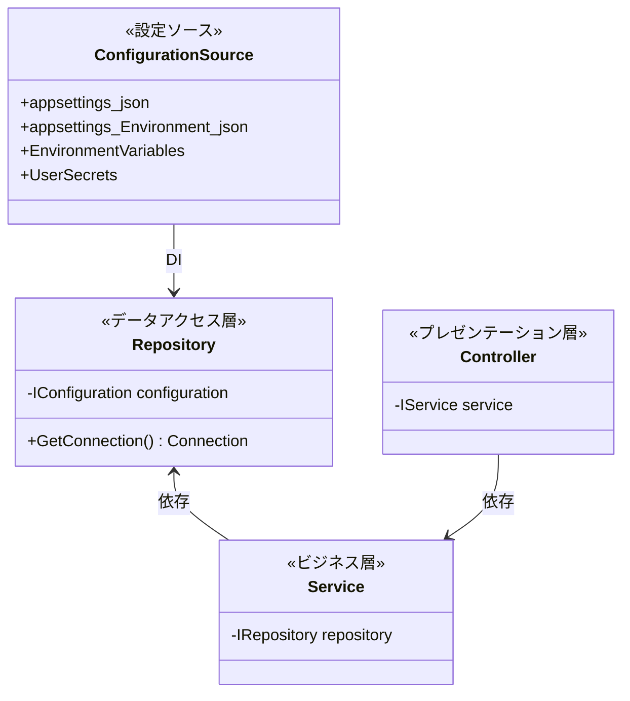
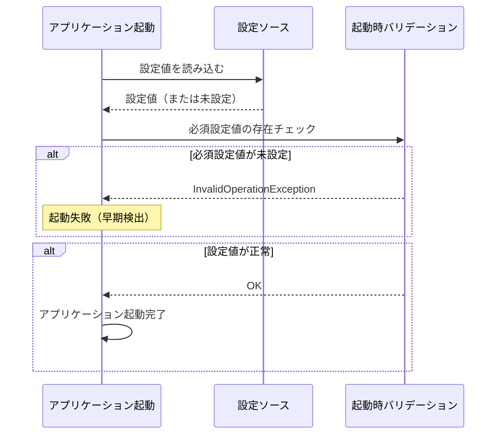

# 設定管理設計

## 文書情報
- **作成日**: 2026-03-07
- **バージョン**: 1.0
- **ステータス**: ドラフト

---

## 1. 基本方針

1. **設定値はコードに書かない**: 接続文字列・APIキー・URLはすべて設定ファイルまたは環境変数で管理する
2. **シークレットは Git にコミットしない**: `.env` / `secrets.json` は `.gitignore` 対象にする
3. **環境ごとに設定を切り替える**: `appsettings.Development.json` / `appsettings.Production.json` で環境差分を管理する
4. **IConfiguration 経由でアクセスする**: 設定値への直接アクセスは禁止。必ず `IConfiguration` を DI して使う

---

## 2. 設定ファイルの構成

### 2.1 ファイル構成

```
src/BlazorApp/
├── appsettings.json              ← 全環境共通の設定（デフォルト値）
├── appsettings.Development.json  ← 開発環境の設定（ローカルDB等）
├── appsettings.Production.json   ← 本番環境の設定（環境変数で上書き推奨）
└── appsettings.Test.json         ← テスト環境の設定（インメモリDB等）
```

### 2.2 読み込み優先順位（高い順）

1. 環境変数
2. `appsettings.{Environment}.json`
3. `appsettings.json`

---

## 3. appsettings.json の構造

```json
{
  "ConnectionStrings": {
    "DemoDatabase": "Data Source=demo.db"
  },
  "Logging": {
    "LogLevel": {
      "Default": "Information",
      "Microsoft.AspNetCore": "Warning"
    }
  },
  "App": {
    "Name": "dotnet-container",
    "Version": "1.0.0"
  }
}
```

---

## 4. 環境別の設定例

### 4.1 appsettings.Development.json

```json
{
  "ConnectionStrings": {
    "DemoDatabase": "Data Source=demo-dev.db"
  },
  "Logging": {
    "LogLevel": {
      "Default": "Debug"
    }
  }
}
```

### 4.2 appsettings.Test.json

```json
{
  "ConnectionStrings": {
    "DemoDatabase": "Data Source=:memory:"
  },
  "Logging": {
    "LogLevel": {
      "Default": "Warning"
    }
  }
}
```

---

## 5. シークレット管理

### 5.1 ローカル開発（User Secrets）

```bash
# シークレットの初期化
dotnet user-secrets init

# シークレットの設定
dotnet user-secrets set "ConnectionStrings:ExternalApi" "https://api.example.com/key=xxx"

# シークレットの確認
dotnet user-secrets list
```

> User Secrets は `%APPDATA%\Microsoft\UserSecrets\` に保存される。Git には含まれない。

### 5.2 本番環境（環境変数）

```bash
# 環境変数での設定（ASP.NET Coreは __ でセクション区切り）
ConnectionStrings__DemoDatabase="Data Source=/data/demo.db"
```

### 5.3 .gitignore 必須設定

```gitignore
# シークレット・ローカル設定
appsettings.Local.json
*.secrets.json
.env
```

---

## 6. IConfiguration の使い方

### 6.1 設定アクセスのレイヤー構造

接続文字列へのアクセスは **Repository（データアクセス層）のみ** に限定する。Service / Controller は Repository インターフェース経由でデータを取得し、設定値には直接アクセスしない。



| クラス | 責務 |
|--------|------|
| ConfigurationSource | 設定値の供給元。環境に応じて優先順位が変わる |
| Repository | IConfigurationにアクセスできる唯一のクラス |
| Service | 設定値に直接アクセス不可。Repository経由のみ |
| Controller | 設定値に直接アクセス不可。Service経由のみ |

### 6.2 設定値の取得方法

| 取得方法 | 用途 |
|---------|------|
| `config["App:Name"]` | 単一の設定値を文字列で取得 |
| `config.GetSection("App")` | セクション全体をオブジェクトとして取得 |
| `config.GetValue<T>("App:Version")` | 型変換して取得 |
| `config.GetConnectionString("DemoDatabase")` | 接続文字列専用メソッド |

---

## 7. 設定値のバリデーション

設定値が存在しない・不正な場合は**起動時**に検出する。実行中に気づくより起動時に落とす方が早期発見できる。



---

## 8. 未決事項

- [ ] 本番環境のシークレット管理方法の確定（環境変数 / Azure Key Vault / AWS Secrets Manager）
- [ ] 設定値の型安全アクセス（Options パターン導入の要否）

---

## 9. 参考

- [クラス図](class-diagram.md)
- [データベース接続設計](database-connection.md)

### Microsoft Learn 公式リファレンス

| 内容 | URL |
|------|-----|
| ASP.NET Core の構成 | https://learn.microsoft.com/ja-jp/aspnet/core/fundamentals/configuration/ |
| 開発におけるアプリシークレットの安全な保存（User Secrets） | https://learn.microsoft.com/ja-jp/aspnet/core/security/app-secrets |
| ASP.NET Core のオプションパターン | https://learn.microsoft.com/ja-jp/aspnet/core/fundamentals/configuration/options |
| 環境変数による構成（IConfiguration） | https://learn.microsoft.com/ja-jp/aspnet/core/fundamentals/configuration/#environment-variables |
