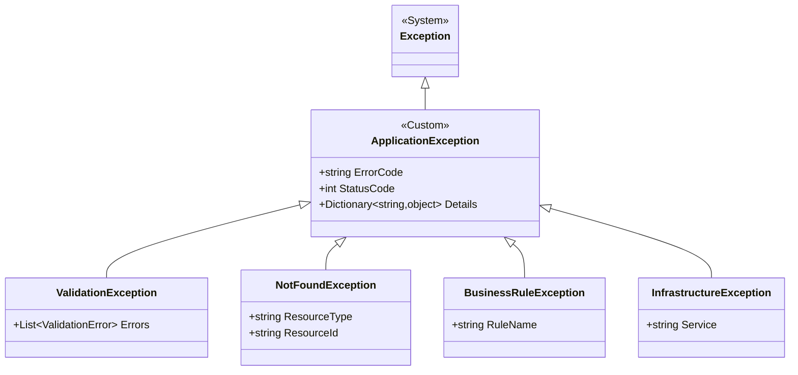

# エラーハンドリング設計

## 文書情報
- **作成日**: 2025-12-12
- **最終更新**: 2025-12-12
- **バージョン**: 1.0
- **ステータス**: 実装中

---

## 1. 基本方針

### 1.1 エラーハンドリングの原則

1. **レイヤーごとに責務を分離**
   - Controller: HTTP ステータスコード設定、エラーレスポンス生成
   - Service: ビジネスロジックの例外スロー
   - Infrastructure: データベース例外、外部API例外

2. **例外を適切にキャッチ**
   - 回復可能なエラー: リトライ、フォールバック
   - 回復不可能なエラー: ログ出力、ユーザーへの通知

3. **ユーザーフレンドリーなエラーメッセージ**
   - 内部エラー詳細を隠蔽
   - ユーザーが対処できる情報を提供

4. **ログとモニタリング**
   - すべてのエラーをログ出力
   - 重大なエラーはアラート通知

---

## 2. 例外の分類

### 2.1 例外クラス階層



---

### 2.2 カスタム例外定義

```csharp
/// <summary>
/// アプリケーション例外の基底クラス
/// </summary>
public abstract class ApplicationException : Exception
{
    /// <summary>
    /// エラーコード（例: "USER_NOT_FOUND"）
    /// </summary>
    public string ErrorCode { get; }

    /// <summary>
    /// HTTPステータスコード
    /// </summary>
    public int StatusCode { get; }

    /// <summary>
    /// エラー詳細情報
    /// </summary>
    public Dictionary<string, object> Details { get; }

    protected ApplicationException(
        string message,
        string errorCode,
        int statusCode,
        Dictionary<string, object>? details = null)
        : base(message)
    {
        ErrorCode = errorCode;
        StatusCode = statusCode;
        Details = details ?? new Dictionary<string, object>();
    }
}

/// <summary>
/// バリデーションエラー
/// </summary>
public class ValidationException : ApplicationException
{
    public List<ValidationError> Errors { get; }

    public ValidationException(List<ValidationError> errors)
        : base("Validation failed", "VALIDATION_ERROR", 400)
    {
        Errors = errors;
        Details["errors"] = errors;
    }
}

/// <summary>
/// リソースが見つからない
/// </summary>
public class NotFoundException : ApplicationException
{
    public string ResourceType { get; }
    public string ResourceId { get; }

    public NotFoundException(string resourceType, string resourceId)
        : base($"{resourceType} with id '{resourceId}' not found", "NOT_FOUND", 404)
    {
        ResourceType = resourceType;
        ResourceId = resourceId;
        Details["resourceType"] = resourceType;
        Details["resourceId"] = resourceId;
    }
}

/// <summary>
/// ビジネスルール違反
/// </summary>
public class BusinessRuleException : ApplicationException
{
    public string RuleName { get; }

    public BusinessRuleException(string ruleName, string message)
        : base(message, "BUSINESS_RULE_VIOLATION", 400)
    {
        RuleName = ruleName;
        Details["ruleName"] = ruleName;
    }
}

/// <summary>
/// インフラストラクチャ例外（DB、外部API等）
/// </summary>
public class InfrastructureException : ApplicationException
{
    public string Service { get; }

    public InfrastructureException(string service, string message, Exception innerException)
        : base(message, "INFRASTRUCTURE_ERROR", 500)
    {
        Service = service;
        Details["service"] = service;
    }
}
```

---

## 3. レイヤー別エラーハンドリング

### 3.1 Controller レイヤー

```csharp
[ApiController]
[Route("api/[controller]")]
public class UserController : ControllerBase
{
    private readonly IUserService _userService;
    private readonly ILogger<UserController> _logger;

    public UserController(IUserService userService, ILogger<UserController> logger)
    {
        _userService = userService;
        _logger = logger;
    }

    /// <summary>
    /// ユーザー取得
    /// </summary>
    [HttpGet("{id}")]
    public async Task<IActionResult> GetUser(int id)
    {
        try
        {
            var user = await _userService.GetUserById(id);
            return Ok(user);
        }
        catch (NotFoundException ex)
        {
            _logger.LogWarning(ex, "User not found: {UserId}", id);
            return NotFound(new ErrorResponse
            {
                Error = ex.Message,
                Code = ex.ErrorCode,
                Details = ex.Details,
                Timestamp = DateTime.UtcNow
            });
        }
        catch (ApplicationException ex)
        {
            _logger.LogError(ex, "Application error in GetUser: {UserId}", id);
            return StatusCode(ex.StatusCode, new ErrorResponse
            {
                Error = ex.Message,
                Code = ex.ErrorCode,
                Details = ex.Details,
                Timestamp = DateTime.UtcNow
            });
        }
        catch (Exception ex)
        {
            _logger.LogError(ex, "Unexpected error in GetUser: {UserId}", id);
            return StatusCode(500, new ErrorResponse
            {
                Error = "Internal server error",
                Code = "INTERNAL_ERROR",
                Timestamp = DateTime.UtcNow
            });
        }
    }

    /// <summary>
    /// ユーザー作成
    /// </summary>
    [HttpPost]
    public async Task<IActionResult> CreateUser([FromBody] CreateUserRequest request)
    {
        try
        {
            // ModelState検証
            if (!ModelState.IsValid)
            {
                return BadRequest(new ErrorResponse
                {
                    Error = "Validation failed",
                    Code = "VALIDATION_ERROR",
                    Details = new Dictionary<string, object>
                    {
                        ["errors"] = ModelState.Values
                            .SelectMany(v => v.Errors)
                            .Select(e => e.ErrorMessage)
                            .ToList()
                    },
                    Timestamp = DateTime.UtcNow
                });
            }

            var user = await _userService.CreateUser(request);
            return CreatedAtAction(nameof(GetUser), new { id = user.Id }, user);
        }
        catch (ValidationException ex)
        {
            _logger.LogWarning(ex, "Validation failed for CreateUser");
            return BadRequest(new ErrorResponse
            {
                Error = ex.Message,
                Code = ex.ErrorCode,
                Details = ex.Details,
                Timestamp = DateTime.UtcNow
            });
        }
        catch (BusinessRuleException ex)
        {
            _logger.LogWarning(ex, "Business rule violation: {RuleName}", ex.RuleName);
            return BadRequest(new ErrorResponse
            {
                Error = ex.Message,
                Code = ex.ErrorCode,
                Details = ex.Details,
                Timestamp = DateTime.UtcNow
            });
        }
        catch (Exception ex)
        {
            _logger.LogError(ex, "Unexpected error in CreateUser");
            return StatusCode(500, new ErrorResponse
            {
                Error = "Internal server error",
                Code = "INTERNAL_ERROR",
                Timestamp = DateTime.UtcNow
            });
        }
    }
}
```

---

### 3.2 Service レイヤー

```csharp
public class UserService : IUserService
{
    private readonly IConfiguration _configuration;
    private readonly ILogger<UserService> _logger;

    public UserService(IConfiguration configuration, ILogger<UserService> logger)
    {
        _configuration = configuration;
        _logger = logger;
    }

    public async Task<User> GetUserById(int id)
    {
        using var connection = GetConnection();
        await connection.OpenAsync();

        var sql = "SELECT Id, Name, Email FROM Users WHERE Id = @Id";
        using var command = new SqliteCommand(sql, connection);
        command.Parameters.AddWithValue("@Id", id);

        using var reader = await command.ExecuteReaderAsync();
        if (!await reader.ReadAsync())
        {
            // NotFoundException をスロー
            throw new NotFoundException("User", id.ToString());
        }

        return new User
        {
            Id = reader.GetInt32(0),
            Name = reader.GetString(1),
            Email = reader.GetString(2)
        };
    }

    public async Task<User> CreateUser(CreateUserRequest request)
    {
        // ビジネスルール検証
        if (await IsEmailExists(request.Email))
        {
            throw new BusinessRuleException(
                "UNIQUE_EMAIL",
                $"Email '{request.Email}' is already registered");
        }

        using var connection = GetConnection();
        await connection.OpenAsync();

        var sql = @"
            INSERT INTO Users (Name, Email, CreatedAt)
            VALUES (@Name, @Email, @CreatedAt)
            RETURNING Id";

        using var command = new SqliteCommand(sql, connection);
        command.Parameters.AddWithValue("@Name", request.Name);
        command.Parameters.AddWithValue("@Email", request.Email);
        command.Parameters.AddWithValue("@CreatedAt", DateTime.UtcNow);

        var id = (long)await command.ExecuteScalarAsync();

        _logger.LogInformation("User created: {UserId}, {Email}", id, request.Email);

        return await GetUserById((int)id);
    }

    private async Task<bool> IsEmailExists(string email)
    {
        using var connection = GetConnection();
        await connection.OpenAsync();

        var sql = "SELECT COUNT(*) FROM Users WHERE Email = @Email";
        using var command = new SqliteCommand(sql, connection);
        command.Parameters.AddWithValue("@Email", email);

        var count = (long)await command.ExecuteScalarAsync();
        return count > 0;
    }

    private SqliteConnection GetConnection()
    {
        var connectionString = _configuration.GetConnectionString("DefaultConnection");
        if (string.IsNullOrEmpty(connectionString))
        {
            throw new InvalidOperationException("Connection string 'DefaultConnection' not found");
        }
        return new SqliteConnection(connectionString);
    }
}
```

---

### 3.3 グローバル例外ハンドラー（Middleware）

```csharp
/// <summary>
/// グローバル例外ハンドリングミドルウェア
/// </summary>
public class GlobalExceptionHandlerMiddleware
{
    private readonly RequestDelegate _next;
    private readonly ILogger<GlobalExceptionHandlerMiddleware> _logger;

    public GlobalExceptionHandlerMiddleware(
        RequestDelegate next,
        ILogger<GlobalExceptionHandlerMiddleware> logger)
    {
        _next = next;
        _logger = logger;
    }

    public async Task InvokeAsync(HttpContext context)
    {
        try
        {
            await _next(context);
        }
        catch (ApplicationException ex)
        {
            _logger.LogError(ex, "Application exception: {ErrorCode}", ex.ErrorCode);
            await HandleApplicationException(context, ex);
        }
        catch (Exception ex)
        {
            _logger.LogError(ex, "Unhandled exception");
            await HandleUnexpectedException(context, ex);
        }
    }

    private static async Task HandleApplicationException(HttpContext context, ApplicationException ex)
    {
        context.Response.ContentType = "application/json";
        context.Response.StatusCode = ex.StatusCode;

        var response = new ErrorResponse
        {
            Error = ex.Message,
            Code = ex.ErrorCode,
            Details = ex.Details,
            Timestamp = DateTime.UtcNow
        };

        await context.Response.WriteAsJsonAsync(response);
    }

    private static async Task HandleUnexpectedException(HttpContext context, Exception ex)
    {
        context.Response.ContentType = "application/json";
        context.Response.StatusCode = 500;

        var response = new ErrorResponse
        {
            Error = "Internal server error",
            Code = "INTERNAL_ERROR",
            Timestamp = DateTime.UtcNow
        };

        await context.Response.WriteAsJsonAsync(response);
    }
}

// Program.cs での登録
app.UseMiddleware<GlobalExceptionHandlerMiddleware>();
```

---

## 4. エラーレスポンス形式

### 4.1 標準エラーレスポンス

```csharp
/// <summary>
/// エラーレスポンス
/// </summary>
public class ErrorResponse
{
    /// <summary>
    /// エラーメッセージ
    /// </summary>
    public string Error { get; set; } = string.Empty;

    /// <summary>
    /// エラーコード（例: "USER_NOT_FOUND", "VALIDATION_ERROR"）
    /// </summary>
    public string Code { get; set; } = string.Empty;

    /// <summary>
    /// エラー詳細情報
    /// </summary>
    public Dictionary<string, object>? Details { get; set; }

    /// <summary>
    /// タイムスタンプ（UTC）
    /// </summary>
    public DateTime Timestamp { get; set; }

    /// <summary>
    /// トレースID（デバッグ用）
    /// </summary>
    public string? TraceId { get; set; }
}
```

**レスポンス例**:
```json
{
  "error": "User with id '123' not found",
  "code": "NOT_FOUND",
  "details": {
    "resourceType": "User",
    "resourceId": "123"
  },
  "timestamp": "2025-12-12T10:00:00Z",
  "traceId": "0HMN8J9K7L6M5N4O3P2Q1R0S"
}
```

---

### 4.2 バリデーションエラーレスポンス

```json
{
  "error": "Validation failed",
  "code": "VALIDATION_ERROR",
  "details": {
    "errors": [
      {
        "field": "Email",
        "message": "The Email field is not a valid e-mail address."
      },
      {
        "field": "Name",
        "message": "The Name field is required."
      }
    ]
  },
  "timestamp": "2025-12-12T10:00:00Z"
}
```

---

## 5. リトライ戦略

### 5.1 Polly を使用したリトライ

```csharp
using Polly;
using Polly.Retry;

public class ExternalApiService
{
    private readonly HttpClient _httpClient;
    private readonly ILogger<ExternalApiService> _logger;
    private readonly AsyncRetryPolicy<HttpResponseMessage> _retryPolicy;

    public ExternalApiService(HttpClient httpClient, ILogger<ExternalApiService> logger)
    {
        _httpClient = httpClient;
        _logger = logger;

        // リトライポリシー設定
        _retryPolicy = Policy
            .HandleResult<HttpResponseMessage>(r => !r.IsSuccessStatusCode)
            .Or<HttpRequestException>()
            .WaitAndRetryAsync(
                retryCount: 3,
                sleepDurationProvider: retryAttempt => TimeSpan.FromSeconds(Math.Pow(2, retryAttempt)),
                onRetry: (outcome, timespan, retryCount, context) =>
                {
                    _logger.LogWarning(
                        "Retry {RetryCount} after {Delay}s due to {Reason}",
                        retryCount,
                        timespan.TotalSeconds,
                        outcome.Exception?.Message ?? outcome.Result?.StatusCode.ToString());
                });
    }

    public async Task<ApiResponse> CallExternalApi(string endpoint)
    {
        var response = await _retryPolicy.ExecuteAsync(async () =>
        {
            return await _httpClient.GetAsync(endpoint);
        });

        if (!response.IsSuccessStatusCode)
        {
            throw new InfrastructureException(
                "ExternalAPI",
                $"API call failed: {response.StatusCode}",
                new HttpRequestException($"Status: {response.StatusCode}"));
        }

        return await response.Content.ReadFromJsonAsync<ApiResponse>();
    }
}
```

---

### 5.2 Circuit Breaker パターン

```csharp
using Polly.CircuitBreaker;

public class ExternalApiServiceWithCircuitBreaker
{
    private readonly HttpClient _httpClient;
    private readonly ILogger<ExternalApiServiceWithCircuitBreaker> _logger;
    private readonly AsyncCircuitBreakerPolicy<HttpResponseMessage> _circuitBreakerPolicy;

    public ExternalApiServiceWithCircuitBreaker(
        HttpClient httpClient,
        ILogger<ExternalApiServiceWithCircuitBreaker> logger)
    {
        _httpClient = httpClient;
        _logger = logger;

        // Circuit Breaker 設定
        _circuitBreakerPolicy = Policy
            .HandleResult<HttpResponseMessage>(r => !r.IsSuccessStatusCode)
            .Or<HttpRequestException>()
            .CircuitBreakerAsync(
                handledEventsAllowedBeforeBreaking: 3,  // 3回失敗したら開放
                durationOfBreak: TimeSpan.FromMinutes(1),  // 1分間開放
                onBreak: (outcome, duration) =>
                {
                    _logger.LogError("Circuit breaker opened for {Duration}s", duration.TotalSeconds);
                },
                onReset: () =>
                {
                    _logger.LogInformation("Circuit breaker reset");
                });
    }

    public async Task<ApiResponse> CallExternalApi(string endpoint)
    {
        try
        {
            var response = await _circuitBreakerPolicy.ExecuteAsync(async () =>
            {
                return await _httpClient.GetAsync(endpoint);
            });

            return await response.Content.ReadFromJsonAsync<ApiResponse>();
        }
        catch (BrokenCircuitException ex)
        {
            _logger.LogError(ex, "Circuit breaker is open");
            throw new InfrastructureException(
                "ExternalAPI",
                "Service temporarily unavailable",
                ex);
        }
    }
}
```

---

## 6. エラーコード一覧

### 6.1 クライアントエラー（4xx）

| コード | HTTPステータス | 説明 |
|-------|--------------|------|
| `VALIDATION_ERROR` | 400 | バリデーションエラー |
| `BUSINESS_RULE_VIOLATION` | 400 | ビジネスルール違反 |
| `UNAUTHORIZED` | 401 | 認証エラー |
| `FORBIDDEN` | 403 | 権限エラー |
| `NOT_FOUND` | 404 | リソースが見つからない |
| `CONFLICT` | 409 | リソースの競合 |
| `RATE_LIMIT_EXCEEDED` | 429 | レート制限超過 |

---

### 6.2 サーバーエラー（5xx）

| コード | HTTPステータス | 説明 |
|-------|--------------|------|
| `INTERNAL_ERROR` | 500 | 内部サーバーエラー |
| `DB_ERROR` | 500 | データベースエラー |
| `INFRASTRUCTURE_ERROR` | 500 | インフラストラクチャエラー |
| `SERVICE_UNAVAILABLE` | 503 | サービス利用不可 |

---

## 7. ログ出力

### 7.1 エラーログの書き方

```csharp
// NG: 例外を文字列で出力
_logger.LogError($"Error: {ex.Message}");

// OK: 構造化ログ + 例外オブジェクト
_logger.LogError(ex, "Failed to get user: {UserId}", userId);

// OK: エラーコードを含める
_logger.LogError(ex, "Business rule violation: {ErrorCode}, {RuleName}",
    ex.ErrorCode, ex.RuleName);
```

---

### 7.2 ログレベルの使い分け

| レベル | 用途 | 例 |
|--------|------|-----|
| Error | 回復不可能なエラー | DB接続失敗、予期しない例外 |
| Warning | 回復可能なエラー | リトライ実行、バリデーションエラー |
| Information | 正常な処理 | ユーザー作成成功 |
| Debug | デバッグ情報 | SQL実行、変数の値 |

---

## 8. 参考

- [ログ設計](logging.md)
- [API設計規約](api-design.md)
- [セキュリティ設計](security.md)
- [シーケンス図](sequence-diagram.md)
