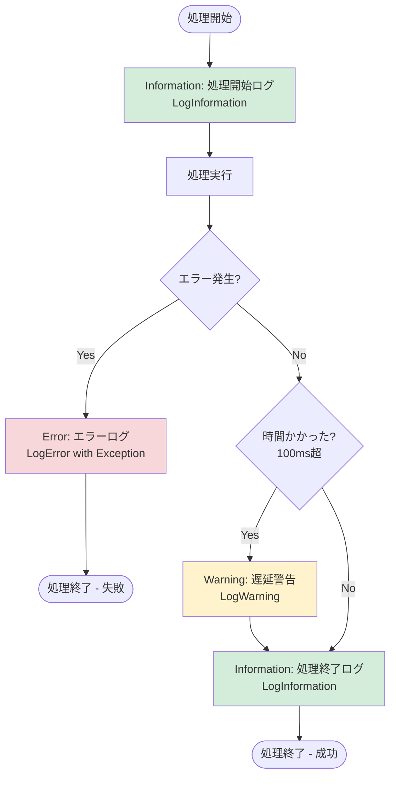
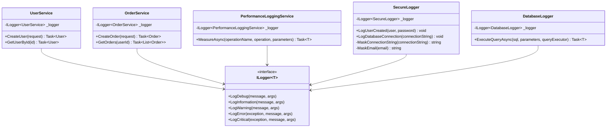
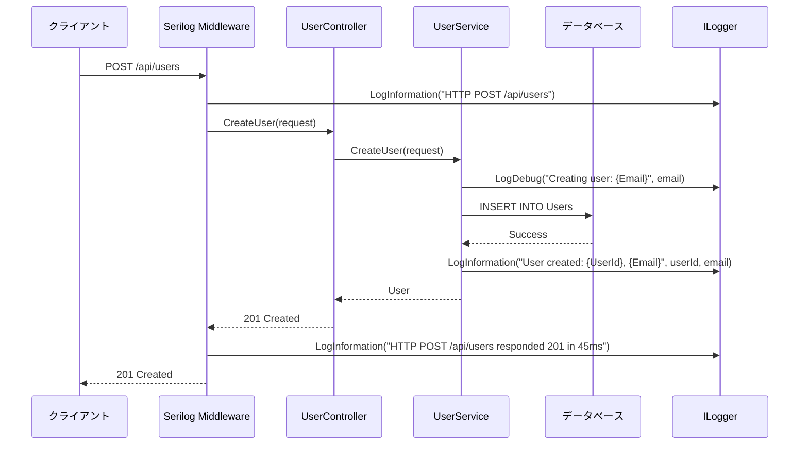
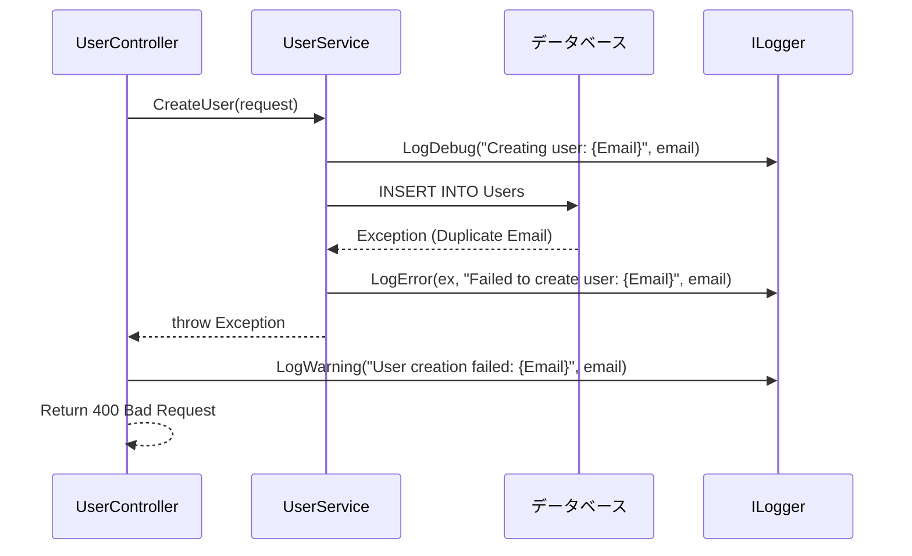
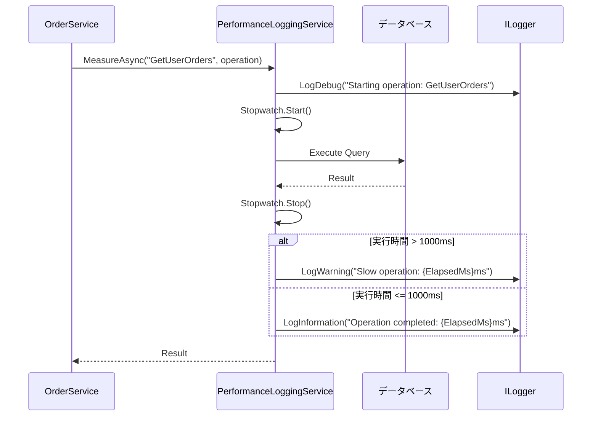

# ログ設計

## 文書情報
- **作成日**: 2025-12-12
- **最終更新**: 2025-12-12
- **バージョン**: 1.0
- **ステータス**: 実装中

---

## 1. ログ設計の基本方針

### 1.1 ログの目的

1. **デバッグ**: 開発中の問題解決
2. **監視**: 本番環境の異常検知
3. **分析**: パフォーマンス分析、ユーザー行動分析
4. **監査**: セキュリティイベント、データ変更の追跡
5. **コンプライアンス**: 法的要件の遵守

---

### 1.2 ログレベル

| レベル | 用途 | 例 | 本番出力 |
|--------|------|-----|---------|
| **Trace** | 詳細なデバッグ情報 | ループ内の変数値 | ❌ |
| **Debug** | デバッグ情報 | SQL実行、メソッド呼び出し | ❌ |
| **Information** | 重要な処理の記録 | API呼び出し成功、ユーザー作成 | ✅ |
| **Warning** | 警告事項 | リトライ実行、非推奨機能使用 | ✅ |
| **Error** | エラー | 例外発生、DB接続失敗 | ✅ |
| **Critical** | 致命的エラー | システム停止、データ破損 | ✅ |

**本番環境のログレベル**: `Information` 以上のみ出力

---

## ログフォーマット

### 開発環境（可読性重視）

```
[HH:mm:ss INF] User created: UserId=123, Email=user@example.com
[HH:mm:ss ERR] Database connection failed: ConnectionString=Server=***
```

**形式**: テキスト形式、色付き出力（Console）

---

### 本番環境（機械可読性重視）

```json
{
  "timestamp": "2025-12-12T10:00:00.123Z",
  "level": "Information",
  "message": "User created",
  "properties": {
    "UserId": 123,
    "Email": "use***@example.com",
    "RequestId": "0HMN8J9K7L6M5N4O3P2Q1R0S",
    "SourceContext": "BlazorApp.Features.User.UserService"
  }
}
```

**形式**: JSON形式（CloudWatch Logs で検索・分析しやすい）

---

## ログ出力先

| 環境 | 出力先 | 保存期間 | フォーマット | 用途 |
|------|--------|---------|------------|------|
| **開発** | Console | - | テキスト | デバッグ |
| **開発** | File (`logs/app-.log`) | 7日 | テキスト | ローカル調査 |
| **本番** | AWS CloudWatch Logs | 30日 | JSON | 監視・分析 |
| **本番** | S3 (アーカイブ) | 1年 | JSON.gz | 長期保存 |

### CloudWatch Logs グループ構成

```
/ecs/dotnet-app/application  # アプリケーションログ
/ecs/dotnet-app/error        # エラーログ（フィルタ済み）
/ecs/dotnet-app/audit        # 監査ログ（認証・認可）
/ecs/dotnet-app/performance  # パフォーマンスログ
```

---

## ログ出力タイミング

### 必須ログ出力タイミング

**いつログを出すか？** フローチャートで確認



**3つの基本パターン**:

| パターン | ログレベル | タイミング | 例 |
|---------|----------|----------|-----|
| 1️⃣ **処理の開始・終了** | Information | メソッド開始時・終了時 | `Creating user`, `User created` |
| 2️⃣ **エラー発生** | Error | catch ブロック内 | `Failed to create user` |
| 3️⃣ **警告事象** | Warning | 条件判定後 | `Slow query: 150ms` |

#### 1. **処理の開始・終了**（Information）
```csharp
_logger.LogInformation("Creating user: {Email}", request.Email);
// 処理実行
_logger.LogInformation("User created: {UserId}", user.Id);
```

#### 2. **エラー発生時**（Error）
```csharp
catch (Exception ex)
{
    _logger.LogError(ex, "Failed to create user: {Email}", request.Email);
    throw;
}
```

#### 3. **警告すべき事象**（Warning）
```csharp
if (sw.ElapsedMilliseconds > 100)
{
    _logger.LogWarning("Slow query: {ElapsedMs}ms", sw.ElapsedMilliseconds);
}
```

**補足**:
- DB操作前は Debug、実行後は Information + 時間測定
- 時間のかかる処理（100ms超）は Warning で警告

### 出力頻度の制限

**ループ内での大量ログ出力を避ける**:

```csharp
// ❌ NG: 1000件のループで毎回ログ
foreach (var user in users)
{
    _logger.LogDebug("Processing user: {UserId}", user.Id);
}

// ✅ OK: バッチ処理後に1回ログ
_logger.LogInformation("Processing {UserCount} users", users.Count);
foreach (var user in users)
{
    // 処理のみ（ログ出力なし）
}
_logger.LogInformation("Processed {UserCount} users in {ElapsedMs}ms", 
    users.Count, stopwatch.ElapsedMilliseconds);
```

---

## クラス図



---

## シーケンス図

### API呼び出しとログ出力



### エラー発生時のログ出力



### パフォーマンス測定とログ出力



---

# 参考
設計の謎　p251