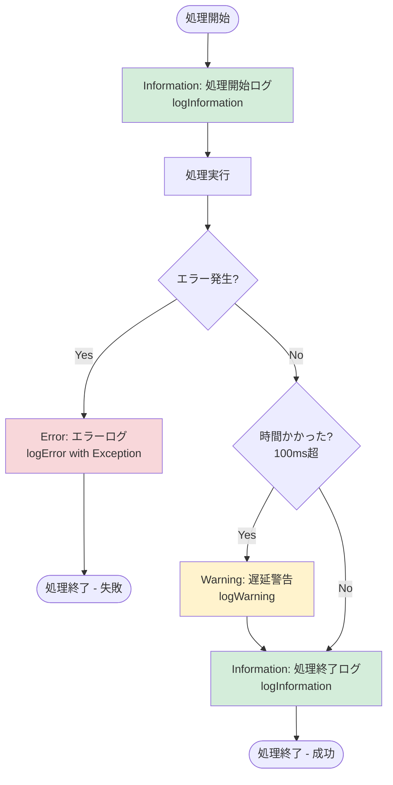
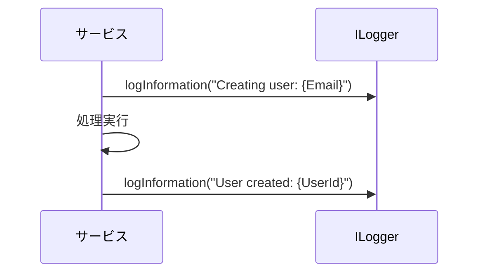
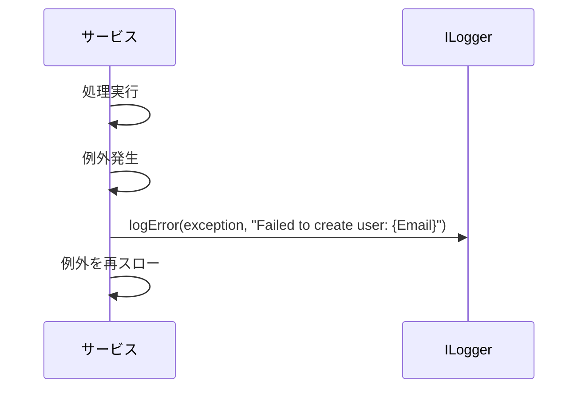
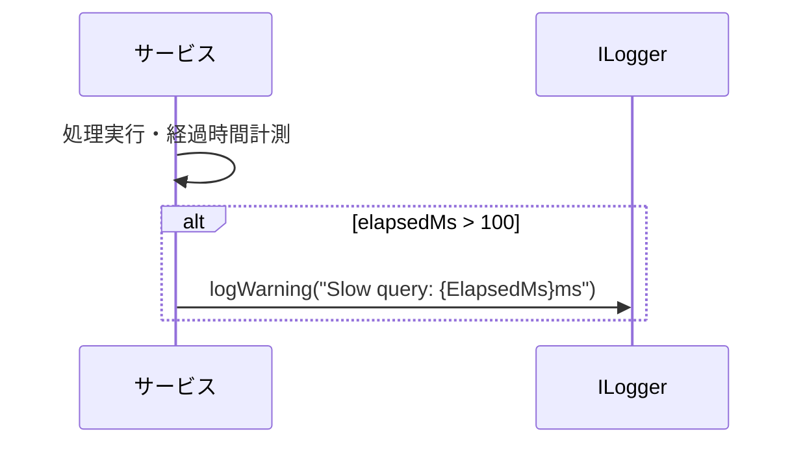
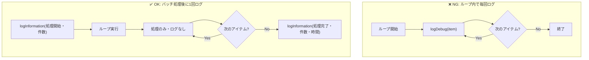
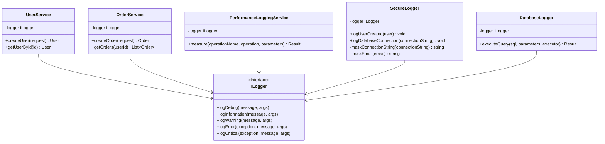
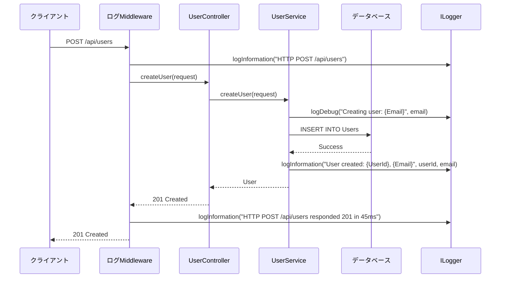
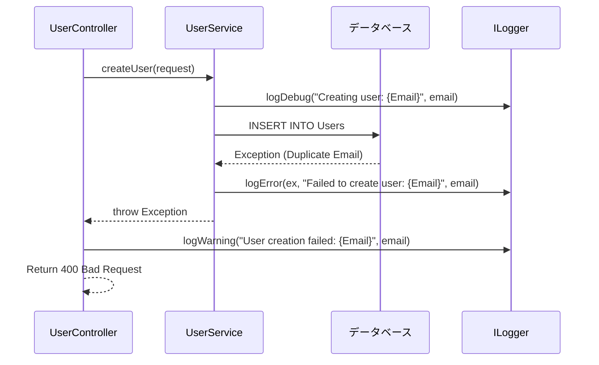
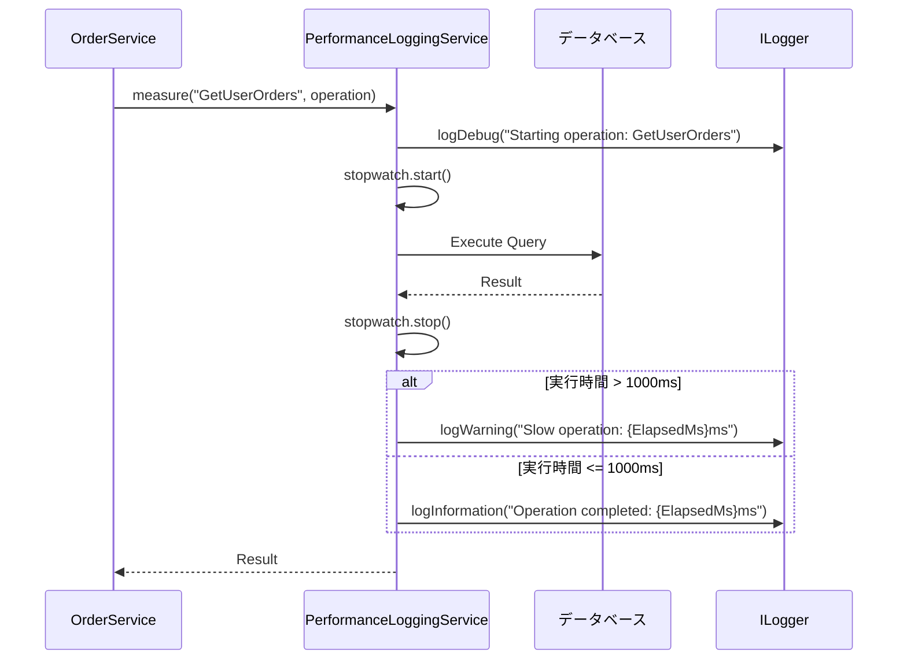

# ログ設計

## 文書情報
- **文書種別**: 外部設計書
- **作成日**: 2025-12-12
- **最終更新**: 2025-12-12
- **バージョン**: 1.0
- **ステータス**: 実装中

---

## 0. 文書の目的

本書は、システムにおけるログ設計の方針・構造・出力タイミングを定義する外部設計書である。
特定の言語・フレームワークに依存せず、どの実装においても適用できる設計原則を示す。
内部設計（実装コード）の参考ドキュメントとして利用すること。

---

## 1. ログ設計の基本方針

### 1.1 ログの目的

1. **デバッグ**: 開発中の問題解決
2. **監視**: 本番環境の異常検知
3. **分析**: パフォーマンス分析、ユーザー行動分析
4. **監査**: セキュリティイベント、データ変更の追跡
5. **コンプライアンス**: 法的要件の遵守

---

### 1.2 ログレベル

| レベル | 用途 | 例 | 本番出力 |
|--------|------|-----|---------|
| **Trace** | 詳細なデバッグ情報 | ループ内の変数値 | ❌ |
| **Debug** | デバッグ情報 | SQL実行、メソッド呼び出し | ❌ |
| **Information** | 重要な処理の記録 | API呼び出し成功、ユーザー作成 | ✅ |
| **Warning** | 警告事項 | リトライ実行、非推奨機能使用 | ✅ |
| **Error** | エラー | 例外発生、DB接続失敗 | ✅ |
| **Critical** | 致命的エラー | システム停止、データ破損 | ✅ |

**本番環境のログレベル**: `Information` 以上のみ出力

---

## 2. ログフォーマット

### 2.1 開発環境（可読性重視）

```
[HH:mm:ss INF] User created: UserId=123, Email=user@example.com
[HH:mm:ss ERR] Database connection failed: ConnectionString=Server=***
```

**形式**: テキスト形式、色付き出力（Console）

---

### 2.2 本番環境（機械可読性重視）

```json
{
  "timestamp": "2025-12-12T10:00:00.123Z",
  "level": "Information",
  "message": "User created",
  "properties": {
    "UserId": 123,
    "Email": "use***@example.com",
    "RequestId": "0HMN8J9K7L6M5N4O3P2Q1R0S",
    "SourceContext": "Features.User.UserService"
  }
}
```

**形式**: JSON形式（CloudWatch Logs で検索・分析しやすい）

---

### 2.3 ログ出力項目

| フィールド | 説明 | 必須 | 例 |
|-----------|------|:----:|----|
| `timestamp` | ログ出力日時（UTC・ISO 8601形式） | ✅ | `2025-12-12T10:00:00.123Z` |
| `level` | ログレベル | ✅ | `Information` |
| `message` | ログメッセージ | ✅ | `User created` |
| `category` | 出力元モジュール・クラス名 | ✅ | `Features.User.UserService` |
| `machineName` | 出力元マシン名・ホスト名 | ✅ | `ecs-task-abc123` |
| `environment` | 実行環境 | ✅ | `Production` |
| `requestId` | リクエスト識別子（トレース用） | ✅ | `0HMN8J9K7L6M5N4O3P2Q1R0S` |
| `correlationId` | 複数サービス間の相関ID | 任意 | `abc-123-xyz` |
| `userId` | 操作ユーザーID（認証済みの場合） | 任意 | `42` |
| `exception` | 例外情報（ErrorレベルのみStack Trace含む） | 任意 | `System.Exception: ...` |

---

## 3. ログ出力先

| 環境 | 出力先 | 保存期間 | フォーマット | 用途 |
|------|--------|---------|------------|------|
| **開発** | Console | - | テキスト | デバッグ |
| **開発** | File (`logs/app-.log`) | 7日 | テキスト | ローカル調査 |
| **本番** | AWS CloudWatch Logs | 30日 | JSON | 監視・分析 |
| **本番** | S3 (アーカイブ) | 1年 | JSON.gz | 長期保存 |

### CloudWatch Logs グループ構成

```
/ecs/app/application  # アプリケーションログ
/ecs/app/error        # エラーログ（フィルタ済み）
/ecs/app/audit        # 監査ログ（認証・認可）
/ecs/app/performance  # パフォーマンスログ
```

---

## 4. ログ出力タイミング

### 4.1 必須ログ出力タイミング

**いつログを出すか？** フローチャートで確認


```mermaid
flowchart TD
    Start([処理開始]) --> Log1[Information: 処理開始ログ<br/>logInformation]
    Log1 --> Process[処理実行]
    Process --> Check{エラー発生?}

    Check -->|Yes| LogError[Error: エラーログ<br/>logError with Exception]
    LogError --> End1([処理終了 - 失敗])

    Check -->|No| CheckTime{時間かかった?<br/>100ms超}
    CheckTime -->|Yes| LogWarn[Warning: 遅延警告<br/>logWarning]
    LogWarn --> Log2[Information: 処理終了ログ<br/>logInformation]

    CheckTime -->|No| Log2
    Log2 --> End2([処理終了 - 成功])

    style Log1 fill:#d4edda
    style LogError fill:#f8d7da
    style LogWarn fill:#fff3cd
    style Log2 fill:#d4edda
```

**3つの基本パターン**:

| パターン | ログレベル | タイミング | 例 |
|---------|----------|----------|-----|
| 1️⃣ **処理の開始・終了** | Information | 処理開始時・終了時 | `Creating user`, `User created` |
| 2️⃣ **エラー発生** | Error | 例外捕捉ブロック内 | `Failed to create user` |
| 3️⃣ **警告事象** | Warning | 条件判定後 | `Slow query: 150ms` |

#### パターン1: 処理の開始・終了（Information）


```mermaid
sequenceDiagram
    participant Service as サービス
    participant Logger as ILogger

    Service->>Logger: logInformation("Creating user: {Email}")
    Service->>Service: 処理実行
    Service->>Logger: logInformation("User created: {UserId}")
```

#### パターン2: エラー発生時（Error）


```mermaid
sequenceDiagram
    participant Service as サービス
    participant Logger as ILogger

    Service->>Service: 処理実行
    Service->>Service: 例外発生
    Service->>Logger: logError(exception, "Failed to create user: {Email}")
    Service->>Service: 例外を再スロー
```

#### パターン3: 警告すべき事象（Warning）


```mermaid
sequenceDiagram
    participant Service as サービス
    participant Logger as ILogger

    Service->>Service: 処理実行・経過時間計測
    alt elapsedMs > 100
        Service->>Logger: logWarning("Slow query: {ElapsedMs}ms")
    end
```

**補足**:
- DB操作前は Debug、実行後は Information + 時間測定
- 時間のかかる処理（100ms超）は Warning で警告

### 4.2 出力頻度の制限

**ループ内での大量ログ出力を避ける**:


```mermaid
flowchart TD
    subgraph NG ["❌ NG: ループ内で毎回ログ"]
        A[ループ開始] --> B["logDebug(item)"]
        B --> C{次のアイテム?}
        C -->|Yes| B
        C -->|No| D[終了]
    end

    subgraph OK ["✅ OK: バッチ処理後に1回ログ"]
        E["logInformation(処理開始・件数)"] --> F[ループ実行]
        F --> G[処理のみ・ログなし]
        G --> H{次のアイテム?}
        H -->|Yes| G
        H -->|No| I["logInformation(処理完了・件数・時間)"]
    end
```

---

## 5. クラス図


```mermaid
classDiagram
    class ILogger {
        <<interface>>
        +logDebug(message, args)
        +logInformation(message, args)
        +logWarning(message, args)
        +logError(exception, message, args)
        +logCritical(exception, message, args)
    }

    class UserService {
        -logger ILogger
        +createUser(request) User
        +getUserById(id) User
    }

    class OrderService {
        -logger ILogger
        +createOrder(request) Order
        +getOrders(userId) List~Order~
    }

    class PerformanceLoggingService {
        -logger ILogger
        +measure(operationName, operation, parameters) Result
    }

    class SecureLogger {
        -logger ILogger
        +logUserCreated(user) void
        +logDatabaseConnection(connectionString) void
        -maskConnectionString(connectionString) string
        -maskEmail(email) string
    }

    class DatabaseLogger {
        -logger ILogger
        +executeQuery(sql, parameters, executor) Result
    }

    UserService --> ILogger
    OrderService --> ILogger
    PerformanceLoggingService --> ILogger
    SecureLogger --> ILogger
    DatabaseLogger --> ILogger
```

---

## 6. シーケンス図

### 6.1 API呼び出しとログ出力


```mermaid
sequenceDiagram
    participant Client as クライアント
    participant Middleware as ログMiddleware
    participant Controller as UserController
    participant Service as UserService
    participant DB as データベース
    participant Logger as ILogger

    Client->>Middleware: POST /api/users
    Middleware->>Logger: logInformation("HTTP POST /api/users")
    Middleware->>Controller: createUser(request)

    Controller->>Service: createUser(request)
    Service->>Logger: logDebug("Creating user: {Email}", email)

    Service->>DB: INSERT INTO Users
    DB-->>Service: Success

    Service->>Logger: logInformation("User created: {UserId}, {Email}", userId, email)
    Service-->>Controller: User

    Controller-->>Middleware: 201 Created
    Middleware->>Logger: logInformation("HTTP POST /api/users responded 201 in 45ms")
    Middleware-->>Client: 201 Created
```

### 6.2 エラー発生時のログ出力


```mermaid
sequenceDiagram
    participant Controller as UserController
    participant Service as UserService
    participant DB as データベース
    participant Logger as ILogger

    Controller->>Service: createUser(request)
    Service->>Logger: logDebug("Creating user: {Email}", email)

    Service->>DB: INSERT INTO Users
    DB-->>Service: Exception (Duplicate Email)

    Service->>Logger: logError(ex, "Failed to create user: {Email}", email)
    Service-->>Controller: throw Exception

    Controller->>Logger: logWarning("User creation failed: {Email}", email)
    Controller-->>Controller: Return 400 Bad Request
```

### 6.3 パフォーマンス測定とログ出力


```mermaid
sequenceDiagram
    participant Service as OrderService
    participant PerfLogger as PerformanceLoggingService
    participant DB as データベース
    participant Logger as ILogger

    Service->>PerfLogger: measure("GetUserOrders", operation)
    PerfLogger->>Logger: logDebug("Starting operation: GetUserOrders")
    PerfLogger->>PerfLogger: stopwatch.start()

    PerfLogger->>DB: Execute Query
    DB-->>PerfLogger: Result

    PerfLogger->>PerfLogger: stopwatch.stop()

    alt 実行時間 > 1000ms
        PerfLogger->>Logger: logWarning("Slow operation: {ElapsedMs}ms")
    else 実行時間 <= 1000ms
        PerfLogger->>Logger: logInformation("Operation completed: {ElapsedMs}ms")
    end

    PerfLogger-->>Service: Result
```

---

## 7. 参考

高安 厚思,『システム設計の謎を解く 改訂版』, SB Creative, 2017年, p.253-p254
