# シーケンス図

## 文書情報
- **作成日**: 2025-12-12
- **最終更新**: 2025-12-12
- **バージョン**: 1.0
- **ステータス**: 実装済み

---

## 1. 典型的な処理フロー

### 1.1 基本的なリクエスト処理フロー

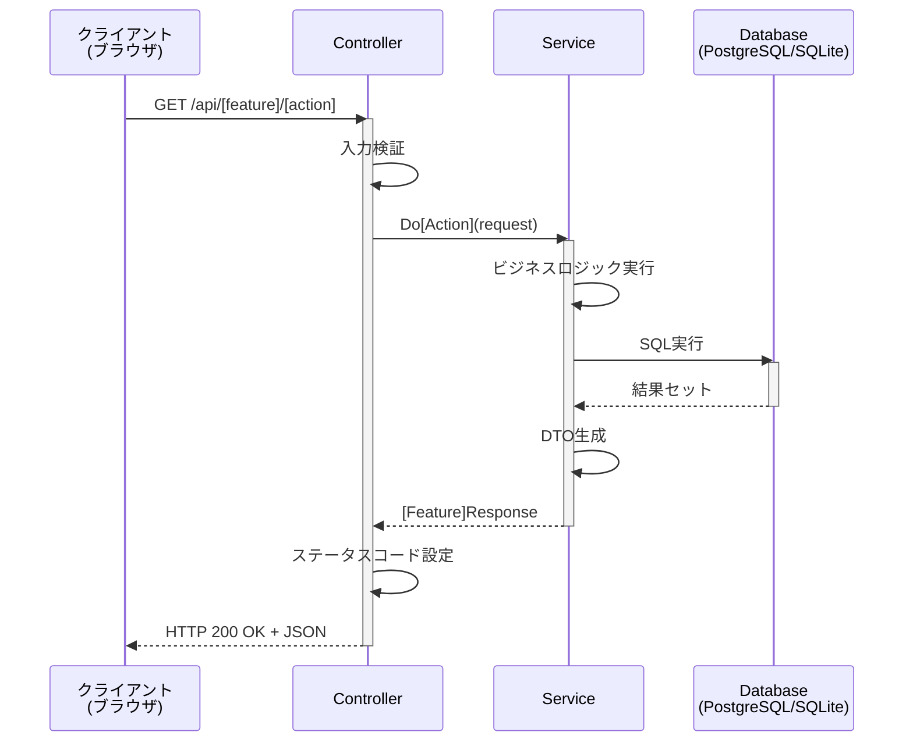
```mermaid
sequenceDiagram
    participant Client as クライアント<br/>(ブラウザ)
    participant Controller as Controller
    participant Service as Service
    participant DB as Database<br/>(PostgreSQL/SQLite)

    Client->>Controller: GET /api/[feature]/[action]
    activate Controller

    Controller->>Controller: 入力検証
    Controller->>Service: Do[Action](request)
    activate Service

    Service->>Service: ビジネスロジック実行
    Service->>DB: SQL実行
    activate DB
    DB-->>Service: 結果セット
    deactivate DB

    Service->>Service: DTO生成
    Service-->>Controller: [Feature]Response
    deactivate Service

    Controller->>Controller: ステータスコード設定
    Controller-->>Client: HTTP 200 OK + JSON
    deactivate Controller
```

**処理ステップ**:
1. クライアントがHTTPリクエストを送信
2. Controller が入力検証（ModelState.IsValid）
3. Service インターフェース経由でビジネスロジック実行
4. Service がデータベースにアクセス
5. Service が結果を DTO に変換
6. Controller が HTTP レスポンスを返却

---

### 1.2 N+1問題デモ（Bad版）の処理フロー

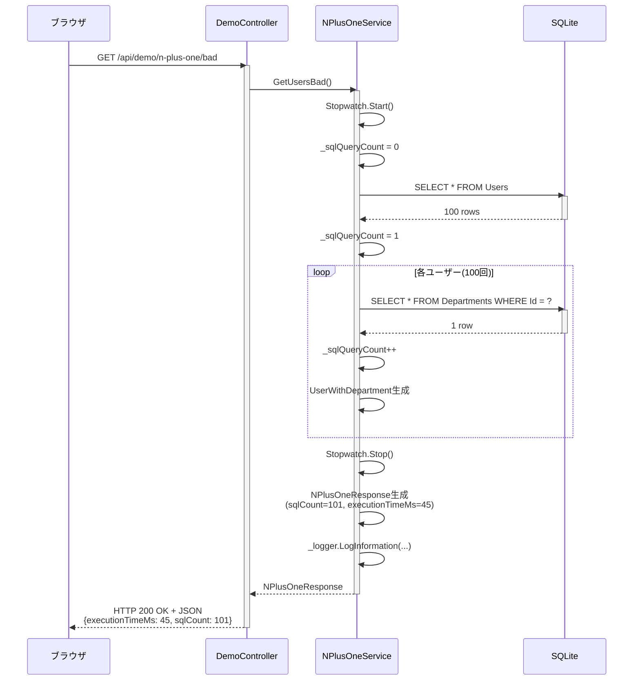
```mermaid
sequenceDiagram
    participant Client as ブラウザ
    participant Controller as DemoController
    participant Service as NPlusOneService
    participant DB as SQLite

    Client->>Controller: GET /api/demo/n-plus-one/bad
    activate Controller

    Controller->>Service: GetUsersBad()
    activate Service

    Service->>Service: Stopwatch.Start()
    Service->>Service: _sqlQueryCount = 0

    Service->>DB: SELECT * FROM Users
    activate DB
    DB-->>Service: 100 rows
    deactivate DB
    Service->>Service: _sqlQueryCount = 1

    loop 各ユーザー(100回)
        Service->>DB: SELECT * FROM Departments WHERE Id = ?
        activate DB
        DB-->>Service: 1 row
        deactivate DB
        Service->>Service: _sqlQueryCount++
        Service->>Service: UserWithDepartment生成
    end

    Service->>Service: Stopwatch.Stop()
    Service->>Service: NPlusOneResponse生成<br/>(sqlCount=101, executionTimeMs=45)
    Service->>Service: _logger.LogInformation(...)
    Service-->>Controller: NPlusOneResponse
    deactivate Service

    Controller-->>Client: HTTP 200 OK + JSON<br/>{executionTimeMs: 45, sqlCount: 101}
    deactivate Controller
```

**ポイント**:
- 1回目: Users テーブルから全ユーザー取得
- 2〜101回目: ループ内で Departments テーブルから個別取得（N+1問題）
- 合計101回のSQL実行
- 実行時間: 約45ms

---

### 1.3 N+1問題デモ（Good版）の処理フロー

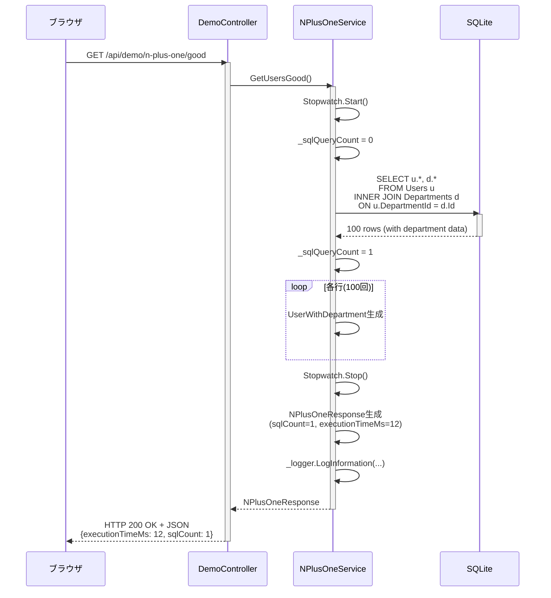
```mermaid
sequenceDiagram
    participant Client as ブラウザ
    participant Controller as DemoController
    participant Service as NPlusOneService
    participant DB as SQLite

    Client->>Controller: GET /api/demo/n-plus-one/good
    activate Controller

    Controller->>Service: GetUsersGood()
    activate Service

    Service->>Service: Stopwatch.Start()
    Service->>Service: _sqlQueryCount = 0

    Service->>DB: SELECT u.*, d.*<br/>FROM Users u<br/>INNER JOIN Departments d<br/>ON u.DepartmentId = d.Id
    activate DB
    DB-->>Service: 100 rows (with department data)
    deactivate DB
    Service->>Service: _sqlQueryCount = 1

    loop 各行(100回)
        Service->>Service: UserWithDepartment生成
    end

    Service->>Service: Stopwatch.Stop()
    Service->>Service: NPlusOneResponse生成<br/>(sqlCount=1, executionTimeMs=12)
    Service->>Service: _logger.LogInformation(...)
    Service-->>Controller: NPlusOneResponse
    deactivate Service

    Controller-->>Client: HTTP 200 OK + JSON<br/>{executionTimeMs: 12, sqlCount: 1}
    deactivate Controller
```

**ポイント**:
- 1回のJOINクエリで全データを取得
- 合計1回のSQL実行
- 実行時間: 約12ms（Bad版の1/4）

---

## 2. エラーハンドリングフロー

### 2.1 データベース接続エラー

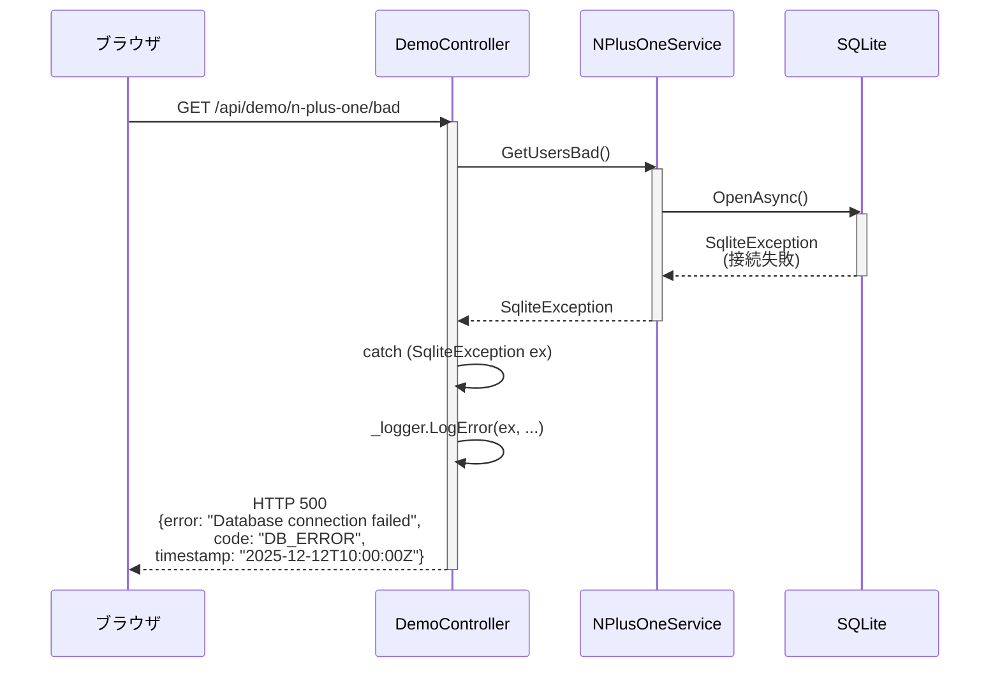
```mermaid
sequenceDiagram
    participant Client as ブラウザ
    participant Controller as DemoController
    participant Service as NPlusOneService
    participant DB as SQLite

    Client->>Controller: GET /api/demo/n-plus-one/bad
    activate Controller

    Controller->>Service: GetUsersBad()
    activate Service

    Service->>DB: OpenAsync()
    activate DB
    DB-->>Service: SqliteException<br/>(接続失敗)
    deactivate DB

    Service-->>Controller: SqliteException
    deactivate Service

    Controller->>Controller: catch (SqliteException ex)
    Controller->>Controller: _logger.LogError(ex, ...)
    Controller-->>Client: HTTP 500<br/>{error: "Database connection failed",<br/>code: "DB_ERROR",<br/>timestamp: "2025-12-12T10:00:00Z"}
    deactivate Controller
```

**エラーレスポンス例**:
```json
{
  "error": "Database connection failed",
  "code": "DB_ERROR",
  "timestamp": "2025-12-12T10:00:00Z"
}
```

---

### 2.2 予期しないエラー

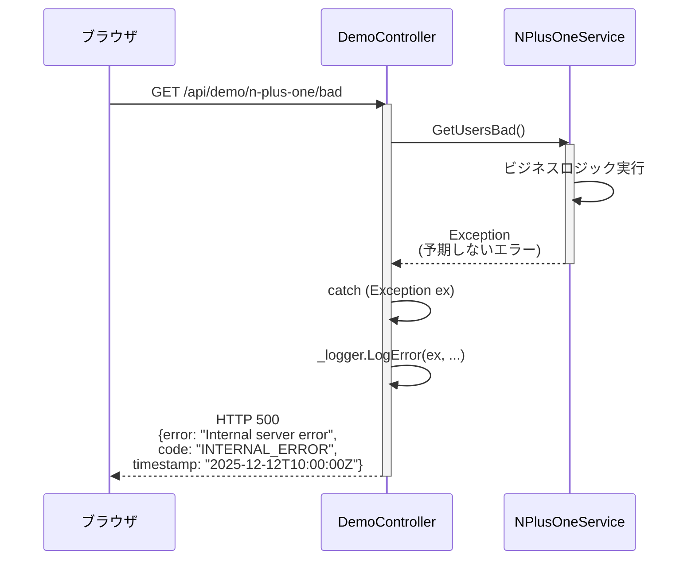
```mermaid
sequenceDiagram
    participant Client as ブラウザ
    participant Controller as DemoController
    participant Service as NPlusOneService

    Client->>Controller: GET /api/demo/n-plus-one/bad
    activate Controller

    Controller->>Service: GetUsersBad()
    activate Service

    Service->>Service: ビジネスロジック実行
    Service-->>Controller: Exception<br/>(予期しないエラー)
    deactivate Service

    Controller->>Controller: catch (Exception ex)
    Controller->>Controller: _logger.LogError(ex, ...)
    Controller-->>Client: HTTP 500<br/>{error: "Internal server error",<br/>code: "INTERNAL_ERROR",<br/>timestamp: "2025-12-12T10:00:00Z"}
    deactivate Controller
```

**エラーレスポンス例**:
```json
{
  "error": "Internal server error",
  "code": "INTERNAL_ERROR",
  "timestamp": "2025-12-12T10:00:00Z"
}
```

---

### 2.3 バリデーションエラー

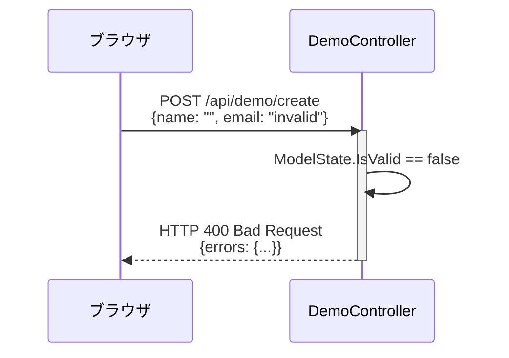
```mermaid
sequenceDiagram
    participant Client as ブラウザ
    participant Controller as DemoController

    Client->>Controller: POST /api/demo/create<br/>{name: "", email: "invalid"}
    activate Controller

    Controller->>Controller: ModelState.IsValid == false
    Controller-->>Client: HTTP 400 Bad Request<br/>{errors: {...}}
    deactivate Controller
```

**エラーレスポンス例**:
```json
{
  "errors": {
    "Name": ["The Name field is required."],
    "Email": ["The Email field is not a valid e-mail address."]
  }
}
```

---

## 3. 認証・認可フロー

### 3.1 Supabase認証フロー

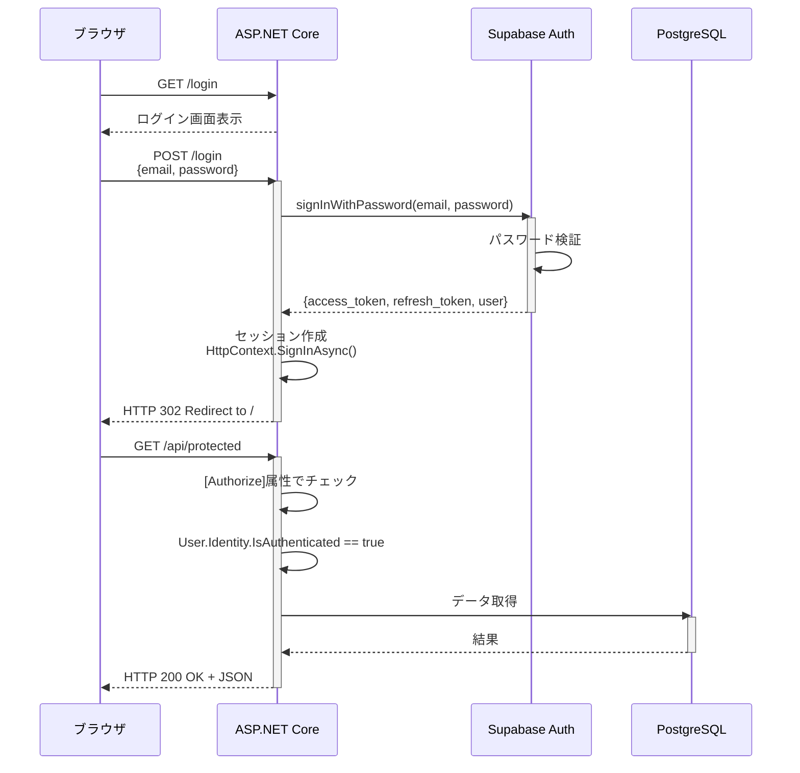
```mermaid
sequenceDiagram
    participant Client as ブラウザ
    participant App as ASP.NET Core
    participant Supabase as Supabase Auth
    participant DB as PostgreSQL

    Client->>App: GET /login
    App-->>Client: ログイン画面表示

    Client->>App: POST /login<br/>{email, password}
    activate App

    App->>Supabase: signInWithPassword(email, password)
    activate Supabase
    Supabase->>Supabase: パスワード検証
    Supabase-->>App: {access_token, refresh_token, user}
    deactivate Supabase

    App->>App: セッション作成<br/>HttpContext.SignInAsync()
    App-->>Client: HTTP 302 Redirect to /
    deactivate App

    Client->>App: GET /api/protected
    activate App
    App->>App: [Authorize]属性でチェック
    App->>App: User.Identity.IsAuthenticated == true
    App->>DB: データ取得
    activate DB
    DB-->>App: 結果
    deactivate DB
    App-->>Client: HTTP 200 OK + JSON
    deactivate App
```

**ポイント**:
- Supabase がパスワード検証を実施
- ASP.NET Core がセッション管理
- `[Authorize]` 属性で認可制御

---

### 3.2 認証失敗フロー

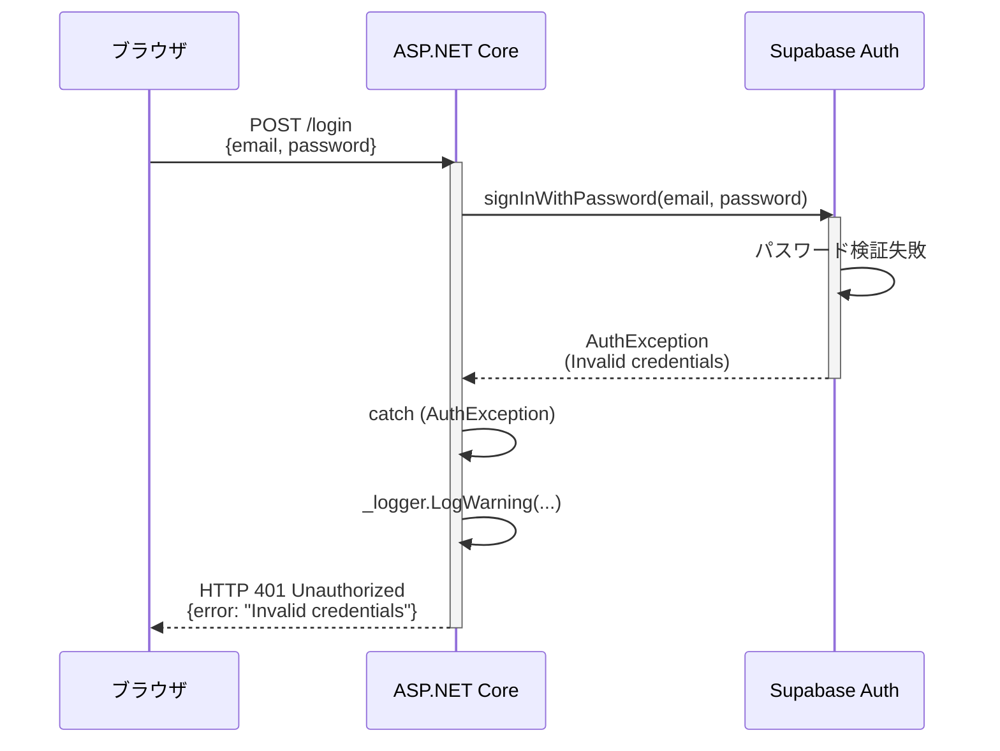
```mermaid
sequenceDiagram
    participant Client as ブラウザ
    participant App as ASP.NET Core
    participant Supabase as Supabase Auth

    Client->>App: POST /login<br/>{email, password}
    activate App

    App->>Supabase: signInWithPassword(email, password)
    activate Supabase
    Supabase->>Supabase: パスワード検証失敗
    Supabase-->>App: AuthException<br/>(Invalid credentials)
    deactivate Supabase

    App->>App: catch (AuthException)
    App->>App: _logger.LogWarning(...)
    App-->>Client: HTTP 401 Unauthorized<br/>{error: "Invalid credentials"}
    deactivate App
```

---

## 4. データベーストランザクションフロー

### 4.1 トランザクション成功フロー

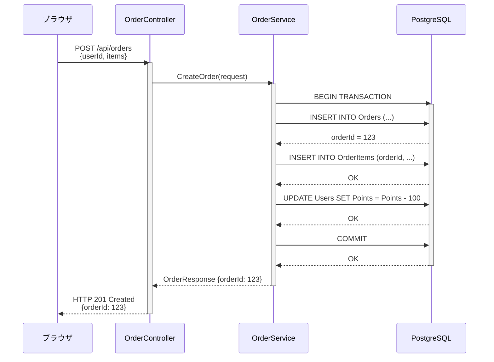
```mermaid
sequenceDiagram
    participant Client as ブラウザ
    participant Controller as OrderController
    participant Service as OrderService
    participant DB as PostgreSQL

    Client->>Controller: POST /api/orders<br/>{userId, items}
    activate Controller

    Controller->>Service: CreateOrder(request)
    activate Service

    Service->>DB: BEGIN TRANSACTION
    activate DB

    Service->>DB: INSERT INTO Orders (...)
    DB-->>Service: orderId = 123

    Service->>DB: INSERT INTO OrderItems (orderId, ...)
    DB-->>Service: OK

    Service->>DB: UPDATE Users SET Points = Points - 100
    DB-->>Service: OK

    Service->>DB: COMMIT
    DB-->>Service: OK
    deactivate DB

    Service-->>Controller: OrderResponse {orderId: 123}
    deactivate Service

    Controller-->>Client: HTTP 201 Created<br/>{orderId: 123}
    deactivate Controller
```

**ポイント**:
- `BEGIN TRANSACTION` でトランザクション開始
- 複数のINSERT/UPDATEを実行
- `COMMIT` で確定

---

### 4.2 トランザクションロールバックフロー

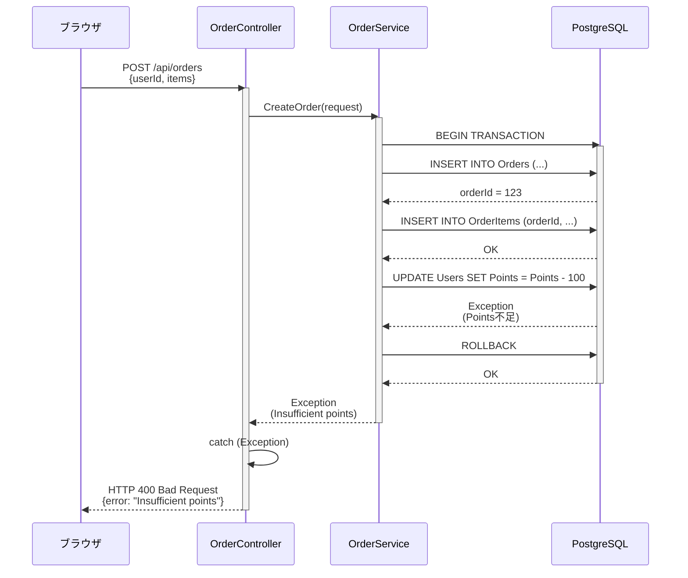
```mermaid
sequenceDiagram
    participant Client as ブラウザ
    participant Controller as OrderController
    participant Service as OrderService
    participant DB as PostgreSQL

    Client->>Controller: POST /api/orders<br/>{userId, items}
    activate Controller

    Controller->>Service: CreateOrder(request)
    activate Service

    Service->>DB: BEGIN TRANSACTION
    activate DB

    Service->>DB: INSERT INTO Orders (...)
    DB-->>Service: orderId = 123

    Service->>DB: INSERT INTO OrderItems (orderId, ...)
    DB-->>Service: OK

    Service->>DB: UPDATE Users SET Points = Points - 100
    DB-->>Service: Exception<br/>(Points不足)

    Service->>DB: ROLLBACK
    DB-->>Service: OK
    deactivate DB

    Service-->>Controller: Exception<br/>(Insufficient points)
    deactivate Service

    Controller->>Controller: catch (Exception)
    Controller-->>Client: HTTP 400 Bad Request<br/>{error: "Insufficient points"}
    deactivate Controller
```

**ポイント**:
- エラー発生時に `ROLLBACK` で全変更を取り消し
- データの整合性を保証

---

## 5. 非同期処理フロー

### 5.1 async/await パターン

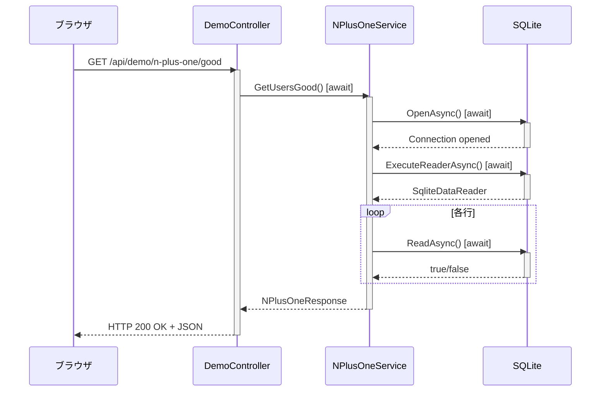
```mermaid
sequenceDiagram
    participant Client as ブラウザ
    participant Controller as DemoController
    participant Service as NPlusOneService
    participant DB as SQLite

    Client->>Controller: GET /api/demo/n-plus-one/good
    activate Controller

    Controller->>Service: GetUsersGood() [await]
    activate Service

    Service->>DB: OpenAsync() [await]
    activate DB
    DB-->>Service: Connection opened
    deactivate DB

    Service->>DB: ExecuteReaderAsync() [await]
    activate DB
    DB-->>Service: SqliteDataReader
    deactivate DB

    loop 各行
        Service->>DB: ReadAsync() [await]
        activate DB
        DB-->>Service: true/false
        deactivate DB
    end

    Service-->>Controller: NPlusOneResponse
    deactivate Service

    Controller-->>Client: HTTP 200 OK + JSON
    deactivate Controller
```

**ポイント**:
- すべてのデータベースアクセスは非同期（`Async` メソッド）
- `await` で非同期処理を待機
- スレッドをブロックせずにI/O待機

---

## 6. ログ出力フロー

### 6.1 成功時のログ出力

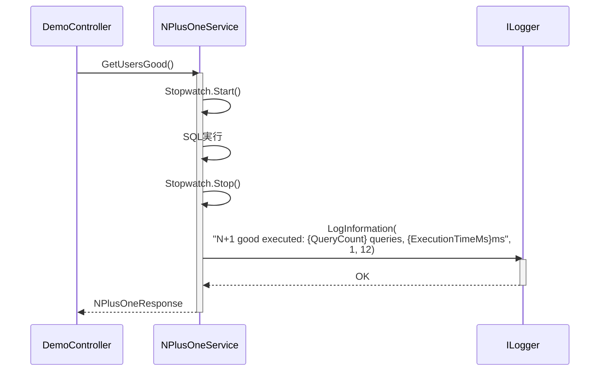
```mermaid
sequenceDiagram
    participant Controller as DemoController
    participant Service as NPlusOneService
    participant Logger as ILogger

    Controller->>Service: GetUsersGood()
    activate Service

    Service->>Service: Stopwatch.Start()
    Service->>Service: SQL実行
    Service->>Service: Stopwatch.Stop()

    Service->>Logger: LogInformation(<br/>"N+1 good executed: {QueryCount} queries, {ExecutionTimeMs}ms",<br/>1, 12)
    activate Logger
    Logger-->>Service: OK
    deactivate Logger

    Service-->>Controller: NPlusOneResponse
    deactivate Service
```

**ログ出力例**:
```
[2025-12-12 10:00:00] [Information] N+1 good executed: 1 queries, 12ms
```

---

### 6.2 エラー時のログ出力

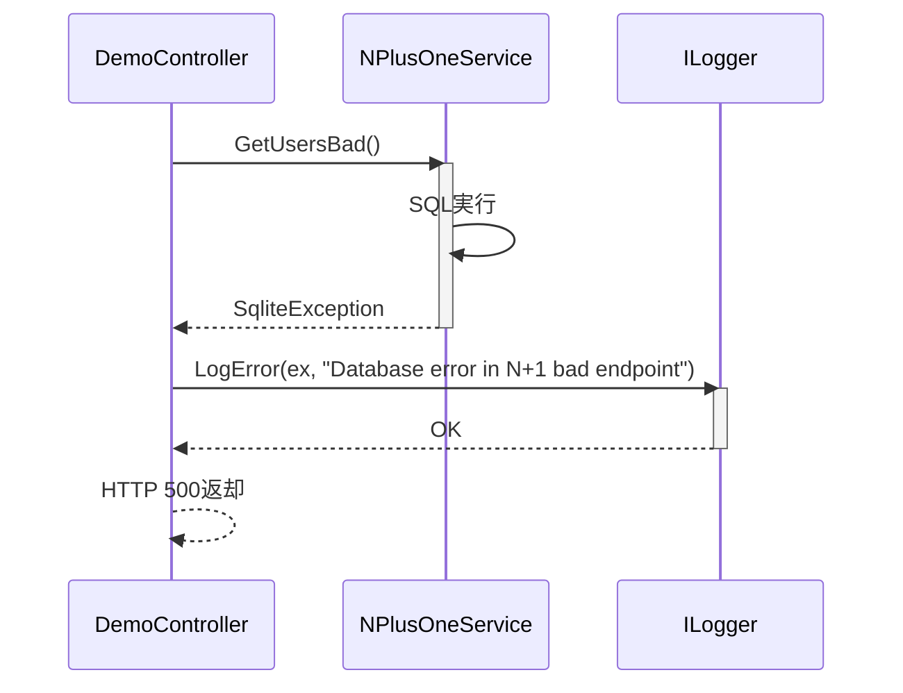
```mermaid
sequenceDiagram
    participant Controller as DemoController
    participant Service as NPlusOneService
    participant Logger as ILogger

    Controller->>Service: GetUsersBad()
    activate Service

    Service->>Service: SQL実行
    Service-->>Controller: SqliteException
    deactivate Service

    Controller->>Logger: LogError(ex, "Database error in N+1 bad endpoint")
    activate Logger
    Logger-->>Controller: OK
    deactivate Logger

    Controller-->>Controller: HTTP 500返却
```

**ログ出力例**:
```
[2025-12-12 10:00:00] [Error] Database error in N+1 bad endpoint
Microsoft.Data.Sqlite.SqliteException: SQLite Error 14: 'unable to open database file'.
   at NPlusOneService.GetUsersBad() in NPlusOneService.cs:line 45
```

---

## 7. キャッシュ利用フロー

### 7.1 キャッシュヒット

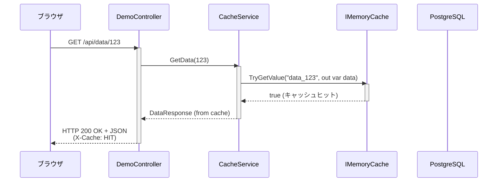
```mermaid
sequenceDiagram
    participant Client as ブラウザ
    participant Controller as DemoController
    participant Service as CacheService
    participant Cache as IMemoryCache
    participant DB as PostgreSQL

    Client->>Controller: GET /api/data/123
    activate Controller

    Controller->>Service: GetData(123)
    activate Service

    Service->>Cache: TryGetValue("data_123", out var data)
    activate Cache
    Cache-->>Service: true (キャッシュヒット)
    deactivate Cache

    Service-->>Controller: DataResponse (from cache)
    deactivate Service

    Controller-->>Client: HTTP 200 OK + JSON<br/>(X-Cache: HIT)
    deactivate Controller
```

**ポイント**:
- キャッシュヒット時はデータベースアクセスなし
- レスポンスヘッダーで `X-Cache: HIT` を返却

---

### 7.2 キャッシュミス

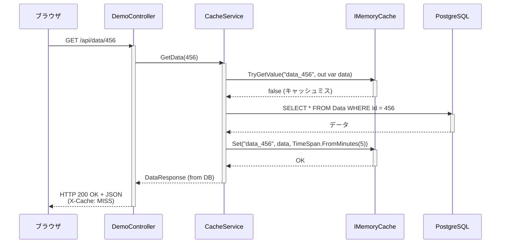
```mermaid
sequenceDiagram
    participant Client as ブラウザ
    participant Controller as DemoController
    participant Service as CacheService
    participant Cache as IMemoryCache
    participant DB as PostgreSQL

    Client->>Controller: GET /api/data/456
    activate Controller

    Controller->>Service: GetData(456)
    activate Service

    Service->>Cache: TryGetValue("data_456", out var data)
    activate Cache
    Cache-->>Service: false (キャッシュミス)
    deactivate Cache

    Service->>DB: SELECT * FROM Data WHERE Id = 456
    activate DB
    DB-->>Service: データ
    deactivate DB

    Service->>Cache: Set("data_456", data, TimeSpan.FromMinutes(5))
    activate Cache
    Cache-->>Service: OK
    deactivate Cache

    Service-->>Controller: DataResponse (from DB)
    deactivate Service

    Controller-->>Client: HTTP 200 OK + JSON<br/>(X-Cache: MISS)
    deactivate Controller
```

**ポイント**:
- キャッシュミス時はデータベースからデータ取得
- 取得したデータをキャッシュに保存（5分間）
- レスポンスヘッダーで `X-Cache: MISS` を返却

---

## 8. ページネーション処理フロー

### 8.1 ページネーション取得

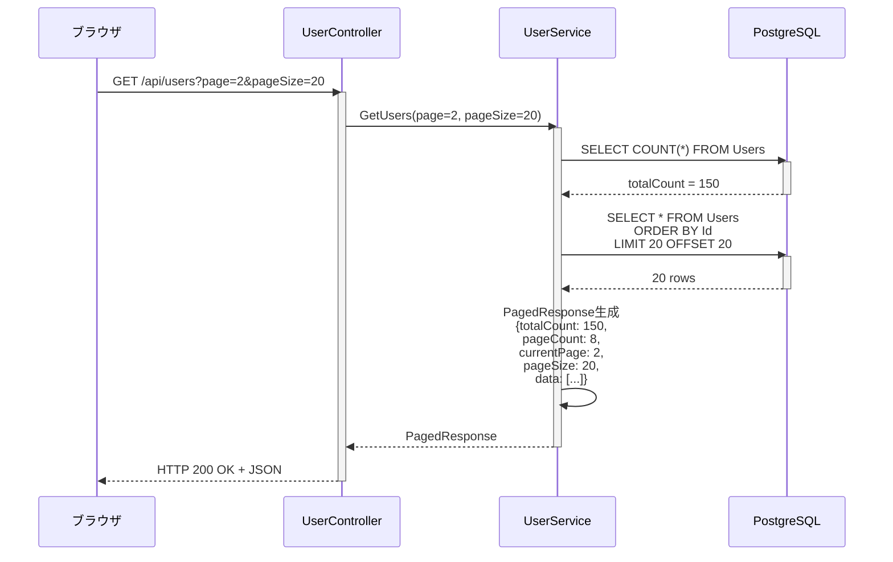
```mermaid
sequenceDiagram
    participant Client as ブラウザ
    participant Controller as UserController
    participant Service as UserService
    participant DB as PostgreSQL

    Client->>Controller: GET /api/users?page=2&pageSize=20
    activate Controller

    Controller->>Service: GetUsers(page=2, pageSize=20)
    activate Service

    Service->>DB: SELECT COUNT(*) FROM Users
    activate DB
    DB-->>Service: totalCount = 150
    deactivate DB

    Service->>DB: SELECT * FROM Users<br/>ORDER BY Id<br/>LIMIT 20 OFFSET 20
    activate DB
    DB-->>Service: 20 rows
    deactivate DB

    Service->>Service: PagedResponse生成<br/>{totalCount: 150,<br/>pageCount: 8,<br/>currentPage: 2,<br/>pageSize: 20,<br/>data: [...]}

    Service-->>Controller: PagedResponse
    deactivate Service

    Controller-->>Client: HTTP 200 OK + JSON
    deactivate Controller
```

**レスポンス例**:
```json
{
  "totalCount": 150,
  "pageCount": 8,
  "currentPage": 2,
  "pageSize": 20,
  "data": [
    {"id": 21, "name": "User 21"},
    {"id": 22, "name": "User 22"},
    ...
  ]
}
```

---

## 9. 参考

- [アーキテクチャ設計](architecture.md)
- [クラス図](class-diagram.md)
- [サンプル実装: N+1問題デモ](../features/n-plus-one-demo/internal-design.md)
- [ADR-002: ORMを使わず素のSQLを採用](../adr/002-avoid-orm-use-raw-sql.md)
