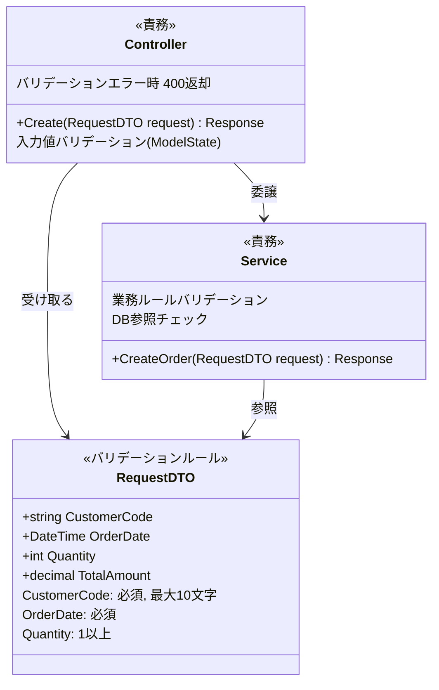
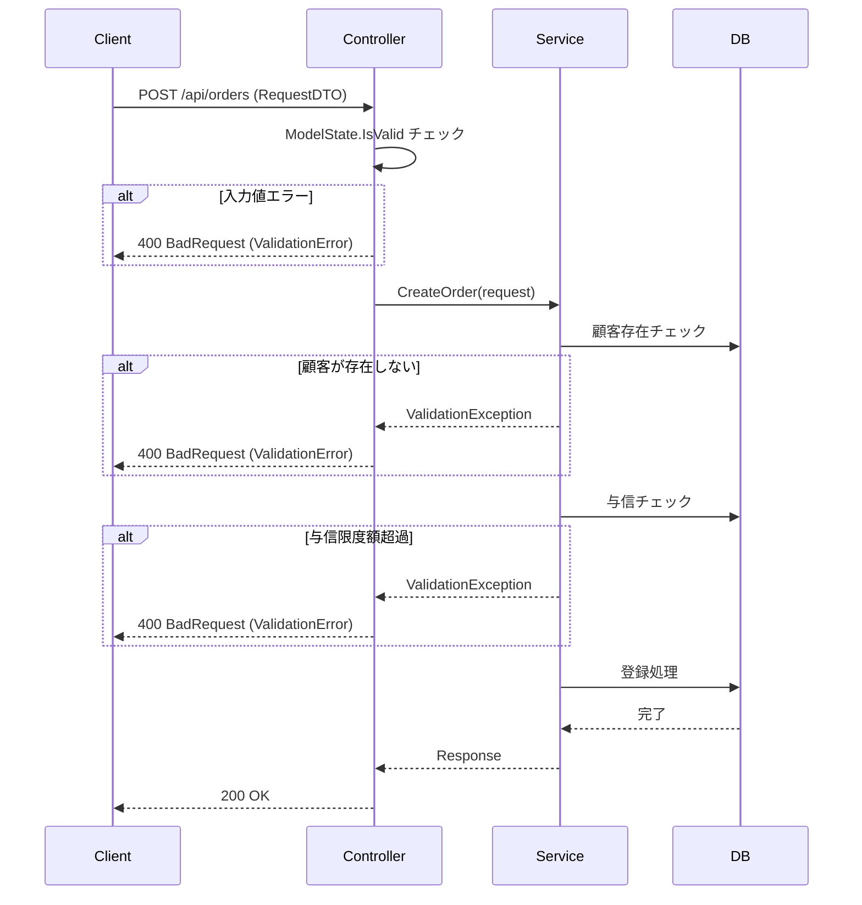

# バリデーション設計

## 文書情報
- **作成日**: 2026-03-07
- **バージョン**: 1.0
- **ステータス**: ドラフト

---

## 1. 基本方針

> **バックエンドのバリデーションは必須。フロントエンドのバリデーションはUX改善のオプション。**

フロントエンドのチェックはブラウザの開発ツールで簡単に回避できるため、セキュリティ・データ整合性の保証はバックエンドで必ず行う。

---

## 2. エラーチェックの分類と実装場所

### 2.1 チェックの3分類

| 分類 | 説明 | 実装層 |
|------|------|--------|
| **単項目チェック** | 1フィールド単独の検証（必須・文字数・形式） | プレゼンテーション層（Controller） |
| **複数項目関連チェック** | 複数フィールドの組み合わせ検証 | ビジネス層（Service） |
| **業務タイミングチェック** | DB参照・業務ルール・排他制御 | ビジネス層（Service） |

### 2.2 フロントエンド vs バックエンド 判断基準

| チェック内容 | 分類 | フロント | バックエンド | 理由 |
|------------|------|---------|------------|------|
| 必須入力 | 単項目 | ○（即時フィードバック） | ○（必須） | UX改善 + セキュリティ |
| 文字数制限 | 単項目 | ○（即時フィードバック） | ○（必須） | UX改善 + DB制約保護 |
| 数値範囲 | 単項目 | ○（即時フィードバック） | ○（必須） | UX改善 + セキュリティ |
| メール形式 | 単項目 | ○（即時フィードバック） | ○（必須） | UX改善 + セキュリティ |
| 重複チェック（DB参照） | 業務タイミング | ✕ | ○（必須） | DB参照が必要なため |
| 業務ルール（複数テーブル） | 複数項目関連 | ✕ | ○（必須） | DB参照が必要なため |
| 認証・認可チェック | 業務タイミング | ✕ | ○（必須） | フロントは改ざん可能なため |

---

## 3. バックエンドのバリデーション実装

### 3.1 クラス構造

RequestDTOにバリデーションルールを宣言的に定義し、Service層で業務ルールチェックを行う。



### 3.2 バリデーションフロー



---

## 4. エラーレスポンス形式

バリデーションエラーは統一した形式で返す。

```json
{
  "type": "ValidationError",
  "errors": [
    {
      "field": "CustomerCode",
      "message": "顧客コードは必須です"
    },
    {
      "field": "Quantity",
      "message": "数量は1以上で入力してください"
    }
  ],
  "timestamp": "2026-03-07T00:00:00Z"
}
```

---

## 5. 未決事項

- [ ] フロントエンドのバリデーションライブラリの選定（Blazorの標準機能で対応するか）
- [ ] 業務ルールのバリデーション例外クラスを共通化するか
- [ ] バリデーションエラーのログ出力要否

---

## 6. 参考

- [クラス図](class-diagram.md)
- [エラーハンドリング設計](error-handling.md)
