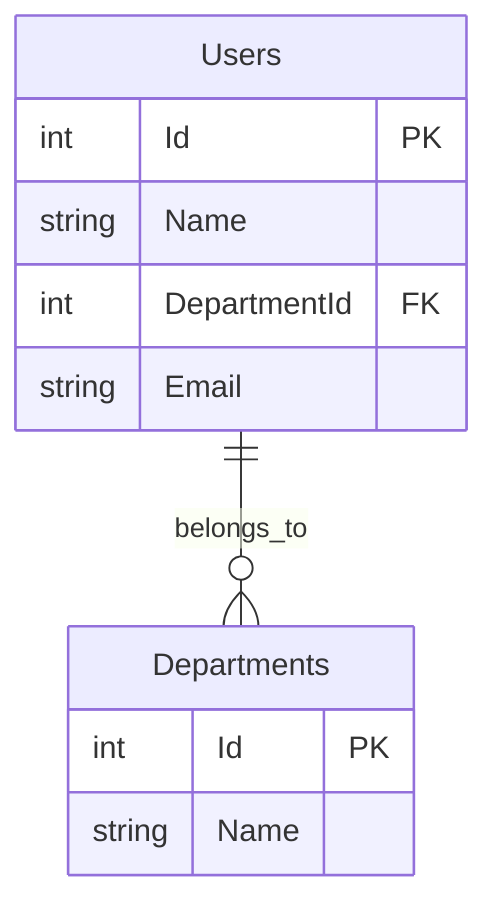

# データベース設計（論理）

## ER図

---

## エンティティ一覧

### 教育用（SQLite）

| No | エンティティ名 | 論理名 | 概要 |
|----|-------------|--------|------|
| E-01 | Users | ユーザー | デモ用ユーザーデータ |
| E-02 | Departments | 部署 | デモ用部署データ |

### 基幹システム（PostgreSQL/Supabase）

| No | エンティティ名 | 論理名 | 概要 | ステータス |
|----|-------------|--------|------|----------|
| E-03 | Products | 商品マスタ | 商品情報 | 🚧 未実装 |
| E-04 | Inventory | 在庫 | 在庫数量 | 🚧 未実装 |
| E-05 | Sales | 売上 | 売上伝票 | 🚧 未実装 |
| E-06 | Productions | 生産計画 | 生産計画 | 🚧 未実装 |

---

## エンティティ定義

### Users（ユーザー）

**用途**: エンジニア教育用デモ - N+1問題

| カラム名 | 型 | NULL | 制約 | 説明 |
|---------|-----|------|------|------|
| Id | INT | NOT NULL | PK | ユーザーID |
| Name | VARCHAR(100) | NOT NULL | - | ユーザー名 |
| DepartmentId | INT | NOT NULL | FK | 部署ID |
| Email | VARCHAR(255) | NOT NULL | UNIQUE | メールアドレス |

**リレーション**:
- Departments.Id (1対多)

---

### Departments（部署）

**用途**: エンジニア教育用デモ - N+1問題

| カラム名 | 型 | NULL | 制約 | 説明 |
|---------|-----|------|------|------|
| Id | INT | NOT NULL | PK | 部署ID |
| Name | VARCHAR(100) | NOT NULL | - | 部署名 |

**リレーション**:
- Users.DepartmentId (多対1)

---

## データベース分離戦略

### 教育用デモ: SQLite
- **用途**: エンジニア教育、デモ、学習
- **理由**: セットアップ不要、軽量、ポータブル
- **データ**: Users, Departments（デモ用100件）
- **詳細**: [ADR-001: SQLiteを教育用デモに採用](../adr/001-use-sqlite-for-education.md)

### 基幹システム: PostgreSQL (Supabase)
- **用途**: 在庫管理、販売管理、生産管理
- **理由**: スケーラビリティ、本番運用
- **データ**: Products, Inventory, Sales, Productions
- **接続先**: https://jfopjsynoorupqptjlep.supabase.co

---

## 参考

- [ADR-001: SQLiteを教育用デモに採用](../adr/001-use-sqlite-for-education.md)
- [ADR-002: ORMを使わず素のSQLを採用](../adr/002-avoid-orm-use-raw-sql.md)
