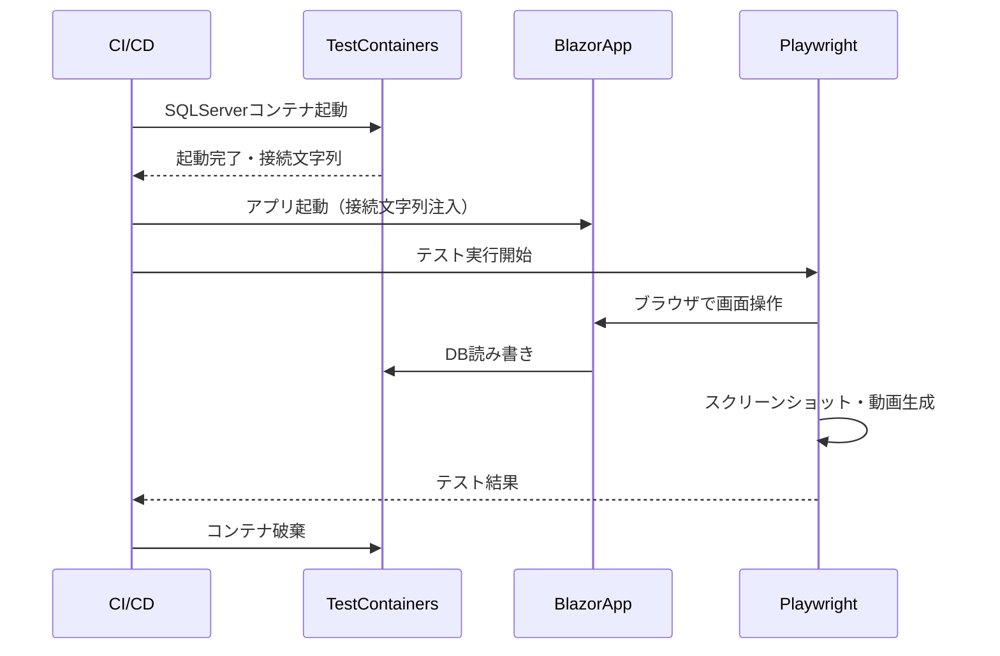

# E2Eテスト - 内部設計書

## 文書情報
- **作成日**: 2026-03-22
- **バージョン**: 1.0
- **ステータス**: Draft（TestContainersは未実装）

## 変更履歴
| 日付 | バージョン | 変更者 | 変更内容 |
|------|----------|--------|---------|
| 2026-03-22 | 1.0 | - | 初版作成 |

---

## 1. 技術スタック

| 役割 | ツール | 理由 |
|------|--------|------|
| ブラウザ自動操作 | Microsoft.Playwright | C#ネイティブ対応・スクショ・動画生成が可能 |
| DBコンテナ | TestContainers（予定） | テスト用の独立したDBを起動し、レコードの挿入・変更・削除を伴うテストが実行できる |
| テストフレームワーク | NUnit | Playwright公式サポート |

---

## 2. プロジェクト構成

```
BlazorApp.E2ETests/
├── HomePageTests.cs              ← ホーム画面
├── CalculatorPageTests.cs        ← 計算機画面
├── OrdersPageTests.cs            ← 注文画面
├── AccessibilityTests.cs         ← アクセシビリティ確認
├── LoggingDemoTests.cs           ← ログデモ
├── ValidationDemoTests.cs        ← バリデーションデモ
├── ErrorHandlingDemoTests.cs     ← エラーハンドリングデモ
├── LikeSearchDemoTests.cs        ← LIKE検索デモ
├── NPlusOneDemoTests.cs          ← N+1デモ
├── FullScanDemoTests.cs          ← フルスキャンデモ
├── SelectStarDemoTests.cs        ← SELECT *デモ
├── RepositoryDemoTests.cs        ← Repositoryパターンデモ
├── FactoryMethodDemoTests.cs     ← Factory Methodパターンデモ
├── StrategyDemoTests.cs          ← Strategyパターンデモ
├── ObserverDemoTests.cs          ← Observerパターンデモ
├── DecoratorDemoTests.cs         ← Decoratorパターンデモ
├── CommandDemoTests.cs           ← Commandパターンデモ
└── bin/Debug/net10.0/
    ├── screenshots/              ← スクリーンショット出力先（自動生成）
    └── videos/                   ← 動画出力先（自動生成）
```

---

## 3. テスト実行方法

### 3.1 前提条件

- .NET 10 SDK インストール済み
- アプリがローカルで起動していること（`http://localhost:5000/dotnet`）
- Playwrightブラウザが初回インストール済みであること

### 3.2 Playwrightブラウザのインストール（初回のみ）

```bash
cd BlazorApp.E2ETests
pwsh bin/Debug/net10.0/.playwright/package/bin/playwright.ps1 install
```

### 3.3 テスト実行

```bash
# 全E2Eテストを実行
dotnet test BlazorApp.E2ETests/

# 特定のテストクラスのみ実行
dotnet test BlazorApp.E2ETests/ --filter "ClassName=HomePageTests"

# 特定のテストメソッドのみ実行
dotnet test BlazorApp.E2ETests/ --filter "FullyQualifiedName~HomePage_Loads_Successfully"
```

### 3.4 出力物の確認

テスト実行後、以下のフォルダに自動生成される。

```
BlazorApp.E2ETests/bin/Debug/net10.0/
├── screenshots/    ← スクリーンショット（.png）
└── videos/         ← 動画（.webm）
```

---

## 4. Playwright設定

### 4.1 スクリーンショット

各テストのキーポイントで撮影する。

```csharp
await Page.ScreenshotAsync(new PageScreenshotOptions
{
    Path = $"screenshots/{テスト名}.png",
    FullPage = true
});
```

### 4.2 動画録画

テスト開始時にコンテキスト単位で動画録画を有効化する。

```csharp
var context = await Browser.NewContextAsync(new BrowserNewContextOptions
{
    RecordVideoDir = "videos/",
    RecordVideoSize = new RecordVideoSize { Width = 1280, Height = 720 }
});
```

**動画の使い道**:
- テスト証跡として保管
- 操作マニュアル素材として再利用（マニュアル手動更新コストをゼロにする）

### 4.3 ベースURL

```csharp
private const string BaseUrl = "http://localhost:5000/dotnet";
```

ローカル起動中のアプリに対してテストを実行する。

---

## 5. TestContainers構成（未実装・設計）

### 5.1 採用理由

| 比較 | SQLiteインメモリ | TestContainers |
|------|---------------|---------------|
| 本番再現度 | 低（SQLiteとSQLServerは挙動が異なる） | 高（本番と同じDBエンジン） |
| 速度 | 速い | やや遅い（Docker起動あり） |
| E2Eとの相性 | 悪い（アプリと別プロセス） | 良い（コンテナで完結） |

**E2Eテストでは本番と同じDB環境を使うべき**のため、TestContainersを採用する。

### 5.2 構成イメージ

```
テスト起動
→ TestContainersがSQLServerコンテナを起動
→ マイグレーション・初期データ投入
→ Playwrightがブラウザを起動してアプリを操作
→ スクリーンショット・動画を生成
→ テスト終了後にコンテナを破棄
```

### 5.3 実装予定コード

```csharp
// NuGet: Testcontainers.MsSql
var sqlContainer = new MsSqlBuilder()
    .WithPassword("YourPassword123!")
    .Build();

await sqlContainer.StartAsync();

// 接続文字列をアプリに注入してテスト実行
var connectionString = sqlContainer.GetConnectionString();
```

---

## 6. テスト命名規則

```
{画面名}_{操作内容}_{期待結果}
```

例：
- `HomePage_Loads_Successfully`
- `OrdersPage_PriceCalculation_Works`
- `OrdersPage_BulkDiscount_Applies`

---

## 7. シーケンス図



---

## 8. CI/CD連携

```yaml
# GitHub Actions（概要）
- name: E2Eテスト実行
  run: dotnet test BlazorApp.E2ETests/
  # TestContainersが自動でDockerコンテナを起動・破棄する

- name: テスト証跡をアーティファクトとして保存
  uses: actions/upload-artifact@v3
  with:
    name: e2e-evidence
    path: |
      screenshots/
      videos/
```

---

## 9. 参考

- [E2Eテスト外部設計書](e2e-test-external.md)
- [テスト設計（共通）](testing.md)
- [ADR-003: テストプロジェクト分離](../adr/003-test-project-separation.md)
