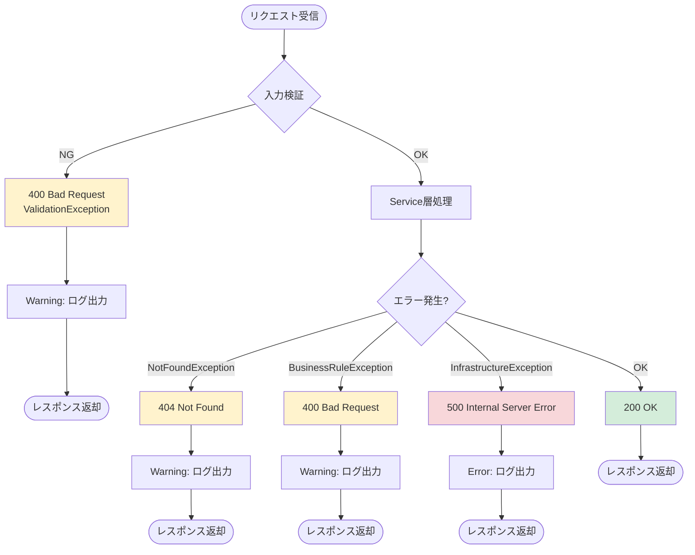
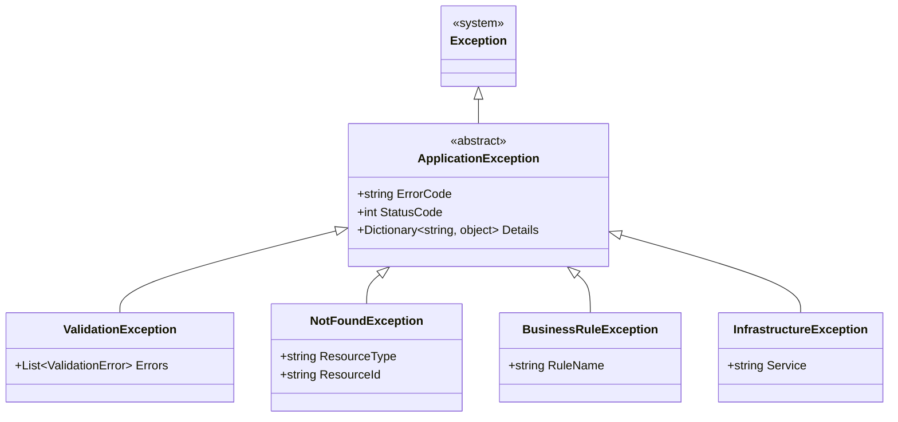
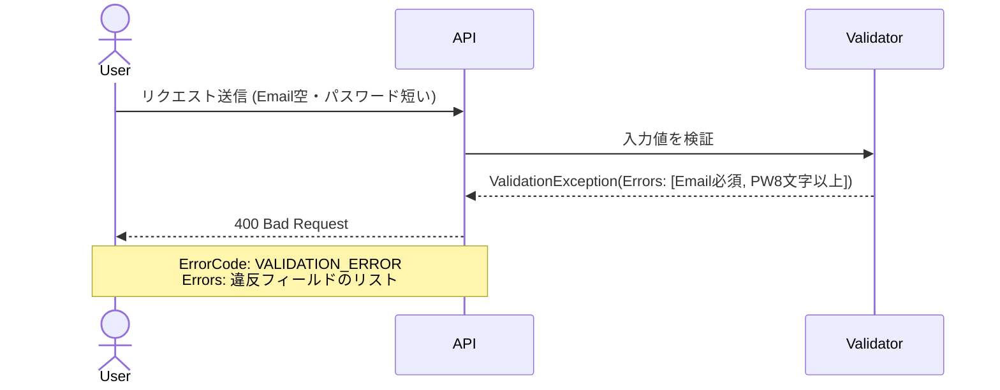
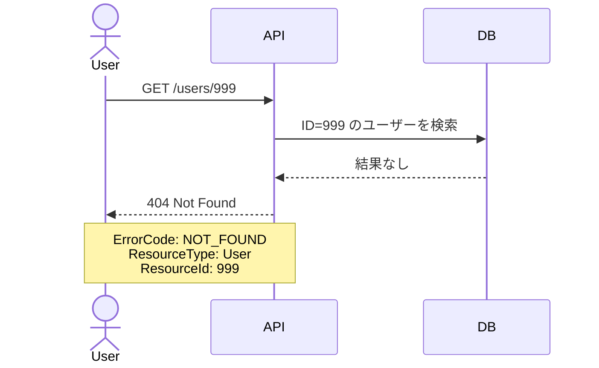
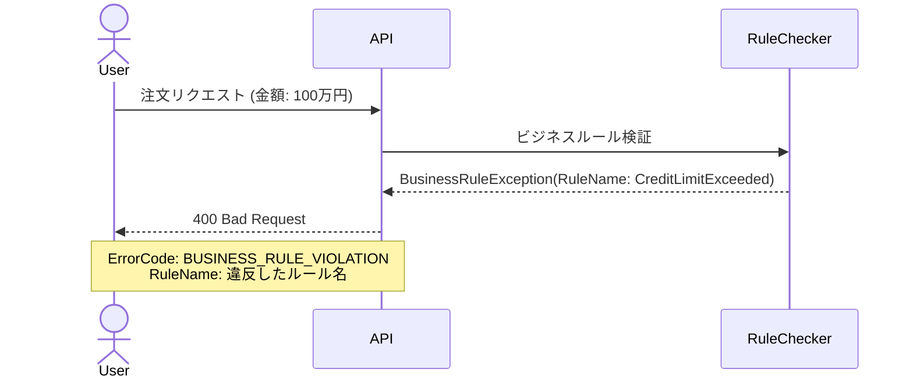
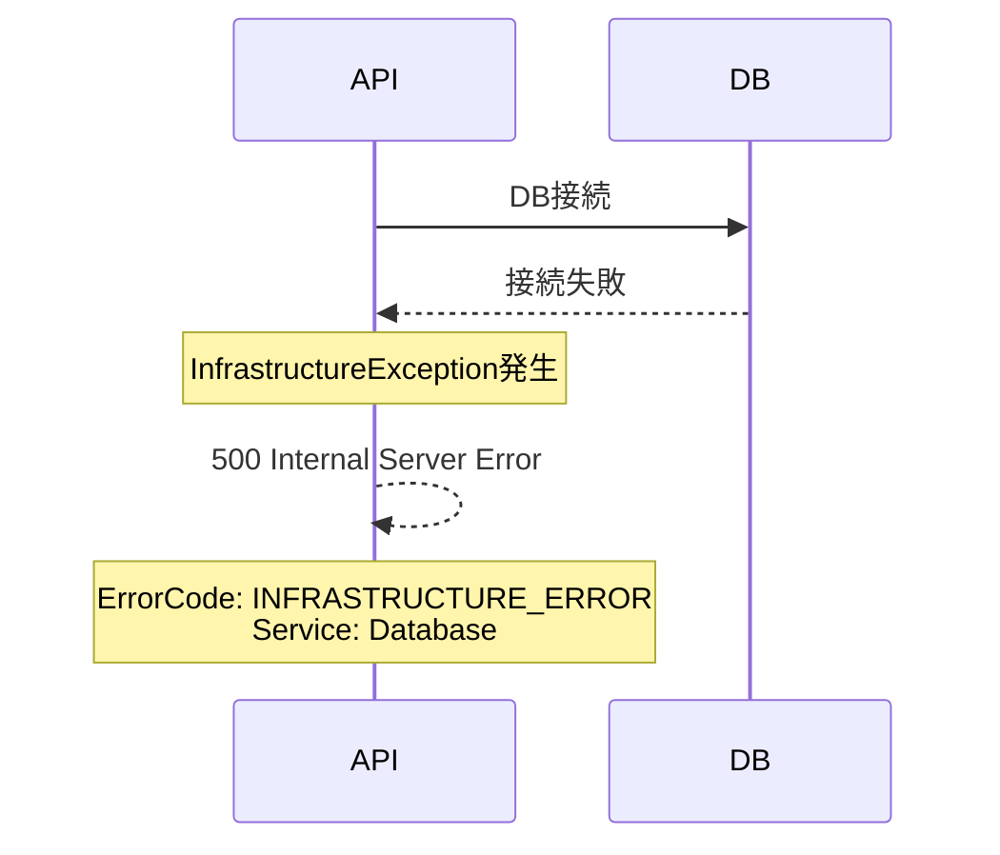
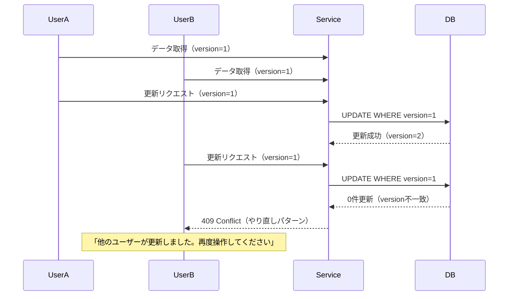

# エラーハンドリング設計

## 文書情報
- **文書種別**: 外部設計書
- **作成日**: 2025-12-12
- **最終更新**: 2025-12-12
- **バージョン**: 1.0
- **ステータス**: 実装中

## 文書の目的

本文書は**外部設計書**として、エラーハンドリングの構造・動作を言語非依存で定義する。

実装言語・フレームワークが決定した後、本設計書を元に実装設計書（内部設計書）およびコードを作成する。

| 設計フェーズ | 文書 | 内容 |
|---|---|---|
| 外部設計（本文書） | error-handling.md | クラス構造・処理フロー・設計意図 |
| 内部設計 | 実装時に作成 | 言語固有の実装詳細・使用例 |

---

## 1. エラーハンドリングの基本方針

### 1.1 目的

1. **安定性**: 例外発生時もアプリケーションを停止させない
2. **可読性**: エラーメッセージをユーザーにわかりやすく提示
3. **保守性**: エラーの原因を素早く特定できる
4. **セキュリティ**: 内部情報を外部に漏らさない

---

### 1.2 エラーハンドリングの原則

| 原則 | 説明 |
|------|------|
| **レイヤー分離** | Controller → Service → Infrastructure で責務を明確化 |
| **早期リターン** | エラーは早く検知して早く返す |
| **適切なログ出力** | すべてのエラーを Information/Warning/Error で記録 |
| **ユーザーフレンドリー** | 技術的詳細を隠し、対処方法を提示 |

---

## 2. エラーレスポンス形式

### 2.1 開発環境（詳細情報あり）

```json
{
  "error": "User not found",
  "code": "NOT_FOUND",
  "details": {
    "resourceType": "User",
    "resourceId": "123"
  },
  "timestamp": "2025-12-12T10:00:00.123Z",
  "stackTrace": "at UserService.GetUserById..."
}
```

---

### 2.2 本番環境（簡潔）

```json
{
  "error": "User not found",
  "code": "NOT_FOUND",
  "timestamp": "2025-12-12T10:00:00.123Z"
}
```

**形式**: JSON形式、スタックトレースは本番環境では非表示

---

## 3. 例外の種類

### 3.1 3つのカテゴリ

例外を以下の3つに分類して管理します。

#### 1️⃣ **業務上の例外**（Business Exceptions）
- **説明**: ビジネスルールやバリデーションのエラー
- **HTTPステータス**: 400 Bad Request / 404 Not Found
- **対応**: ユーザーに修正方法を提示
- **例**: 在庫不足、必須項目未入力、ユーザーID不一致

#### 2️⃣ **システム上の例外**（Infrastructure Exceptions）
- **説明**: 外部システムやインフラのエラー
- **HTTPステータス**: 500 Internal Server Error / 503 Service Unavailable
- **対応**: リトライ、アラート通知
- **例**: DB接続失敗、外部API タイムアウト

#### 3️⃣ **プログラミング言語の例外**（Runtime Exceptions）
- **説明**: ランタイムの予期しないエラー
- **HTTPステータス**: 500 Internal Server Error
- **対応**: ログ出力、バグ修正
- **例**: NullReferenceException, ArgumentNullException, IndexOutOfRangeException

---

### 3.2 カスタム例外の分類

| 例外クラス | カテゴリ | HTTPステータス | 用途 | 例 |
|-----------|---------|--------------|------|-----|
| **ValidationException** | 業務 | 400 Bad Request | 入力検証エラー | 必須項目未入力 |
| **NotFoundException** | 業務 | 404 Not Found | リソース未存在 | ユーザーID不一致 |
| **BusinessRuleException** | 業務 | 400 Bad Request | ビジネスルール違反 | 在庫不足 |
| **InfrastructureException** | システム | 500 Internal Server Error | 外部システムエラー | DB接続失敗 |

**補足**:
- ランタイム例外（NullReferenceException等）はキャッチして InfrastructureException に変換
- すべての例外は最終的に ErrorResponse として返却

---

## 4. エラーハンドリングのタイミング

### 4.1 エラーハンドリングフロー



---

## 5. 例外クラス定義

### 5.1 クラス図



### 5.2 各クラスの固有プロパティの意図

| クラス | 固有プロパティ | 用途 |
|---|---|---|
| ApplicationException | ErrorCode / StatusCode / Details | 全例外共通。エラー種別・HTTPステータス・追加情報を保持 |
| ValidationException | Errors（リスト） | 複数フィールドのエラーを同時に返すためリスト型 |
| NotFoundException | ResourceType / ResourceId | 何のリソースがどのIDで見つからなかったかを特定 |
| BusinessRuleException | RuleName | どのビジネスルールに違反したかを特定（例: CreditLimitExceeded） |
| InfrastructureException | Service | どの外部サービスが障害かを特定（例: Database・ExternalAPI） |

---

### 5.3 ValidationException（入力検証エラー）

ユーザーの入力値が不正な場合に発生する。複数フィールドのエラーをまとめて返す。



---

### 5.4 NotFoundException（リソース未存在）

指定されたIDのリソースがDBに存在しない場合に発生する。



---

### 5.5 BusinessRuleException（ビジネスルール違反）

技術的には正常だがビジネスルール上許可できない操作の場合に発生する。



---

### 5.6 InfrastructureException（外部システムエラー）

DB・外部APIなど外部システムの障害時に発生する。



---

## 6. エラーコード一覧

### 6.1 クライアントエラー（4xx）

| コード | HTTPステータス | 説明 |
|-------|--------------|------|
| `VALIDATION_ERROR` | 400 | バリデーションエラー |
| `BUSINESS_RULE_VIOLATION` | 400 | ビジネスルール違反 |
| `UNAUTHORIZED` | 401 | 認証エラー |
| `FORBIDDEN` | 403 | 権限エラー |
| `NOT_FOUND` | 404 | リソースが見つからない |
| `CONFLICT` | 409 | リソースの競合 |
| `RATE_LIMIT_EXCEEDED` | 429 | レート制限超過 |

---

### 6.2 サーバーエラー（5xx）

| コード | HTTPステータス | 説明 |
|-------|--------------|------|
| `INTERNAL_ERROR` | 500 | 内部サーバーエラー |
| `DB_ERROR` | 500 | データベースエラー |
| `INFRASTRUCTURE_ERROR` | 500 | インフラストラクチャエラー |
| `SERVICE_UNAVAILABLE` | 503 | サービス利用不可 |

---

## 7. ログ戦略

### 7.1 ログレベルの使い分け

| レベル | 用途 | 例 |
|--------|------|-----|
| Error | 回復不可能なエラー | DB接続失敗、予期しない例外 |
| Warning | 回復可能なエラー | リトライ実行、バリデーションエラー |
| Information | 正常な処理 | ユーザー作成成功 |
| Debug | デバッグ情報 | SQL実行、変数の値 |

---

## 8. エラー後の対応パターン

エラー発生後の挙動を3つのパターンに分類して対応方針を決定する。

| パターン | 説明 | 対象エラー例 | ユーザー向け対応 |
|---------|------|------------|----------------|
| **再入力パターン** | ユーザーが入力を修正して再試行できる | 単項目エラー・必須未入力 | エラー箇所を示して修正を促す |
| **やり直しパターン** | 操作を最初からやり直す必要がある | 排他エラー・業務タイミングエラー | 「再度操作してください」を表示 |
| **お手上げパターン** | ユーザーでは対処不能。管理者対応が必要 | DBエラー・インフラ障害 | 「しばらく時間をおいてください」を表示 |

### 8.1 排他エラーの扱い

排他制御エラー（楽観的ロック違反）は**やり直しパターン**で対応する。



> **バージョンキー採用の理由**: タイムスタンプは精度の問題で同時更新を検知できない場合があるため、整数のバージョンキーを使用する。

---

## 9. 参考

- [ログ設計](logging.md)
- [API設計規約](api-design.md)
- [セキュリティ設計](security.md)

## 10. 参考書籍

高安 厚思,『システム設計の謎を解く 改訂版』, SB Creative, 2017年, pp.251-252.

---

## 10. 実装詳細（C# / ASP.NET Core）

## 例外処理方針

### レイヤー別の責務

| レイヤー | 責務 | 例外処理 |
|---------|------|---------|
| Controller | HTTPリクエスト処理 | try-catchでラップ、500エラー返却 |
| Service | ビジネスロジック | 業務例外をスロー |
| DB層 | データアクセス | SqlException をそのままスロー |

---

## Controller層のエラーハンドリング

### DemoController

```csharp
[HttpGet("api/demo/n-plus-one/bad")]
public async Task<IActionResult> NPlusOneBad()
{
    try
    {
        var result = await _nPlusOneService.GetUsersBad();
        return Ok(result);
    }
    catch (SqliteException ex)
    {
        _logger.LogError(ex, "Database error in N+1 bad endpoint");
        return StatusCode(500, new
        {
            error = "Database connection failed",
            code = "DB_ERROR",
            timestamp = DateTime.UtcNow
        });
    }
    catch (Exception ex)
    {
        _logger.LogError(ex, "Unexpected error in N+1 bad endpoint");
        return StatusCode(500, new
        {
            error = "Internal server error",
            code = "INTERNAL_ERROR",
            timestamp = DateTime.UtcNow
        });
    }
}
```

**ポイント**:
- **SqliteException**: DB接続エラー
- **Exception**: 予期しないエラー
- **ログ出力**: すべての例外を記録
- **エラーレスポンス**: JSON形式で返却

---

## Service層のエラーハンドリング

### NPlusOneService

```csharp
public async Task<NPlusOneResponse> GetUsersBad()
{
    // 例外はそのままスロー（Controller層でキャッチ）
    var connection = GetConnection();
    await connection.OpenAsync(); // SqliteException がスローされる可能性

    // ...
}

private SqliteConnection GetConnection()
{
    var connectionString = _configuration.GetConnectionString("DemoDatabase");
    if (string.IsNullOrEmpty(connectionString))
    {
        throw new InvalidOperationException("Connection string 'DemoDatabase' not found");
    }
    return new SqliteConnection(connectionString);
}
```

**ポイント**:
- **設定エラー**: `InvalidOperationException` をスロー
- **DB接続エラー**: `SqliteException` をそのままスロー
- **ログ不要**: Controller層でログ出力

---

## エラーレスポンス形式

### 共通エラー形式
```json
{
  "error": "エラーメッセージ",
  "code": "ERROR_CODE",
  "timestamp": "2025-12-10T12:00:00Z"
}
```

### エラーコード一覧

| コード | 意味 | HTTPステータス | 説明 |
|-------|------|---------------|------|
| DB_ERROR | データベースエラー | 500 | DB接続失敗、SQL実行エラー |
| CONFIG_ERROR | 設定エラー | 500 | 接続文字列未設定 |
| INTERNAL_ERROR | 内部エラー | 500 | 予期しないエラー |
| VALIDATION_ERROR | 入力エラー | 400 | パラメータ不正 |
| NOT_FOUND | リソース未検出 | 404 | データが見つからない |

---

## ログ設計

### ログレベル

| レベル | 用途 | 例 |
|-------|------|-----|
| Error | 例外発生時 | DB接続エラー、予期しないエラー |
| Warning | 想定外の状況 | データ0件、リトライ |
| Information | 正常処理 | API呼び出し、処理完了 |
| Debug | 開発時デバッグ | SQL文、クエリ回数 |

### ログ出力例

```csharp
// Error
_logger.LogError(ex, "Error in N+1 bad endpoint");

// Warning
_logger.LogWarning("No users found in database");

// Information
_logger.LogInformation("N+1 bad executed: {QueryCount} queries, {ExecutionTimeMs}ms",
    result.SqlCount, result.ExecutionTimeMs);

// Debug
_logger.LogDebug("Executing SQL: {Sql}", sql);
```

---

## 例外クラス設計

### 業務例外（将来実装）

```csharp
public class BusinessException : Exception
{
    public string ErrorCode { get; }

    public BusinessException(string message, string errorCode)
        : base(message)
    {
        ErrorCode = errorCode;
    }
}

// 使用例
if (inventory < 0)
{
    throw new BusinessException("在庫不足です", "INSUFFICIENT_INVENTORY");
}
```

---

## リトライ戦略（将来実装）

### Exponential Backoff

```csharp
public async Task<T> ExecuteWithRetry<T>(Func<Task<T>> func, int maxRetries = 3)
{
    for (int i = 0; i < maxRetries; i++)
    {
        try
        {
            return await func();
        }
        catch (SqliteException ex) when (i < maxRetries - 1)
        {
            var delay = TimeSpan.FromSeconds(Math.Pow(2, i)); // 1秒, 2秒, 4秒
            _logger.LogWarning(ex, "Retry {Attempt}/{MaxRetries} after {Delay}s",
                i + 1, maxRetries, delay.TotalSeconds);
            await Task.Delay(delay);
        }
    }
    throw new Exception("Max retries exceeded");
}
```

---

## Circuit Breaker（将来実装）

### Polly を使用

```csharp
var circuitBreakerPolicy = Policy
    .Handle<SqliteException>()
    .CircuitBreakerAsync(
        exceptionsAllowedBeforeBreaking: 3,
        durationOfBreak: TimeSpan.FromSeconds(30)
    );

// 使用例
var result = await circuitBreakerPolicy.ExecuteAsync(async () =>
{
    return await _nPlusOneService.GetUsersBad();
});
```

**用途**: 外部API（Supabase）の障害時に遮断

---

## タイムアウト設計

### DB接続タイムアウト

```csharp
var connectionString = "Data Source=demo.db;Connection Timeout=30";
var connection = new SqliteConnection(connectionString);
```

### HTTP リクエストタイムアウト

```csharp
// Supabase 接続テスト
var httpClient = new HttpClient
{
    Timeout = TimeSpan.FromSeconds(30)
};
```

---

## エラーハンドリングのテスト

### 単体テスト

```csharp
[Fact]
public async Task NPlusOneBad_DatabaseError_Returns500()
{
    // Arrange
    var mockService = new Mock<INPlusOneService>();
    mockService.Setup(s => s.GetUsersBad())
        .ThrowsAsync(new SqliteException("Connection failed", 1));

    var controller = new DemoController(mockService.Object, _logger);

    // Act
    var result = await controller.NPlusOneBad();

    // Assert
    var statusCodeResult = Assert.IsType<ObjectResult>(result);
    Assert.Equal(500, statusCodeResult.StatusCode);
}
```

---

## 実例: 2025-12-10 Secrets Manager エラー

### 発生したエラー
```
ResourceInitializationError: unable to retrieve secret from asm:
service call has been retried 1 time(s):
retrieved secret from Secrets Manager did not contain json key anon_key
```

### 原因
- Secrets Manager のキー名: `anonKey` (camelCase)
- タスク定義の参照: `anon_key` (snake_case)

### 対応
```bash
aws secretsmanager update-secret \
  --secret-id ecs/typescript-container/supabase \
  --secret-string '{"url":"...","anon_key":"..."}' \
  --region ap-northeast-1
```

### 教訓
- **キー名の統一**: snake_case に統一
- **環境変数検証**: 起動時にチェック
- **ログ出力**: エラー内容を詳細に記録

詳細: [運用設計手順書 - インシデント対応](../operations.md#ケース1-ecs-タスクが起動しない)

---

## 参考

- [クラス設計](class-design.md)
- [シーケンス図](sequence-diagrams.md)
- [運用設計手順書](../operations.md)
- 野村総合研究所,『図解でなっとく！トラブル知らずのシステム設計 エラー制御・排他制御編』
