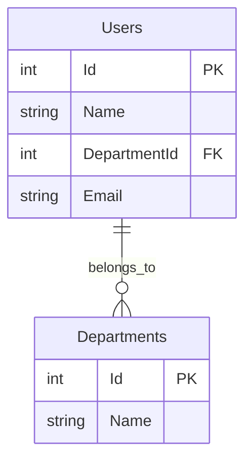

# 外部設計書（基本設計書）

## 文書情報
- **作成日**: 2025-12-10
- **最終更新**: 2025-12-10
- **バージョン**: 1.0
- **ステータス**: Draft

## 変更履歴
| 日付 | バージョン | 変更者 | 変更内容 |
|------|----------|--------|---------|
| 2025-12-10 | 1.0 | - | 初版作成 |

---

## 1. 画面設計

詳細は [画面遷移図](screen-transition.md) を参照。

### 1.1 画面一覧

| No | 画面ID | 画面名 | パス | ステータス |
|----|--------|--------|------|----------|
| 01 | HOME | ホーム画面 | /dotnet/ | ✅ |
| 02 | DEMO_PERF | SQLパフォーマンス | /dotnet/Demo/Performance | ✅ |
| 03 | DEMO_ERROR | エラーハンドリング | /dotnet/Demo/ErrorHandling | 🚧 |
| 04 | DEMO_SEC | セキュリティ | /dotnet/Demo/Security | 🚧 |
| 05 | DEMO_DATA | データ構造 | /dotnet/Demo/DataStructures | 🚧 |
| 06 | INV | 在庫管理 | /dotnet/Inventory/Index | 🚧 |
| 07 | SALES | 販売管理 | /dotnet/Sales/Index | 🚧 |
| 08 | PROD | 生産管理 | /dotnet/Production/Index | 🚧 |
| 09 | CALC | 電卓 | /dotnet/Calculator/Index | ✅ |

### 1.2 画面レイアウト

#### 共通レイアウト
- **ファイル**: `Views/Shared/_Layout.cshtml`
- **構成**:
  - ヘッダー: グローバルナビゲーション
  - コンテンツエリア: 各画面の内容
  - フッター: コピーライト

#### グローバルナビゲーション
- Home
- Calculator
- Orders
- Demo

---

## 2. API仕様

### 2.1 エンドポイント一覧

#### 教育用デモ

| No | メソッド | パス | 概要 | レスポンス |
|----|---------|------|------|----------|
| A-01 | GET | /api/demo/n-plus-one/bad | N+1問題（非効率版） | NPlusOneResponse |
| A-02 | GET | /api/demo/n-plus-one/good | N+1問題（最適化版） | NPlusOneResponse |

#### 基幹システム

| No | メソッド | パス | 概要 | レスポンス |
|----|---------|------|------|----------|
| A-03 | GET | /healthz | ヘルスチェック | { "status": "healthy" } |
| A-04 | GET | /supabase/test | Supabase接続テスト | 接続結果 |

#### WinFormsマイグレーション

| No | メソッド | パス | 概要 | レスポンス |
|----|---------|------|------|----------|
| A-05 | POST | /dotnet/Calculator/Calculate | 四則演算 | 計算結果 |

### 2.2 データ形式

#### NPlusOneResponse
```json
{
  "executionTimeMs": 45,
  "sqlCount": 101,
  "dataSize": 5621,
  "rowCount": 100,
  "message": "N+1問題あり: ループ内で部署情報を100回個別に取得しています（合計101クエリ）",
  "data": [
    {
      "id": 1,
      "name": "User 1",
      "department": {
        "id": 1,
        "name": "Department 1"
      }
    }
  ]
}
```

---

## 3. データベース設計（論理）

### 3.1 ER図



### 3.2 エンティティ一覧

#### 教育用（SQLite）

| No | エンティティ名 | 論理名 | 概要 |
|----|-------------|--------|------|
| E-01 | Users | ユーザー | デモ用ユーザーデータ |
| E-02 | Departments | 部署 | デモ用部署データ |

#### 基幹システム（PostgreSQL）

| No | エンティティ名 | 論理名 | 概要 |
|----|-------------|--------|------|
| E-03 | Products | 商品マスタ | 商品情報 |
| E-04 | Inventory | 在庫 | 在庫数量 |
| E-05 | Sales | 売上 | 売上伝票 |
| E-06 | Productions | 生産計画 | 生産計画 |

### 3.3 エンティティ定義

#### Users（ユーザー）
| カラム名 | 型 | NULL | 制約 | 説明 |
|---------|-----|------|------|------|
| Id | INT | NOT NULL | PK | ユーザーID |
| Name | VARCHAR(100) | NOT NULL | - | ユーザー名 |
| DepartmentId | INT | NOT NULL | FK | 部署ID |
| Email | VARCHAR(255) | NOT NULL | UNIQUE | メールアドレス |

#### Departments（部署）
| カラム名 | 型 | NULL | 制約 | 説明 |
|---------|-----|------|------|------|
| Id | INT | NOT NULL | PK | 部署ID |
| Name | VARCHAR(100) | NOT NULL | - | 部署名 |

---

## 4. 外部インターフェース設計

### 4.1 外部システム連携

#### Supabase
- **用途**: 認証、データベース
- **接続方法**: REST API
- **認証**: SUPABASE_ANON_KEY
- **エンドポイント**: https://jfopjsynoorupqptjlep.supabase.co

#### AWS Secrets Manager
- **用途**: 秘密情報管理
- **取得方法**: SDK経由
- **秘密情報**:
  - GEMINI_API_KEY
  - LANGCHAIN_API_KEY
  - SUPABASE_URL
  - SUPABASE_ANON_KEY

---

## 5. 画面詳細設計

### 5.1 SQLパフォーマンスデモ画面

#### 画面項目
| No | 項目名 | 型 | 必須 | 説明 |
|----|--------|-----|------|------|
| 01 | テスト実行ボタン（Bad） | Button | - | N+1問題版を実行 |
| 02 | テスト実行ボタン（Good） | Button | - | 最適化版を実行 |
| 03 | 実行結果表示エリア | Div | - | JSON結果表示 |

#### 画面遷移
1. ボタンクリック
2. API呼び出し（/api/demo/n-plus-one/bad or good）
3. 結果を画面に表示

---

## 6. セキュリティ設計

### 6.1 認証・認可
- 現在未実装（教育用デモのため）
- 将来的にSupabase Authを導入予定

### 6.2 通信暗号化
- HTTPS必須
- TLS 1.2以上

### 6.3 入力検証
- SQLインジェクション対策: パラメータ化クエリ
- XSS対策: HTMLエンコーディング
- CSRF対策: Anti-CSRFトークン（将来実装）

---

## 7. エラーハンドリング

### 7.1 エラーレスポンス形式
```json
{
  "error": "エラーメッセージ",
  "code": "ERROR_CODE",
  "timestamp": "2025-12-10T12:00:00Z"
}
```

### 7.2 HTTPステータスコード
| コード | 意味 | 使用例 |
|-------|------|--------|
| 200 | OK | 正常レスポンス |
| 400 | Bad Request | 入力エラー |
| 500 | Internal Server Error | サーバーエラー |
| 503 | Service Unavailable | サービス停止中 |
