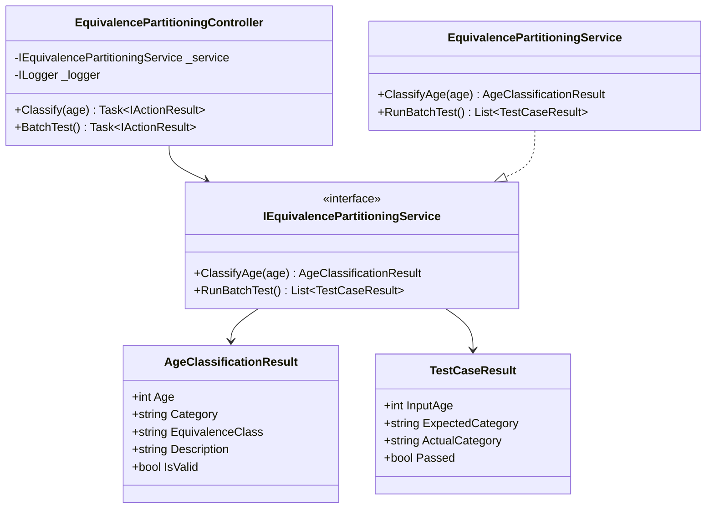
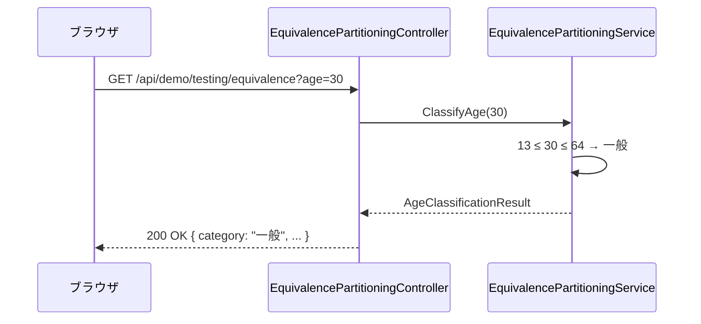
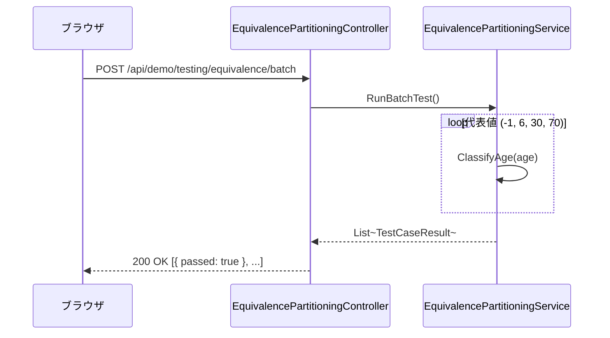

# 同値分割デモ - 内部設計書

## 文書情報
- **作成日**: 2026-05-03
- **最終更新**: 2026-05-03
- **バージョン**: 1.0
- **ステータス**: Draft

---

## 1. クラス設計

### 1.1 クラス図



---

### 1.2 インターフェース定義

```csharp
public interface IEquivalencePartitioningService
{
    AgeClassificationResult ClassifyAge(int? age);
    List<TestCaseResult> RunBatchTest();
}
```

---

### 1.3 主要クラス詳細

#### EquivalencePartitioningService

**責務**: 年齢入力を同値クラスに分類するビジネスロジック

**同値クラス定義**:

| クラス | 条件 | 区分 | 代表値 |
|--------|------|------|--------|
| 無効クラス（負） | age < 0 | エラー | -1 |
| 有効クラス（子供） | 0 ≤ age ≤ 12 | 子供 | 6 |
| 有効クラス（一般） | 13 ≤ age ≤ 64 | 一般 | 30 |
| 有効クラス（シニア） | age ≥ 65 | シニア | 70 |
| 無効クラス（非数値） | null / 非数値 | エラー | "abc" |

**実装例**:
```csharp
public class EquivalencePartitioningService : IEquivalencePartitioningService
{
    public AgeClassificationResult ClassifyAge(int? age)
    {
        if (age == null)
            return new AgeClassificationResult
            {
                IsValid = false,
                Category = "エラー",
                EquivalenceClass = "無効クラス（非数値）",
                Description = "数値を入力してください"
            };

        if (age < 0)
            return new AgeClassificationResult
            {
                Age = age.Value,
                IsValid = false,
                Category = "エラー",
                EquivalenceClass = "無効クラス（負）",
                Description = "年齢は0以上を入力してください"
            };

        if (age <= 12)
            return new AgeClassificationResult
            {
                Age = age.Value,
                IsValid = true,
                Category = "子供",
                EquivalenceClass = "有効クラス（子供：0〜12歳）",
                Description = $"{age}歳は子供区分です（0〜12歳の同値クラス）"
            };

        if (age <= 64)
            return new AgeClassificationResult
            {
                Age = age.Value,
                IsValid = true,
                Category = "一般",
                EquivalenceClass = "有効クラス（一般：13〜64歳）",
                Description = $"{age}歳は一般区分です（13〜64歳の同値クラス）"
            };

        return new AgeClassificationResult
        {
            Age = age.Value,
            IsValid = true,
            Category = "シニア",
            EquivalenceClass = "有効クラス（シニア：65歳以上）",
            Description = $"{age}歳はシニア区分です（65歳以上の同値クラス）"
        };
    }

    public List<TestCaseResult> RunBatchTest()
    {
        var cases = new List<(int Age, string Expected)>
        {
            (-1, "エラー"),
            (6,  "子供"),
            (30, "一般"),
            (70, "シニア"),
        };

        return cases.Select(c =>
        {
            var result = ClassifyAge(c.Age);
            return new TestCaseResult
            {
                InputAge = c.Age,
                ExpectedCategory = c.Expected,
                ActualCategory = result.Category,
                Passed = result.Category == c.Expected
            };
        }).ToList();
    }
}
```

---

## 2. シーケンス図

### 2.1 単一判定



### 2.2 バッチテスト



---

## 3. エラーハンドリング

```csharp
[HttpGet("api/demo/testing/equivalence")]
public IActionResult Classify([FromQuery] int? age)
{
    try
    {
        var result = _service.ClassifyAge(age);
        return Ok(result);
    }
    catch (Exception ex)
    {
        _logger.LogError(ex, "Equivalence partitioning error");
        return StatusCode(500, new { error = ex.Message });
    }
}
```

---

## 4. 参考

- [外部設計書](external-design.md)
- [テストケース](test-cases.md)
