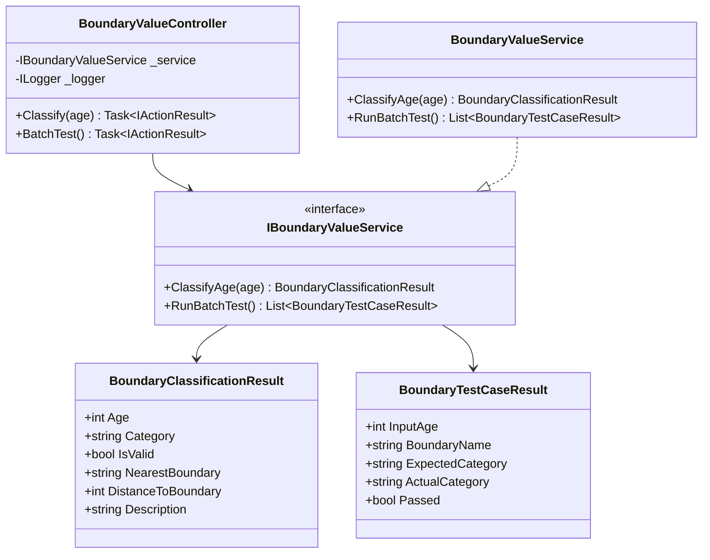
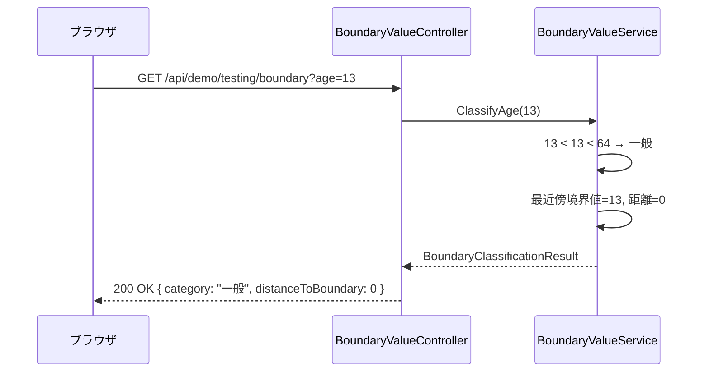
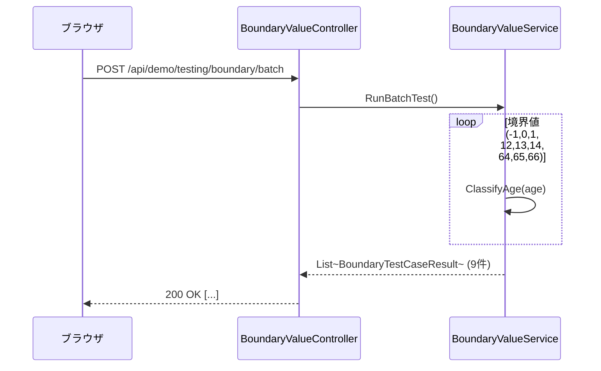

# 境界値分析デモ - 内部設計書

## 文書情報
- **作成日**: 2026-05-03
- **最終更新**: 2026-05-03
- **バージョン**: 1.0
- **ステータス**: Draft

---

## 1. クラス設計

### 1.1 クラス図



---

### 1.2 インターフェース定義

```csharp
public interface IBoundaryValueService
{
    BoundaryClassificationResult ClassifyAge(int? age);
    List<BoundaryTestCaseResult> RunBatchTest();
}
```

---

### 1.3 主要クラス詳細

#### BoundaryValueService

**責務**: 年齢を分類し、最近傍境界値との距離を返すビジネスロジック

**境界値定義**:

| 境界 | 境界値-1 | 境界値 | 境界値+1 | 意味 |
|------|---------|--------|---------|------|
| 最小有効値 | -1（無効） | 0（子供） | 1（子供） | 0が最小有効値 |
| 子供→一般 | 12（子供） | 13（一般） | 14（一般） | 13が子供/一般の境界 |
| 一般→シニア | 64（一般） | 65（シニア） | 66（シニア） | 65が一般/シニアの境界 |

**実装例**:
```csharp
public class BoundaryValueService : IBoundaryValueService
{
    private static readonly int[] Boundaries = { 0, 13, 65 };

    public BoundaryClassificationResult ClassifyAge(int? age)
    {
        if (age == null)
            return new BoundaryClassificationResult
            {
                IsValid = false,
                Category = "エラー",
                Description = "数値を入力してください"
            };

        var category = age < 0 ? "エラー"
            : age <= 12 ? "子供"
            : age <= 64 ? "一般"
            : "シニア";

        var nearestBoundary = Boundaries
            .OrderBy(b => Math.Abs(b - age.Value))
            .First();

        return new BoundaryClassificationResult
        {
            Age = age.Value,
            IsValid = age >= 0,
            Category = category,
            NearestBoundary = $"境界値{nearestBoundary}",
            DistanceToBoundary = Math.Abs(nearestBoundary - age.Value),
            Description = BuildDescription(age.Value, category, nearestBoundary)
        };
    }

    public List<BoundaryTestCaseResult> RunBatchTest()
    {
        var cases = new List<(int Age, string BoundaryName, string Expected)>
        {
            (-1, "最小値境界-1", "エラー"),
            ( 0, "最小値境界",   "子供"),
            ( 1, "最小値境界+1", "子供"),
            (12, "子供/一般境界-1", "子供"),
            (13, "子供/一般境界",   "一般"),
            (14, "子供/一般境界+1", "一般"),
            (64, "一般/シニア境界-1", "一般"),
            (65, "一般/シニア境界",   "シニア"),
            (66, "一般/シニア境界+1", "シニア"),
        };

        return cases.Select(c =>
        {
            var result = ClassifyAge(c.Age);
            return new BoundaryTestCaseResult
            {
                InputAge = c.Age,
                BoundaryName = c.BoundaryName,
                ExpectedCategory = c.Expected,
                ActualCategory = result.Category,
                Passed = result.Category == c.Expected
            };
        }).ToList();
    }

    private string BuildDescription(int age, string category, int nearest)
        => $"{age}歳は{category}区分です（境界値{nearest}まで{Math.Abs(nearest - age)}）";
}
```

---

## 2. シーケンス図

### 2.1 単一判定



### 2.2 バッチテスト（9境界値）



---

## 3. 同値分割との違い

| 観点 | 同値分割 | 境界値分析 |
|------|---------|-----------|
| テスト観点 | クラスの代表値1点 | 境界の前後3点 |
| テスト数 | 少ない（代表値のみ） | 多い（境界ごとに3点） |
| 発見しやすいバグ | クラス分類ロジック誤り | off-by-oneエラー（≤ vs <） |

---

## 4. エラーハンドリング

```csharp
[HttpGet("api/demo/testing/boundary")]
public IActionResult Classify([FromQuery] int? age)
{
    try
    {
        var result = _service.ClassifyAge(age);
        return Ok(result);
    }
    catch (Exception ex)
    {
        _logger.LogError(ex, "Boundary value error");
        return StatusCode(500, new { error = ex.Message });
    }
}
```

---

## 5. 参考

- [外部設計書](external-design.md)
- [テストケース](test-cases.md)
