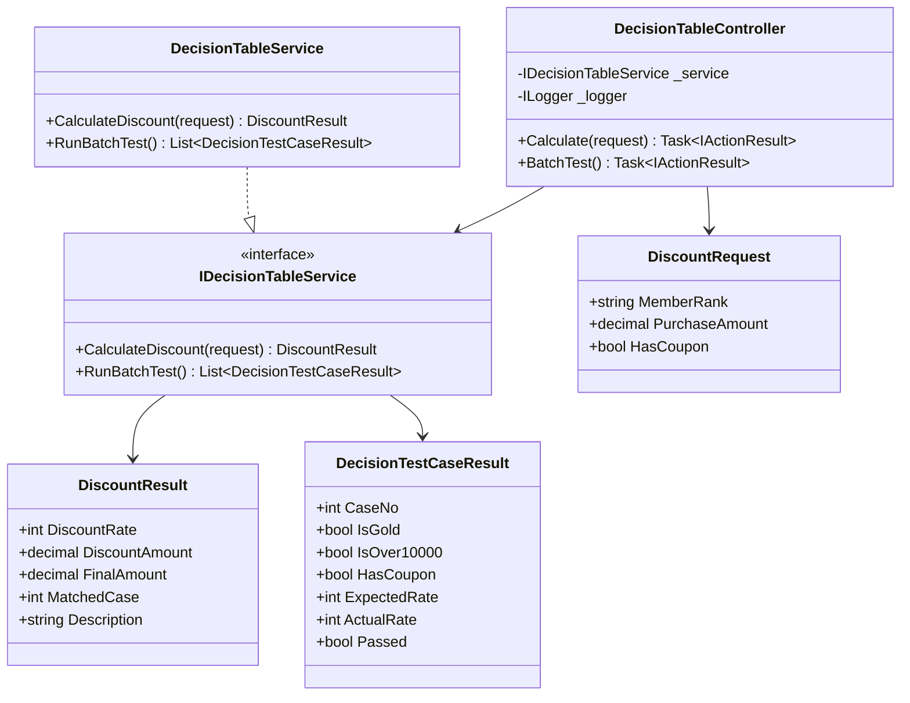
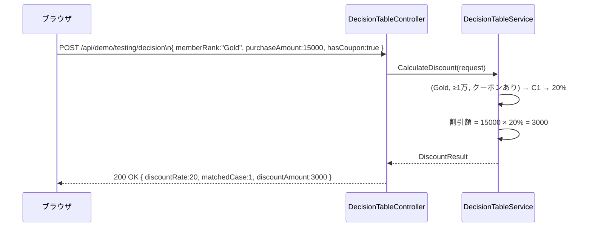

# デシジョンテーブルデモ - 内部設計書

## 文書情報
- **作成日**: 2026-05-03
- **最終更新**: 2026-05-03
- **バージョン**: 1.0
- **ステータス**: Draft

---

## 1. クラス設計

### 1.1 クラス図



---

### 1.2 インターフェース定義

```csharp
public interface IDecisionTableService
{
    DiscountResult CalculateDiscount(DiscountRequest request);
    List<DecisionTestCaseResult> RunBatchTest();
}
```

---

### 1.3 デシジョンテーブル定義

| ケース | Gold会員 | 1万円以上 | クーポン | 割引率 |
|--------|---------|---------|---------|--------|
| C1 | Y | Y | Y | 20% |
| C2 | Y | Y | N | 15% |
| C3 | Y | N | - | 10% |
| C4 | N | Y | Y | 15% |
| C5 | N | Y | N | 5% |
| C6 | N | N | - | 0% |

※ C3・C6の「-」はクーポン有無に関わらず同じ割引率

---

### 1.4 主要クラス詳細

#### DecisionTableService

**責務**: 3条件の組み合わせから割引率を決定するビジネスロジック

**実装例**:
```csharp
public class DecisionTableService : IDecisionTableService
{
    public DiscountResult CalculateDiscount(DiscountRequest request)
    {
        var isGold = request.MemberRank == "Gold";
        var isOver10000 = request.PurchaseAmount >= 10000;

        var (rate, caseNo) = (isGold, isOver10000, request.HasCoupon) switch
        {
            (true,  true,  true)  => (20, 1),  // C1
            (true,  true,  false) => (15, 2),  // C2
            (true,  false, _)     => (10, 3),  // C3
            (false, true,  true)  => (15, 4),  // C4
            (false, true,  false) => ( 5, 5),  // C5
            (false, false, _)     => ( 0, 6),  // C6
        };

        var discountAmount = request.PurchaseAmount * rate / 100;

        return new DiscountResult
        {
            DiscountRate = rate,
            DiscountAmount = discountAmount,
            FinalAmount = request.PurchaseAmount - discountAmount,
            MatchedCase = caseNo,
            Description = $"ケース{caseNo}に該当: {rate}%割引"
        };
    }

    public List<DecisionTestCaseResult> RunBatchTest()
    {
        var cases = new List<(int No, string Rank, decimal Amount, bool Coupon, int Expected)>
        {
            (1, "Gold", 15000, true,  20),
            (2, "Gold", 15000, false, 15),
            (3, "Gold",  5000, false, 10),
            (4, "一般",  15000, true,  15),
            (5, "一般",  15000, false,  5),
            (6, "一般",   5000, false,  0),
        };

        return cases.Select(c =>
        {
            var result = CalculateDiscount(new DiscountRequest
            {
                MemberRank = c.Rank,
                PurchaseAmount = c.Amount,
                HasCoupon = c.Coupon
            });

            return new DecisionTestCaseResult
            {
                CaseNo = c.No,
                IsGold = c.Rank == "Gold",
                IsOver10000 = c.Amount >= 10000,
                HasCoupon = c.Coupon,
                ExpectedRate = c.Expected,
                ActualRate = result.DiscountRate,
                Passed = result.DiscountRate == c.Expected
            };
        }).ToList();
    }
}
```

---

## 2. シーケンス図



---

## 3. エラーハンドリング

```csharp
[HttpPost("api/demo/testing/decision")]
public IActionResult Calculate([FromBody] DiscountRequest request)
{
    try
    {
        if (request.PurchaseAmount < 0)
            return BadRequest(new { error = "購入金額は0以上を指定してください" });

        var result = _service.CalculateDiscount(request);
        return Ok(result);
    }
    catch (Exception ex)
    {
        _logger.LogError(ex, "Decision table error");
        return StatusCode(500, new { error = ex.Message });
    }
}
```

---

## 4. 参考

- [外部設計書](external-design.md)
- [テストケース](test-cases.md)
