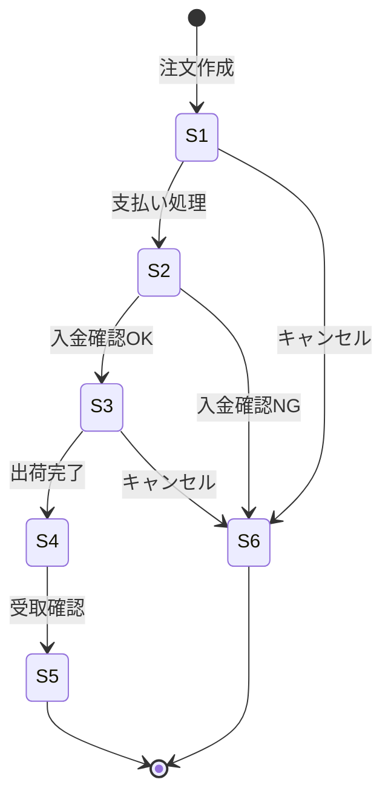

# 状態遷移テストデモ - 外部設計書

## 文書情報
- **作成日**: 2026-03-19
- **最終更新**: 2026-03-19
- **バージョン**: 1.0
- **ステータス**: 設計中

---

## 1. 画面設計

### 1.1 画面一覧

| No | 画面ID | 画面名 | パス | ステータス |
|----|--------|--------|------|----------|
| 01 | DEMO_TEST_ST | 状態遷移テストデモ | /Demo/TestingTechniques/StateTransition | 未実装 |

---

### 1.2 画面詳細

**概要**: 注文ステータスの遷移を例に、状態遷移図とテストケースを可視化するデモ

**状態一覧**:

| 状態ID | 状態名 | 説明 |
|--------|--------|------|
| S1 | 注文受付 | 注文が作成された初期状態 |
| S2 | 入金確認中 | 支払い処理中 |
| S3 | 出荷準備中 | 入金確認済み、倉庫で準備中 |
| S4 | 出荷済み | 商品を発送した状態 |
| S5 | 完了 | 顧客が受取確認した状態 |
| S6 | キャンセル | 注文がキャンセルされた状態 |

**遷移一覧**:

| 遷移ID | 現在状態 | イベント | 次状態 | 備考 |
|--------|---------|---------|--------|------|
| T1 | S1: 注文受付 | 支払い処理 | S2: 入金確認中 | |
| T2 | S2: 入金確認中 | 入金確認OK | S3: 出荷準備中 | |
| T3 | S2: 入金確認中 | 入金確認NG | S6: キャンセル | |
| T4 | S3: 出荷準備中 | 出荷完了 | S4: 出荷済み | |
| T5 | S4: 出荷済み | 受取確認 | S5: 完了 | |
| T6 | S1: 注文受付 | キャンセル | S6: キャンセル | |
| T7 | S3: 出荷準備中 | キャンセル | S6: キャンセル | 出荷前のみ可 |

**画面項目**:

| No | 項目名 | 型 | 説明 |
|----|--------|-----|------|
| 01 | 概念説明セクション | Div | 状態遷移テストの説明 |
| 02 | 状態遷移図 | Div(Mermaid) | 状態とイベントの図 |
| 03 | 状態一覧テーブル | Table | 状態ID・名称・説明 |
| 04 | 遷移一覧テーブル | Table | 遷移ID・現在状態・イベント・次状態 |
| 05 | 現在状態表示 | Badge | 現在の注文ステータスをカラー表示 |
| 06 | 実行可能イベント一覧 | ButtonGroup | 現在状態から遷移可能なイベントボタン |
| 07 | 遷移実行ボタン | Button | イベントを発火して状態遷移 |
| 08 | 遷移履歴テーブル | Table | 実行した遷移の履歴（状態・イベント・結果） |
| 09 | リセットボタン | Button | S1（注文受付）に戻す |
| 10 | 全遷移テスト自動実行ボタン | Button | 全遷移パスをまとめて検証 |
| 11 | テスト結果一覧 | Table | パス・遷移・期待値・実際値・合否 |
| 12 | ソースコードリンクセクション | Div | GitHubリンク一覧 |
| 13 | ドキュメントリンクセクション | Div | GitHubドキュメントリンク一覧 |

**状態遷移図（Mermaid）**:


**画面レイアウト**:
```
┌─────────────────────────────────────┐
│ 状態遷移テストデモ                   │
├─────────────────────────────────────┤
│ [概念説明]                           │
│                                     │
│ 状態遷移図                           │
│ [注文受付]→[入金確認中]→[出荷準備中] │
│            ↓               ↓        │
│         [キャンセル]   [出荷済み]    │
│                            ↓        │
│                          [完了]      │
│                                     │
│ 現在の状態: [出荷準備中 🟡]          │
│                                     │
│ 実行可能なイベント:                  │
│ [出荷完了]  [キャンセル]             │
│                                     │
│ 遷移履歴:                           │
│ ┌──────────┬──────────┬──────────┐  │
│ │現在状態  │イベント  │次状態    │  │
│ │注文受付  │支払い処理│入金確認中│  │
│ │入金確認中│確認OK    │出荷準備中│  │
│ └──────────┴──────────┴──────────┘  │
│                          [リセット]  │
└─────────────────────────────────────┘
```

---

## 2. API設計

| メソッド | パス | 説明 |
|---------|------|------|
| GET | /api/demo/testing/state | 現在状態取得 |
| POST | /api/demo/testing/state/transition | イベント発火・状態遷移 |
| DELETE | /api/demo/testing/state/reset | リセット（S1に戻す） |
| POST | /api/demo/testing/state/batch | 全遷移パス自動実行 |

---

## 3. GitHub リンク

### ソースコード

| ファイル | 説明 |
|---------|------|
| StateTransitionController.cs | Controller |
| StateTransitionService.cs | Service |

### ドキュメント

| ファイル | 説明 |
|---------|------|
| external-design.md | 本ドキュメント |
