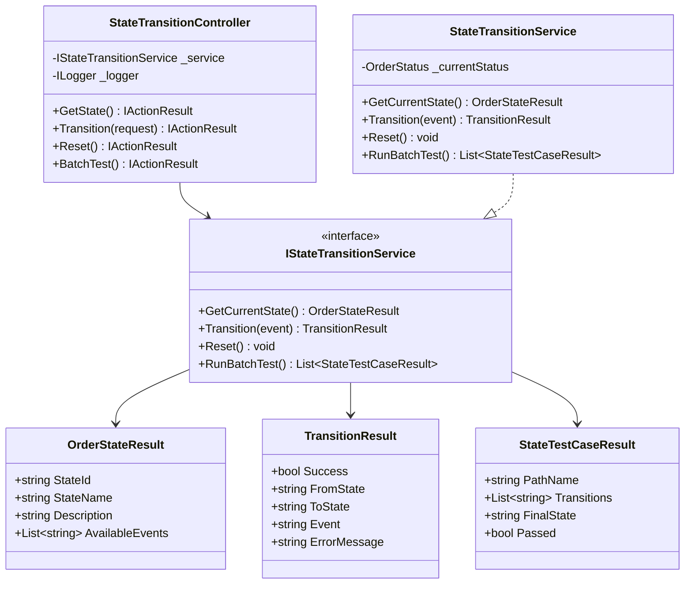
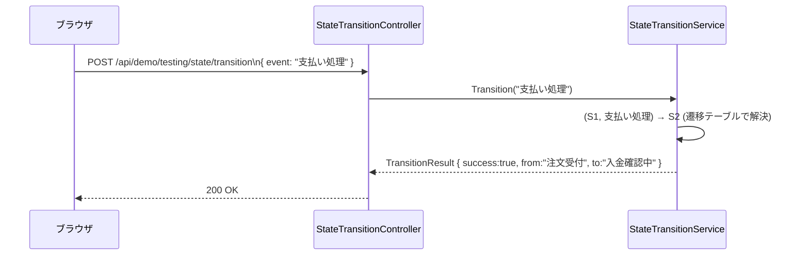
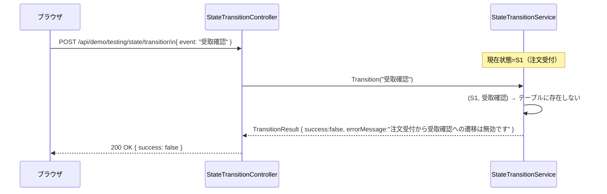

# 状態遷移テストデモ - 内部設計書

## 文書情報
- **作成日**: 2026-05-03
- **最終更新**: 2026-05-03
- **バージョン**: 1.0
- **ステータス**: Draft

---

## 1. クラス設計

### 1.1 クラス図



---

### 1.2 インターフェース定義

```csharp
public interface IStateTransitionService
{
    OrderStateResult GetCurrentState();
    TransitionResult Transition(string eventName);
    void Reset();
    List<StateTestCaseResult> RunBatchTest();
}
```

---

### 1.3 状態・遷移定義

**状態定義**:

| 状態ID | Enum | 状態名 | AvailableEvents |
|--------|------|--------|----------------|
| S1 | OrderReceived | 注文受付 | 支払い処理, キャンセル |
| S2 | PaymentPending | 入金確認中 | 入金確認OK, 入金確認NG |
| S3 | PreparingShipment | 出荷準備中 | 出荷完了, キャンセル |
| S4 | Shipped | 出荷済み | 受取確認 |
| S5 | Completed | 完了 | なし（終端） |
| S6 | Cancelled | キャンセル | なし（終端） |

**遷移テーブル**:

| 現在状態 | イベント | 次状態 |
|---------|---------|--------|
| S1 | 支払い処理 | S2 |
| S1 | キャンセル | S6 |
| S2 | 入金確認OK | S3 |
| S2 | 入金確認NG | S6 |
| S3 | 出荷完了 | S4 |
| S3 | キャンセル | S6 |
| S4 | 受取確認 | S5 |

---

### 1.4 主要クラス詳細

#### StateTransitionService

**責務**: InMemoryでステートマシンを管理するビジネスロジック

**実装例**:
```csharp
public class StateTransitionService : IStateTransitionService
{
    private OrderStatus _current = OrderStatus.OrderReceived;

    private static readonly Dictionary<(OrderStatus, string), OrderStatus> TransitionTable = new()
    {
        { (OrderStatus.OrderReceived,      "支払い処理"),  OrderStatus.PaymentPending },
        { (OrderStatus.OrderReceived,      "キャンセル"),  OrderStatus.Cancelled },
        { (OrderStatus.PaymentPending,     "入金確認OK"),  OrderStatus.PreparingShipment },
        { (OrderStatus.PaymentPending,     "入金確認NG"),  OrderStatus.Cancelled },
        { (OrderStatus.PreparingShipment,  "出荷完了"),    OrderStatus.Shipped },
        { (OrderStatus.PreparingShipment,  "キャンセル"),  OrderStatus.Cancelled },
        { (OrderStatus.Shipped,            "受取確認"),    OrderStatus.Completed },
    };

    public OrderStateResult GetCurrentState()
    {
        var available = TransitionTable.Keys
            .Where(k => k.Item1 == _current)
            .Select(k => k.Item2)
            .ToList();

        return new OrderStateResult
        {
            StateId = _current.ToStateId(),
            StateName = _current.ToStateName(),
            Description = _current.ToDescription(),
            AvailableEvents = available
        };
    }

    public TransitionResult Transition(string eventName)
    {
        var key = (_current, eventName);
        if (!TransitionTable.TryGetValue(key, out var next))
        {
            return new TransitionResult
            {
                Success = false,
                FromState = _current.ToStateName(),
                Event = eventName,
                ErrorMessage = $"{_current.ToStateName()}から「{eventName}」への遷移は無効です"
            };
        }

        var from = _current;
        _current = next;

        return new TransitionResult
        {
            Success = true,
            FromState = from.ToStateName(),
            ToState = next.ToStateName(),
            Event = eventName
        };
    }

    public void Reset() => _current = OrderStatus.OrderReceived;

    public List<StateTestCaseResult> RunBatchTest()
    {
        return new List<(string Name, string[] Events, string FinalState)>
        {
            ("正常完了パス", new[] { "支払い処理", "入金確認OK", "出荷完了", "受取確認" }, "完了"),
            ("入金NG→キャンセル", new[] { "支払い処理", "入金確認NG" }, "キャンセル"),
            ("注文直後キャンセル", new[] { "キャンセル" }, "キャンセル"),
            ("出荷前キャンセル", new[] { "支払い処理", "入金確認OK", "キャンセル" }, "キャンセル"),
        }.Select(path =>
        {
            Reset();
            var transitions = new List<string>();
            foreach (var e in path.Events)
            {
                var r = Transition(e);
                transitions.Add($"{r.FromState} --{e}--> {r.ToState ?? r.ErrorMessage}");
            }
            var finalState = GetCurrentState().StateName;
            Reset();
            return new StateTestCaseResult
            {
                PathName = path.Name,
                Transitions = transitions,
                FinalState = finalState,
                Passed = finalState == path.FinalState
            };
        }).ToList();
    }
}
```

---

## 2. シーケンス図

### 2.1 遷移実行（正常系）



### 2.2 無効遷移



---

## 3. エラーハンドリング

```csharp
[HttpPost("api/demo/testing/state/transition")]
public IActionResult Transition([FromBody] TransitionRequest request)
{
    try
    {
        var result = _service.Transition(request.Event);
        return Ok(result);
    }
    catch (Exception ex)
    {
        _logger.LogError(ex, "State transition error");
        return StatusCode(500, new { error = ex.Message });
    }
}
```

---

## 4. 参考

- [外部設計書](external-design.md)
- [テストケース](test-cases.md)
