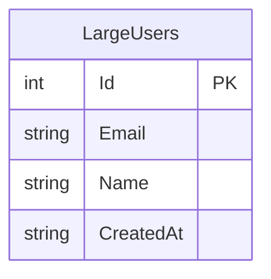

# フルテーブルスキャンデモ - 外部設計書

## 文書情報
- **作成日**: 2026-03-11
- **最終更新**: 2026-03-11
- **バージョン**: 1.0
- **ステータス**: 実装中

---

## 1. 画面設計

### 1.1 画面一覧

| No | 画面ID | 画面名 | パス | ステータス |
|----|--------|--------|------|----------|
| 01 | DEMO_FULLSCAN | フルスキャンデモ | /dotnet/Demo/FullScan | 🚧 実装中 |

---

### 1.2 画面詳細

#### DEMO_FULLSCAN: フルスキャンデモ

**概要**: インデックスなし/あり検索を実行し、結果を比較表示

**画面項目**:

| No | 項目名 | 型 | 必須 | 説明 |
|----|--------|-----|------|------|
| 01 | セットアップボタン | Button | - | 100万件データ生成 |
| 02 | インデックスなし検索ボタン | Button | - | フルスキャン検索を実行 |
| 03 | インデックス作成ボタン | Button | - | Emailカラムにインデックス作成 |
| 04 | インデックスあり検索ボタン | Button | - | インデックス検索を実行 |
| 05 | 検索Email入力欄 | Input | - | 検索対象のメールアドレス |
| 06 | 実行結果表示エリア | Div | - | JSON結果表示 |

**画面レイアウト**:
```
┌──────────────────────────────────────────┐
│ フルテーブルスキャンデモ                   │
├──────────────────────────────────────────┤
│ Email: [user500000@example.com        ]  │
│                                          │
│ [セットアップ（100万件生成）]             │
│                                          │
│ ┌──────────────────┐ ┌────────────────┐  │
│ │ インデックスなし検索│ │インデックス作成 │  │
│ └──────────────────┘ └────────────────┘  │
│                                          │
│ [インデックスあり検索]                    │
│                                          │
│ 結果:                                    │
│ ┌──────────────────────────────────┐     │
│ │ {                                │     │
│ │   "executionTimeMs": 3000,       │     │
│ │   "hasIndex": false,             │     │
│ │   ...                            │     │
│ │ }                                │     │
│ └──────────────────────────────────┘     │
└──────────────────────────────────────────┘
```

---

## 2. API設計

### 2.1 エンドポイント一覧

| No | メソッド | パス | 概要 | レスポンス |
|----|---------|------|------|----------|
| A-01 | POST | /api/demo/full-scan/setup | 100万件データ生成 | SetupResponse |
| A-02 | GET | /api/demo/full-scan/without-index | インデックスなし検索 | FullScanResponse |
| A-03 | POST | /api/demo/full-scan/create-index | インデックス作成 | SetupResponse |
| A-04 | GET | /api/demo/full-scan/with-index | インデックスあり検索 | FullScanResponse |

---

### 2.2 API詳細仕様

#### A-01: データセットアップ

**エンドポイント**:
```
POST /api/demo/full-scan/setup
```

**リクエスト**: なし

**レスポンス**:
```json
{
  "success": true,
  "rowCount": 1000000,
  "executionTimeMs": 45000,
  "message": "100万件のデータを生成しました"
}
```

**HTTPステータスコード**:

| コード | 意味 | 説明 |
|-------|------|------|
| 200 | OK | 正常終了（既にデータあり含む） |
| 500 | Internal Server Error | サーバーエラー |

---

#### A-02: インデックスなし検索

**エンドポイント**:
```
GET /api/demo/full-scan/without-index?email={email}
```

**リクエストパラメータ**:

| パラメータ | 型 | 必須 | 説明 |
|-----------|-----|------|------|
| email | string | ✅ | 検索するメールアドレス |

**レスポンス**:
```json
{
  "executionTimeMs": 3000,
  "rowCount": 1,
  "hasIndex": false,
  "data": [
    {
      "id": 500000,
      "email": "user500000@example.com",
      "name": "田中太郎"
    }
  ],
  "message": "インデックスなし: 100万件を全件スキャンしました"
}
```

**HTTPステータスコード**:

| コード | 意味 | 説明 |
|-------|------|------|
| 200 | OK | 正常終了（0件でも200） |
| 400 | Bad Request | emailパラメータなし |
| 500 | Internal Server Error | サーバーエラー |

---

#### A-03: インデックス作成

**エンドポイント**:
```
POST /api/demo/full-scan/create-index
```

**リクエスト**: なし

**レスポンス**:
```json
{
  "success": true,
  "executionTimeMs": 5000,
  "message": "IX_LargeUsers_Email インデックスを作成しました"
}
```

---

#### A-04: インデックスあり検索

**エンドポイント**:
```
GET /api/demo/full-scan/with-index?email={email}
```

**リクエストパラメータ**:

| パラメータ | 型 | 必須 | 説明 |
|-----------|-----|------|------|
| email | string | ✅ | 検索するメールアドレス |

**レスポンス**:
```json
{
  "executionTimeMs": 5,
  "rowCount": 1,
  "hasIndex": true,
  "data": [
    {
      "id": 500000,
      "email": "user500000@example.com",
      "name": "田中太郎"
    }
  ],
  "message": "インデックスあり: インデックスを使って高速に取得しました"
}
```

---

### 2.3 データ型定義

#### FullScanResponse

```csharp
public class FullScanResponse
{
    public long ExecutionTimeMs { get; set; }
    public int RowCount { get; set; }
    public bool HasIndex { get; set; }
    public string Message { get; set; }
    public List<LargeUserInfo> Data { get; set; }
}
```

#### LargeUserInfo

```csharp
public class LargeUserInfo
{
    public int Id { get; set; }
    public string Email { get; set; }
    public string Name { get; set; }
}
```

#### SetupResponse

```csharp
public class SetupResponse
{
    public bool Success { get; set; }
    public int RowCount { get; set; }
    public long ExecutionTimeMs { get; set; }
    public string Message { get; set; }
}
```

---

## 3. データベース設計（論理）

### 3.1 ER図



---

### 3.2 エンティティ定義

#### LargeUsers（大規模ユーザー）

**用途**: フルテーブルスキャンデモ用の大規模データ

| カラム名 | 型 | NULL | 制約 | 説明 |
|---------|-----|------|------|------|
| Id | INTEGER | NOT NULL | PK | ユーザーID |
| Email | TEXT | NOT NULL | - | メールアドレス（最初はインデックスなし） |
| Name | TEXT | NOT NULL | - | ユーザー名 |
| CreatedAt | TEXT | NOT NULL | - | 作成日時 |

**データ件数**: 100万件

**インデックス**:
- `IX_LargeUsers_Email`（後から追加）: Email カラム

---

## 4. エラーハンドリング

### 4.1 エラーレスポンス形式

```json
{
  "error": "エラーメッセージ",
  "code": "ERROR_CODE",
  "timestamp": "2026-03-11T12:00:00Z"
}
```

### 4.2 エラーコード一覧

| コード | HTTPステータス | 意味 | 対処方法 |
|-------|--------------|------|---------|
| MISSING_PARAM | 400 | emailパラメータなし | パラメータを付与 |
| DATA_NOT_SETUP | 400 | セットアップ未実施 | セットアップAPIを先に呼ぶ |
| DB_ERROR | 500 | データベースエラー | ログ確認 |
| INTERNAL_ERROR | 500 | サーバーエラー | 管理者に連絡 |

---

## 5. 参考

- [要件定義書](requirements.md)
- [内部設計書](internal-design.md)
- [全体API仕様書](../../common/api-specification.md)
