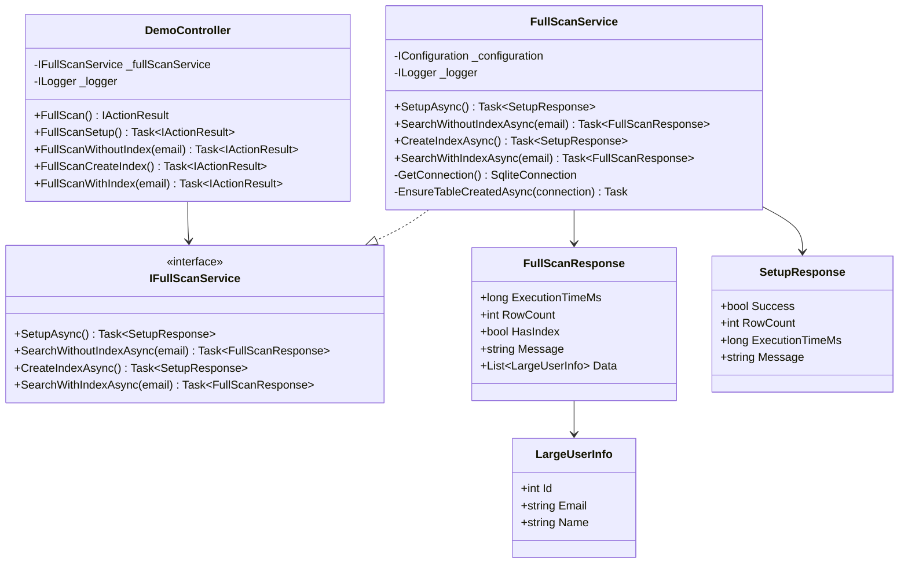
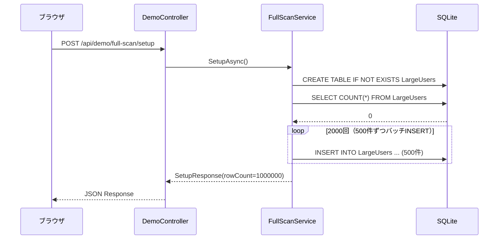
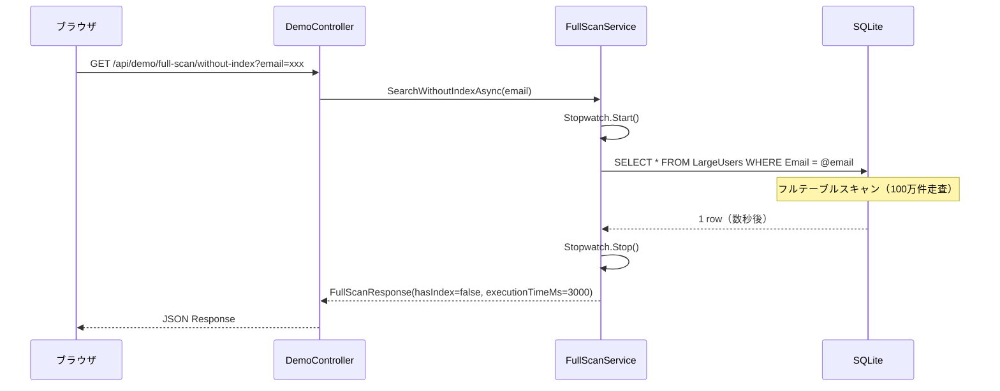
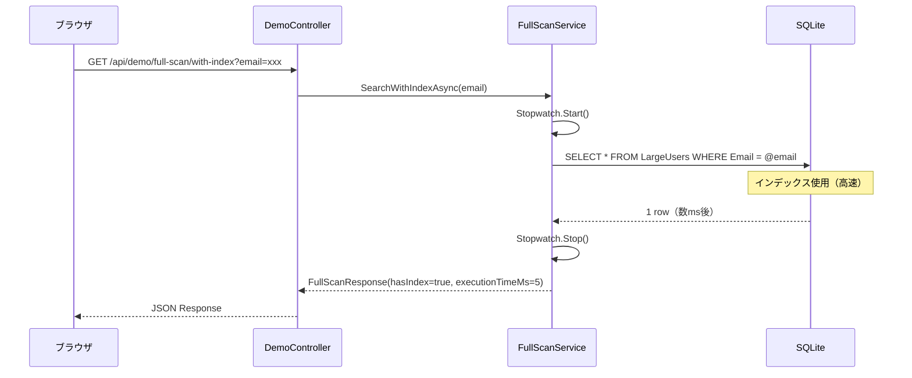

# フルテーブルスキャンデモ - 内部設計書

## 文書情報
- **作成日**: 2026-03-11
- **最終更新**: 2026-03-11
- **バージョン**: 1.0
- **ステータス**: 実装中

---

## 1. クラス設計

### 1.1 クラス図



---

### 1.2 インターフェース定義

#### IFullScanService

```csharp
public interface IFullScanService
{
    Task<SetupResponse> SetupAsync();
    Task<FullScanResponse> SearchWithoutIndexAsync(string email);
    Task<SetupResponse> CreateIndexAsync();
    Task<FullScanResponse> SearchWithIndexAsync(string email);
}
```

---

### 1.3 主要クラス詳細

#### FullScanService

**責務**: フルテーブルスキャンとインデックス検索のデモを実装

**依存関係**:
- `IConfiguration`: 接続文字列取得
- `ILogger<FullScanService>`: ログ出力

**主要メソッド**:

| メソッド名 | 戻り値 | 概要 |
|-----------|--------|------|
| SetupAsync() | Task\<SetupResponse\> | 100万件データ生成（既存の場合はスキップ） |
| SearchWithoutIndexAsync(email) | Task\<FullScanResponse\> | インデックスなし検索（フルスキャン） |
| CreateIndexAsync() | Task\<SetupResponse\> | Emailカラムにインデックス作成 |
| SearchWithIndexAsync(email) | Task\<FullScanResponse\> | インデックスあり検索 |
| GetConnection() | SqliteConnection | DB接続取得 |
| EnsureTableCreatedAsync(connection) | Task | テーブルが存在しない場合に作成 |

**アルゴリズム（SetupAsync）**:
```
1. テーブル作成（IF NOT EXISTS）
2. 既存データ件数確認
3. 件数 > 0 なら既存データありとして返却
4. 100万件のダミーデータを500件ずつバッチINSERT
5. SetupResponseを返却
```

**アルゴリズム（SearchWithoutIndexAsync）**:
```
1. Stopwatch.Start()
2. WHERE Email = @email で検索（インデックスなし → フルスキャン）
3. Stopwatch.Stop()
4. FullScanResponse（hasIndex=false）を返却
```

**アルゴリズム（CreateIndexAsync）**:
```
1. Stopwatch.Start()
2. CREATE INDEX IF NOT EXISTS IX_LargeUsers_Email ON LargeUsers(Email)
3. Stopwatch.Stop()
4. SetupResponseを返却
```

**アルゴリズム（SearchWithIndexAsync）**:
```
1. Stopwatch.Start()
2. WHERE Email = @email で検索（インデックスあり → 高速）
3. Stopwatch.Stop()
4. FullScanResponse（hasIndex=true）を返却
```

---

## 2. シーケンス図

### 2.1 セットアップ



---

### 2.2 インデックスなし検索



---

### 2.3 インデックスあり検索



---

## 3. データベース設計（物理）

### 3.1 テーブル定義

#### LargeUsers（大規模ユーザー）

**DDL**:
```sql
CREATE TABLE IF NOT EXISTS LargeUsers (
    Id INTEGER PRIMARY KEY AUTOINCREMENT,
    Email TEXT NOT NULL,
    Name TEXT NOT NULL,
    CreatedAt TEXT DEFAULT (datetime('now'))
);
-- 注意: 最初はEmailカラムにインデックスを作成しない
```

**インデックスDDL（後から追加）**:
```sql
CREATE INDEX IF NOT EXISTS IX_LargeUsers_Email ON LargeUsers(Email);
```

**初期データ（100万件、バッチINSERT）**:
```sql
-- 500件ずつ2000回INSERTを繰り返す
INSERT INTO LargeUsers (Email, Name) VALUES
    ('user000001@example.com', '田中太郎'),
    ('user000002@example.com', '鈴木花子'),
    -- ...（500件）
    ;
```

---

### 3.2 SQL文

#### インデックスなし検索（フルスキャン）

```sql
SELECT Id, Email, Name
FROM LargeUsers
WHERE Email = @email;
-- EXPLAINすると: SCAN TABLE LargeUsers
```

#### インデックスあり検索

```sql
SELECT Id, Email, Name
FROM LargeUsers
WHERE Email = @email;
-- EXPLAINすると: SEARCH TABLE LargeUsers USING INDEX IX_LargeUsers_Email
```

---

## 4. エラーハンドリング

### 4.1 例外処理

```csharp
[HttpGet("api/demo/full-scan/without-index")]
public async Task<IActionResult> FullScanWithoutIndex([FromQuery] string? email)
{
    if (string.IsNullOrEmpty(email))
        return BadRequest(new { error = "emailパラメータが必要です", code = "MISSING_PARAM" });

    try
    {
        var result = await _fullScanService.SearchWithoutIndexAsync(email);
        return Ok(result);
    }
    catch (Exception ex)
    {
        _logger.LogError(ex, "Error in full-scan without-index endpoint");
        return StatusCode(500, new { error = ex.Message, code = "INTERNAL_ERROR" });
    }
}
```

---

## 5. ログ設計

### 5.1 ログ出力

```csharp
// セットアップ完了
_logger.LogInformation("FullScan setup completed: {RowCount} rows, {ExecutionTimeMs}ms",
    result.RowCount, result.ExecutionTimeMs);

// インデックスなし検索
_logger.LogInformation("FullScan without-index: email={Email}, {ExecutionTimeMs}ms",
    email, result.ExecutionTimeMs);

// インデックスあり検索
_logger.LogInformation("FullScan with-index: email={Email}, {ExecutionTimeMs}ms",
    email, result.ExecutionTimeMs);
```

---

## 6. パフォーマンス設計

### 6.1 バッチINSERT

100万件を一度にINSERTすると遅いため、500件ずつバッチ処理する。

```csharp
const int batchSize = 500;
const int totalRows = 1_000_000;
for (int batch = 0; batch < totalRows / batchSize; batch++)
{
    var values = new StringBuilder();
    for (int i = 0; i < batchSize; i++)
    {
        var rowNum = batch * batchSize + i + 1;
        if (i > 0) values.Append(',');
        values.Append($"('user{rowNum:D7}@example.com', 'ユーザー{rowNum}')");
    }
    var cmd = connection.CreateCommand();
    cmd.CommandText = $"INSERT INTO LargeUsers (Email, Name) VALUES {values}";
    await cmd.ExecuteNonQueryAsync();
}
```

### 6.2 トランザクション

バッチINSERT全体をトランザクションで囲み、速度を向上させる。

```csharp
using var transaction = connection.BeginTransaction();
// バッチINSERT処理
transaction.Commit();
```

---

## 7. 参考

- [外部設計書](external-design.md)
- [テストケース](test-cases.md)
- [ADR-002: ORMを使わず素のSQLを採用](../../adr/002-avoid-orm-use-raw-sql.md)
