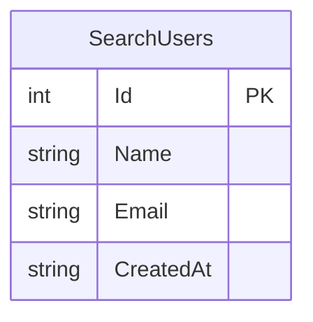

# LIKE検索デモ - 外部設計書

## 文書情報
- **作成日**: 2026-03-12
- **最終更新**: 2026-03-12
- **バージョン**: 1.0
- **ステータス**: 設計中

---

## 1. 画面設計

### 1.1 画面一覧

| No | 画面ID | 画面名 | パス | ステータス |
|----|--------|--------|------|----------|
| 01 | DEMO_LIKE_SEARCH | LIKE検索デモ | /dotnet/Demo/LikeSearch | 🚧 実装予定 |

---

### 1.2 画面レイアウト

```
┌──────────────────────────────────────────────────┐
│ LIKE検索デモ                                      │
├──────────────────────────────────────────────────┤
│ Step 1: [セットアップ（10万件生成）]              │
│                                                  │
│ 検索キーワード: [山              ]               │
│                                                  │
│ ┌──────────────────┐  ┌──────────────────────┐   │
│ │ Step 2           │  │ Step 3               │   │
│ │ [前方一致検索]   │  │ [中間一致検索]       │   │
│ │ LIKE '山%'       │  │ LIKE '%山%'          │   │
│ └──────────────────┘  └──────────────────────┘   │
│                                                  │
│ 比較結果:                                         │
│ ┌──────────────────────────────────────────────┐ │
│ │            前方一致    中間一致               │ │
│ │ 実行時間   3 ms        450 ms                │ │
│ │ 件数       1,205件     2,341件               │ │
│ │ インデックス ✅ 使用   ❌ 未使用（フルスキャン）│ │
│ └──────────────────────────────────────────────┘ │
└──────────────────────────────────────────────────┘
```

---

## 2. API設計

### 2.1 エンドポイント一覧

| No | メソッド | パス | 概要 |
|----|---------|------|------|
| A-01 | POST | /api/demo/like-search/setup | 10万件データ生成 |
| A-02 | GET | /api/demo/like-search/prefix | 前方一致検索 |
| A-03 | GET | /api/demo/like-search/partial | 中間一致検索 |

---

### 2.2 API詳細仕様

#### A-01: データセットアップ

```
POST /api/demo/like-search/setup
```

**レスポンス**:
```json
{
  "success": true,
  "rowCount": 100000,
  "executionTimeMs": 12000,
  "message": "セットアップ完了: 10万件のデータを生成しました（IX_SearchUsers_Name インデックスあり）"
}
```

---

#### A-02: 前方一致検索

```
GET /api/demo/like-search/prefix?keyword=山
```

**リクエストパラメータ**:

| パラメータ | 型 | 必須 | 説明 |
|-----------|-----|------|------|
| keyword | string | ✅ | 検索キーワード |

**レスポンス**:
```json
{
  "executionTimeMs": 3,
  "rowCount": 1205,
  "usesIndex": true,
  "searchType": "prefix",
  "sql": "SELECT Id, Name, Email FROM SearchUsers WHERE Name LIKE @keyword",
  "keyword": "山%",
  "message": "前方一致（LIKE '山%'）: インデックスを使用して 3ms で 1,205件を取得しました",
  "data": [
    { "id": 1, "name": "山田太郎", "email": "user1@example.com" }
  ]
}
```

---

#### A-03: 中間一致検索

```
GET /api/demo/like-search/partial?keyword=山
```

**レスポンス**:
```json
{
  "executionTimeMs": 450,
  "rowCount": 2341,
  "usesIndex": false,
  "searchType": "partial",
  "sql": "SELECT Id, Name, Email FROM SearchUsers WHERE Name LIKE @keyword",
  "keyword": "%山%",
  "message": "中間一致（LIKE '%山%'）: インデックス無効・フルスキャンで 450ms かかりました",
  "data": [
    { "id": 1, "name": "山田太郎", "email": "user1@example.com" }
  ]
}
```

---

### 2.3 データ型定義

#### LikeSearchResponse

```csharp
public class LikeSearchResponse
{
    public long ExecutionTimeMs { get; set; }
    public int RowCount { get; set; }
    public bool UsesIndex { get; set; }
    public string SearchType { get; set; } = "";   // "prefix" or "partial"
    public string Sql { get; set; } = "";
    public string Keyword { get; set; } = "";       // 実際に使ったパターン（例: "山%" or "%山%"）
    public string Message { get; set; } = "";
    public List<SearchUserInfo> Data { get; set; } = new();
}

public class SearchUserInfo
{
    public int Id { get; set; }
    public string Name { get; set; } = "";
    public string Email { get; set; } = "";
}
```

---

## 3. データベース設計（論理）

### 3.1 ER図



### 3.2 エンティティ定義

#### SearchUsers（検索用ユーザー）

| カラム名 | 型 | NULL | 制約 | 説明 |
|---------|-----|------|------|------|
| Id | INTEGER | NOT NULL | PK | ユーザーID（自動採番） |
| Name | TEXT | NOT NULL | - | ユーザー名（日本人名） |
| Email | TEXT | NOT NULL | - | メールアドレス |
| CreatedAt | TEXT | NOT NULL | - | 作成日時 |

**データ件数**: 10万件

**インデックス**:
- `IX_SearchUsers_Name`（Name カラム）: 前方一致で有効、中間一致では無効

---

## 4. エラーハンドリング

| コード | HTTPステータス | 意味 | 対処方法 |
|-------|--------------|------|---------|
| MISSING_PARAM | 400 | keyword パラメータなし | パラメータを付与 |
| DATA_NOT_SETUP | 400 | セットアップ未実施 | セットアップAPIを先に呼ぶ |
| INTERNAL_ERROR | 500 | サーバーエラー | ログ確認 |

---

## 5. 参考

- [要件定義書](requirements.md)
- [内部設計書](internal-design.md)
- [Issue #15](https://github.com/RYA234/dotnet_container/issues/15)
