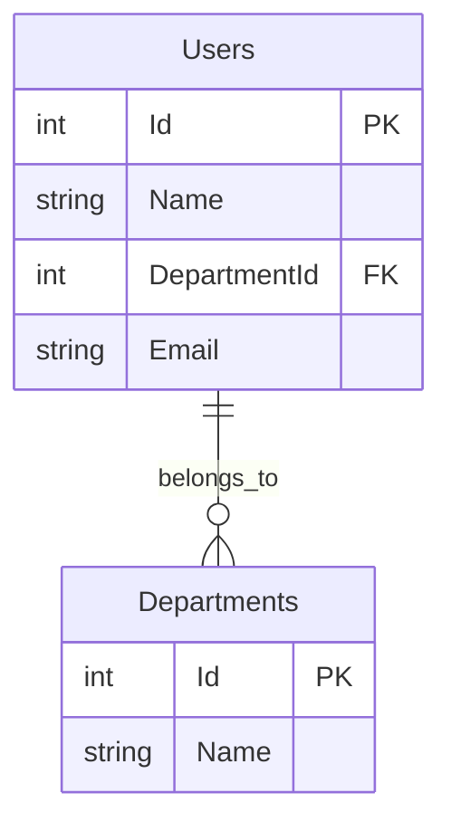

# N+1問題デモ - 外部設計書

## 文書情報
- **作成日**: 2025-12-10
- **最終更新**: 2025-12-10
- **バージョン**: 1.0
- **ステータス**: 実装済み

---

## 1. 画面設計

### 1.1 画面一覧

| No | 画面ID | 画面名 | パス | ステータス |
|----|--------|--------|------|----------|
| 01 | DEMO_PERF | SQLパフォーマンスデモ | /dotnet/Demo/Performance | ✅ |

---

### 1.2 画面詳細

#### DEMO_PERF: SQLパフォーマンスデモ

**概要**: N+1問題のBad版とGood版を実行し、結果を比較表示

**画面項目**:

| No | 項目名 | 型 | 必須 | 説明 |
|----|--------|-----|------|------|
| 01 | テスト実行ボタン（Bad） | Button | - | N+1問題版を実行 |
| 02 | テスト実行ボタン（Good） | Button | - | 最適化版を実行 |
| 03 | 実行結果表示エリア（Bad） | Div | - | JSON結果表示 |
| 04 | 実行結果表示エリア（Good） | Div | - | JSON結果表示 |

**画面動作**:

1. **テスト実行（Bad）ボタンクリック時**
   - JavaScriptで `/api/demo/n-plus-one/bad` にGETリクエスト
   - レスポンスをJSON形式で表示
   - 実行時間とクエリ回数を強調表示

2. **テスト実行（Good）ボタンクリック時**
   - JavaScriptで `/api/demo/n-plus-one/good` にGETリクエスト
   - レスポンスをJSON形式で表示
   - Bad版との差分を強調表示

**画面レイアウト**:
```
┌─────────────────────────────────────┐
│ SQLパフォーマンスデモ                │
├─────────────────────────────────────┤
│ ┌─────────────┐ ┌─────────────┐    │
│ │ Bad版実行   │ │ Good版実行  │    │
│ └─────────────┘ └─────────────┘    │
│                                     │
│ Bad版結果:                          │
│ ┌─────────────────────────────┐    │
│ │ {                            │    │
│ │   "executionTimeMs": 45,     │    │
│ │   "sqlCount": 101,           │    │
│ │   ...                        │    │
│ │ }                            │    │
│ └─────────────────────────────┘    │
│                                     │
│ Good版結果:                         │
│ ┌─────────────────────────────┐    │
│ │ {                            │    │
│ │   "executionTimeMs": 12,     │    │
│ │   "sqlCount": 1,             │    │
│ │   ...                        │    │
│ │ }                            │    │
│ └─────────────────────────────┘    │
└─────────────────────────────────────┘
```

---

## 2. API設計

### 2.1 エンドポイント一覧

| No | メソッド | パス | 概要 | レスポンス |
|----|---------|------|------|----------|
| A-01 | GET | /api/demo/n-plus-one/bad | N+1問題（非効率版） | NPlusOneResponse |
| A-02 | GET | /api/demo/n-plus-one/good | N+1問題（最適化版） | NPlusOneResponse |

---

### 2.2 API詳細仕様

#### A-01: N+1問題（Bad版）

**エンドポイント**:
```
GET /api/demo/n-plus-one/bad
```

**リクエスト**: なし

**レスポンス**:
```json
{
  "executionTimeMs": 45,
  "sqlCount": 101,
  "dataSize": 5621,
  "rowCount": 100,
  "message": "N+1問題あり: ループ内で部署情報を100回個別に取得しています（合計101クエリ）",
  "data": [
    {
      "id": 1,
      "name": "User 1",
      "department": {
        "id": 1,
        "name": "Engineering"
      }
    }
  ]
}
```

**HTTPステータスコード**:

| コード | 意味 | 説明 |
|-------|------|------|
| 200 | OK | 正常終了 |
| 500 | Internal Server Error | サーバーエラー |

---

#### A-02: N+1問題（Good版）

**エンドポイント**:
```
GET /api/demo/n-plus-one/good
```

**リクエスト**: なし

**レスポンス**:
```json
{
  "executionTimeMs": 12,
  "sqlCount": 1,
  "dataSize": 5621,
  "rowCount": 100,
  "message": "最適化済み: 1回のJOINクエリで全データを取得しています",
  "data": [
    {
      "id": 1,
      "name": "User 1",
      "department": {
        "id": 1,
        "name": "Engineering"
      }
    }
  ]
}
```

**HTTPステータスコード**:

| コード | 意味 | 説明 |
|-------|------|------|
| 200 | OK | 正常終了 |
| 500 | Internal Server Error | サーバーエラー |

---

### 2.3 データ型定義

#### NPlusOneResponse

```csharp
public class NPlusOneResponse
{
    public long ExecutionTimeMs { get; set; }
    public int SqlCount { get; set; }
    public int DataSize { get; set; }
    public int RowCount { get; set; }
    public string Message { get; set; }
    public List<UserWithDepartment> Data { get; set; }
}
```

#### UserWithDepartment

```csharp
public class UserWithDepartment
{
    public int Id { get; set; }
    public string Name { get; set; }
    public DepartmentInfo Department { get; set; }
}
```

#### DepartmentInfo

```csharp
public class DepartmentInfo
{
    public int Id { get; set; }
    public string Name { get; set; }
}
```

---

## 3. データベース設計（論理）

### 3.1 ER図



---

### 3.2 エンティティ定義

#### Users（ユーザー）

**用途**: N+1問題デモ用のユーザーデータ

| カラム名 | 型 | NULL | 制約 | 説明 |
|---------|-----|------|------|------|
| Id | INT | NOT NULL | PK | ユーザーID |
| Name | VARCHAR(100) | NOT NULL | - | ユーザー名 |
| DepartmentId | INT | NOT NULL | FK | 部署ID |
| Email | VARCHAR(255) | NOT NULL | UNIQUE | メールアドレス |

**リレーション**:
- Departments.Id (多対1)

**データ件数**: 100件

---

#### Departments（部署）

**用途**: N+1問題デモ用の部署データ

| カラム名 | 型 | NULL | 制約 | 説明 |
|---------|-----|------|------|------|
| Id | INT | NOT NULL | PK | 部署ID |
| Name | VARCHAR(100) | NOT NULL | - | 部署名 |

**データ件数**: 5件
- Engineering
- Sales
- Marketing
- HR
- Finance

---

## 4. エラーハンドリング

### 4.1 エラーレスポンス形式

```json
{
  "error": "エラーメッセージ",
  "code": "ERROR_CODE",
  "timestamp": "2025-12-10T12:00:00Z"
}
```

### 4.2 エラーコード一覧

| コード | HTTPステータス | 意味 | 対処方法 |
|-------|--------------|------|---------|
| DB_ERROR | 500 | データベースエラー | ログ確認 |
| INTERNAL_ERROR | 500 | サーバーエラー | 管理者に連絡 |

---

## 5. 参考

- [要件定義書](requirements.md)
- [内部設計書](internal-design.md)
- [全体API仕様書](../../external-design/api-specification.md)
