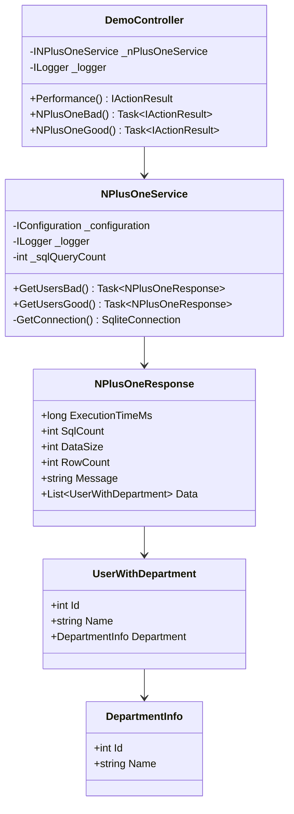
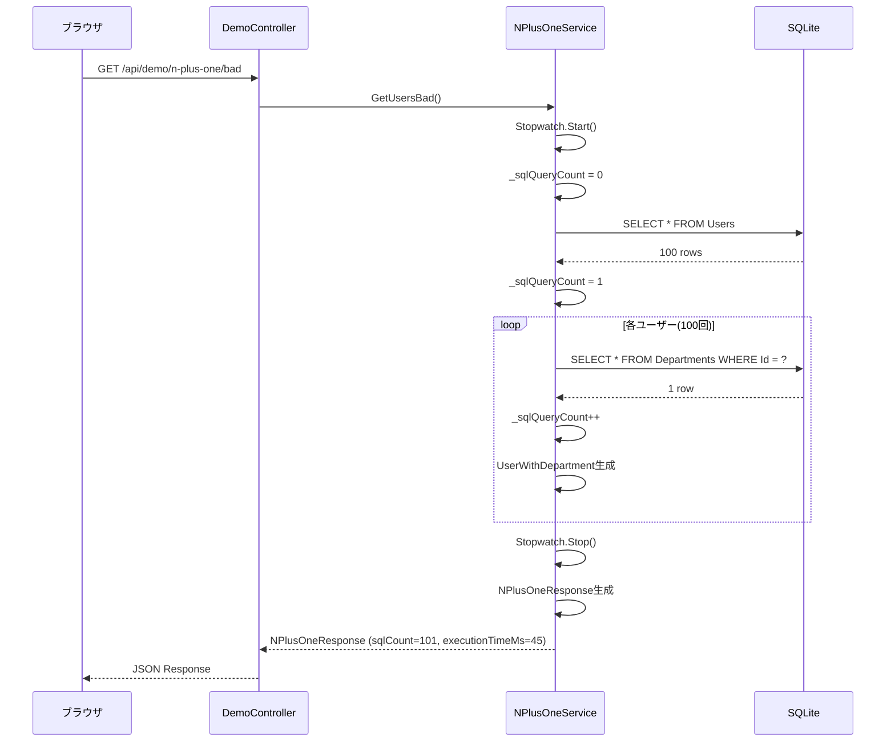
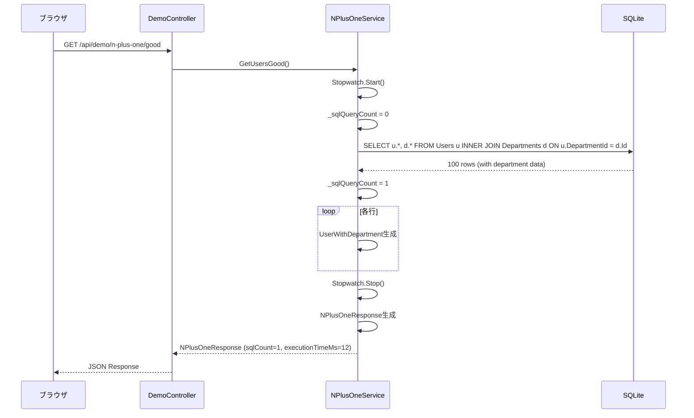

# N+1問題デモ - 内部設計書

## 文書情報
- **作成日**: 2025-12-10
- **最終更新**: 2025-12-10
- **バージョン**: 1.0
- **ステータス**: 実装済み

---

## 1. クラス設計

### 1.1 クラス図



---

### 1.2 インターフェース定義

#### INPlusOneService

```csharp
public interface INPlusOneService
{
    Task<NPlusOneResponse> GetUsersBad();
    Task<NPlusOneResponse> GetUsersGood();
}
```

---

### 1.3 主要クラス詳細

#### NPlusOneService

**責務**: N+1問題のBad版とGood版を実装

**依存関係**:
- `IConfiguration`: 接続文字列取得
- `ILogger<NPlusOneService>`: ログ出力

**主要メソッド**:

| メソッド名 | 戻り値 | 概要 |
|-----------|--------|------|
| GetUsersBad() | Task\<NPlusOneResponse\> | N+1問題版（101回クエリ） |
| GetUsersGood() | Task\<NPlusOneResponse\> | 最適化版（1回クエリ） |
| GetConnection() | SqliteConnection | DB接続取得 |

**実装例（XMLコメント付き）**:

```csharp
/// <summary>
/// N+1問題のデモ実装
/// </summary>
/// <remarks>
/// <para><strong>設計書:</strong> .github/docs/features/n-plus-one-demo/internal-design.md</para>
/// <para><strong>責務:</strong> N+1問題のBad版とGood版を実装し、実行時間とクエリ回数を測定する</para>
/// <para><strong>依存関係:</strong></para>
/// <list type="bullet">
/// <item><description>IConfiguration: 接続文字列取得</description></item>
/// <item><description>ILogger&lt;NPlusOneService&gt;: ログ出力</description></item>
/// </list>
/// </remarks>
public class NPlusOneService : INPlusOneService
{
    private readonly IConfiguration _configuration;
    private readonly ILogger<NPlusOneService> _logger;
    private int _sqlQueryCount = 0;

    public NPlusOneService(IConfiguration configuration, ILogger<NPlusOneService> logger)
    {
        _configuration = configuration;
        _logger = logger;
    }

    /// <summary>
    /// N+1問題版（非効率な実装）
    /// </summary>
    /// <returns>実行結果（実行時間、クエリ回数、データ）</returns>
    /// <remarks>
    /// <para><strong>アルゴリズム:</strong></para>
    /// <list type="number">
    /// <item><description>Stopwatch.Start()</description></item>
    /// <item><description>Usersテーブルから全ユーザー取得（1回目のクエリ）</description></item>
    /// <item><description>各ユーザーごとにループ: Departmentsテーブルから取得（N回のクエリ）</description></item>
    /// <item><description>Stopwatch.Stop()</description></item>
    /// <item><description>NPlusOneResponseを生成して返却</description></item>
    /// </list>
    /// <para><strong>SQL実行回数:</strong> 101回（1回のUsers取得 + 100回のDepartments取得）</para>
    /// <para><strong>期待実行時間:</strong> 約45ms</para>
    /// <para><strong>SQL文（1回目）:</strong></para>
    /// <code>
    /// SELECT Id, Name, DepartmentId, Email FROM Users;
    /// </code>
    /// <para><strong>SQL文（2回目以降、ループ内で100回実行）:</strong></para>
    /// <code>
    /// SELECT Id, Name FROM Departments WHERE Id = @DeptId;
    /// </code>
    /// </remarks>
    public async Task<NPlusOneResponse> GetUsersBad()
    {
        // 実装
    }

    /// <summary>
    /// N+1問題版（最適化済み）
    /// </summary>
    /// <returns>実行結果（実行時間、クエリ回数、データ）</returns>
    /// <remarks>
    /// <para><strong>アルゴリズム:</strong> JOINで一括取得</para>
    /// <para><strong>SQL文:</strong></para>
    /// <code>
    /// SELECT
    ///     u.Id,
    ///     u.Name,
    ///     u.Email,
    ///     d.Id AS DeptId,
    ///     d.Name AS DeptName
    /// FROM Users u
    /// INNER JOIN Departments d ON u.DepartmentId = d.Id;
    /// </code>
    /// <para><strong>SQL実行回数:</strong> 1回</para>
    /// <para><strong>期待実行時間:</strong> 約12ms</para>
    /// </remarks>
    public async Task<NPlusOneResponse> GetUsersGood()
    {
        // 実装
    }
}
```

**アルゴリズム（Bad版）**:
```
1. Stopwatch.Start()
2. _sqlQueryCount = 0
3. Usersテーブルから全ユーザー取得（1回目のクエリ）
   _sqlQueryCount++
4. 各ユーザーごとにループ:
   4-1. DepartmentsテーブルからDepartmentId一致で取得（N回のクエリ）
        _sqlQueryCount++
   4-2. UserWithDepartmentオブジェクト生成
5. Stopwatch.Stop()
6. NPlusOneResponseを生成して返却
```

**アルゴリズム（Good版）**:
```
1. Stopwatch.Start()
2. _sqlQueryCount = 0
3. UsersとDepartmentsをJOINして一括取得（1回のクエリ）
   _sqlQueryCount++
4. 各行をUserWithDepartmentオブジェクトに変換
5. Stopwatch.Stop()
6. NPlusOneResponseを生成して返却
```

---

## 2. シーケンス図

### 2.1 Bad版



---

### 2.2 Good版



---

## 3. データベース設計（物理）

### 3.1 テーブル定義

#### Users（ユーザー）

**DDL**:
```sql
CREATE TABLE Users (
    Id INTEGER PRIMARY KEY AUTOINCREMENT,
    Name TEXT NOT NULL,
    DepartmentId INTEGER NOT NULL,
    Email TEXT NOT NULL UNIQUE,
    FOREIGN KEY (DepartmentId) REFERENCES Departments(Id)
);
```

**初期データ（100件）**:
```sql
-- 1件目
INSERT INTO Users (Name, DepartmentId, Email) VALUES ('User 1', 1, 'user1@example.com');
-- 2件目
INSERT INTO Users (Name, DepartmentId, Email) VALUES ('User 2', 2, 'user2@example.com');
-- ... 100件
```

---

#### Departments（部署）

**DDL**:
```sql
CREATE TABLE Departments (
    Id INTEGER PRIMARY KEY AUTOINCREMENT,
    Name TEXT NOT NULL
);
```

**初期データ（5件）**:
```sql
INSERT INTO Departments (Id, Name) VALUES
(1, 'Engineering'),
(2, 'Sales'),
(3, 'Marketing'),
(4, 'HR'),
(5, 'Finance');
```

---

### 3.2 SQL文

#### Bad版（101回のクエリ）

```sql
-- 1回目
SELECT Id, Name, DepartmentId, Email FROM Users;

-- 2回目以降（ループ内で100回実行）
SELECT Id, Name FROM Departments WHERE Id = 1;
SELECT Id, Name FROM Departments WHERE Id = 2;
SELECT Id, Name FROM Departments WHERE Id = 3;
-- ... 100回
```

#### Good版（1回のクエリ）

```sql
SELECT
    u.Id,
    u.Name,
    u.Email,
    d.Id AS DeptId,
    d.Name AS DeptName
FROM Users u
INNER JOIN Departments d ON u.DepartmentId = d.Id;
```

---

## 4. エラーハンドリング

### 4.1 例外処理

```csharp
[HttpGet("api/demo/n-plus-one/bad")]
public async Task<IActionResult> NPlusOneBad()
{
    try
    {
        var result = await _nPlusOneService.GetUsersBad();
        return Ok(result);
    }
    catch (SqliteException ex)
    {
        _logger.LogError(ex, "Database error in N+1 bad endpoint");
        return StatusCode(500, new
        {
            error = "Database connection failed",
            code = "DB_ERROR",
            timestamp = DateTime.UtcNow
        });
    }
    catch (Exception ex)
    {
        _logger.LogError(ex, "Unexpected error in N+1 bad endpoint");
        return StatusCode(500, new
        {
            error = "Internal server error",
            code = "INTERNAL_ERROR",
            timestamp = DateTime.UtcNow
        });
    }
}
```

---

## 5. ログ設計

### 5.1 ログ出力

```csharp
// Information
_logger.LogInformation("N+1 bad executed: {QueryCount} queries, {ExecutionTimeMs}ms",
    result.SqlCount, result.ExecutionTimeMs);

// Error
_logger.LogError(ex, "Error in N+1 bad endpoint");
```

---

## 6. パフォーマンス測定

### 6.1 実行時間測定

```csharp
var sw = Stopwatch.StartNew();
// 処理実行
sw.Stop();
response.ExecutionTimeMs = sw.ElapsedMilliseconds;
```

### 6.2 SQL実行回数カウント

```csharp
private int _sqlQueryCount = 0;

// クエリ実行前
_sqlQueryCount++;
var command = new SqliteCommand(sql, connection);
```

---

## 7. 参考

- [外部設計書](external-design.md)
- [テストケース](test-cases.md)
- [ADR-002: ORMを使わず素のSQLを採用](../../adr/002-avoid-orm-use-raw-sql.md)
