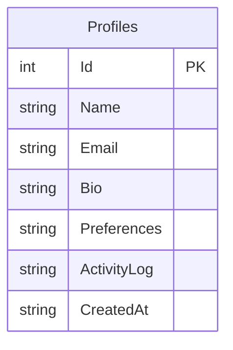

# SELECT * 無駄遣いデモ - 外部設計書

## 文書情報
- **作成日**: 2026-03-12
- **最終更新**: 2026-03-12
- **バージョン**: 1.0
- **ステータス**: 設計中

---

## 1. 画面設計

### 1.1 画面一覧

| No | 画面ID | 画面名 | パス | ステータス |
|----|--------|--------|------|----------|
| 01 | DEMO_SELECT_STAR | SELECT * デモ | /dotnet/Demo/SelectStar | 🚧 実装予定 |

---

### 1.2 画面詳細

#### DEMO_SELECT_STAR: SELECT * デモ

**概要**: SELECT * と必要カラムのみ取得を実行し、転送データ量・コストを比較表示

**画面項目**:

| No | 項目名 | 型 | 説明 |
|----|--------|-----|------|
| 01 | セットアップボタン | Button | 1万件データ生成 |
| 02 | SELECT * 実行ボタン | Button | 全カラム取得を実行 |
| 03 | 必要カラムのみ実行ボタン | Button | 必要カラムのみ取得を実行 |
| 04 | 実行時間 | 表示 | ms 単位で表示 |
| 05 | データサイズ | 表示 | MB / KB 単位で表示 |
| 06 | AWS転送料概算 | 表示 | ドル単位で表示 |
| 07 | 結果表示エリア | Div | JSON結果（先頭3件） |

**画面レイアウト**:
```
┌──────────────────────────────────────────────────┐
│ SELECT * の無駄遣いデモ                            │
├──────────────────────────────────────────────────┤
│ Step 1: [セットアップ（1万件生成）]                │
│                                                  │
│ ┌──────────────────┐  ┌──────────────────────┐   │
│ │ Step 2           │  │ Step 3               │   │
│ │ [SELECT * 実行]  │  │ [必要カラムのみ実行] │   │
│ └──────────────────┘  └──────────────────────┘   │
│                                                  │
│ 比較結果:                                         │
│ ┌──────────────────────────────────────────────┐ │
│ │              SELECT *    必要カラムのみ       │ │
│ │ 実行時間     2,100 ms    85 ms               │ │
│ │ データサイズ  350 MB      500 KB              │ │
│ │ AWS転送料    $0.0035     $0.000005           │ │
│ └──────────────────────────────────────────────┘ │
│                                                  │
│ SELECT * のSQL:                                  │
│ SELECT * FROM Profiles                           │
│                                                  │
│ 必要カラムのみのSQL:                              │
│ SELECT Id, Name, Email FROM Profiles             │
│                                                  │
│ 結果（先頭3件）:                                  │
│ ┌──────────────────────────────────────────┐     │
│ │ [{ "id": 1, "name": "...", ... }]        │     │
│ └──────────────────────────────────────────┘     │
└──────────────────────────────────────────────────┘
```

---

## 2. API設計

### 2.1 エンドポイント一覧

| No | メソッド | パス | 概要 | レスポンス |
|----|---------|------|------|----------|
| A-01 | POST | /api/demo/select-star/setup | 1万件データ生成 | SetupResponse |
| A-02 | GET | /api/demo/select-star/all-columns | SELECT * 全カラム取得 | SelectStarResponse |
| A-03 | GET | /api/demo/select-star/specific-columns | 必要カラムのみ取得 | SelectStarResponse |

---

### 2.2 API詳細仕様

#### A-01: データセットアップ

**エンドポイント**:
```
POST /api/demo/select-star/setup
```

**リクエスト**: なし

**レスポンス**:
```json
{
  "success": true,
  "rowCount": 10000,
  "executionTimeMs": 8000,
  "message": "1万件のデータを生成しました（Bio:10KB, Preferences:5KB, ActivityLog:20KB）"
}
```

**HTTPステータスコード**:

| コード | 意味 | 説明 |
|-------|------|------|
| 200 | OK | 正常終了（既にデータあり含む） |
| 500 | Internal Server Error | サーバーエラー |

---

#### A-02: SELECT * 全カラム取得

**エンドポイント**:
```
GET /api/demo/select-star/all-columns
```

**リクエスト**: なし

**レスポンス**:
```json
{
  "executionTimeMs": 2100,
  "rowCount": 10000,
  "dataSize": 367001600,
  "dataSizeLabel": "350.0 MB",
  "awsCostEstimate": 0.00367,
  "sql": "SELECT * FROM Profiles",
  "message": "SELECT *: 10,000件 × 35KB = 350MB を転送しました（AWS転送料: $0.0037）",
  "data": [
    {
      "id": 1,
      "name": "山田太郎",
      "email": "user1@example.com",
      "bio": "私は東京都出身の...(10KB)",
      "preferences": "{\"theme\":\"dark\",...(5KB)}",
      "activityLog": "[{\"timestamp\":\"...\"(20KB)}]",
      "createdAt": "2026-03-12T00:00:00"
    }
  ]
}
```

**HTTPステータスコード**:

| コード | 意味 | 説明 |
|-------|------|------|
| 200 | OK | 正常終了 |
| 400 | Bad Request | セットアップ未実施 |
| 500 | Internal Server Error | サーバーエラー |

---

#### A-03: 必要カラムのみ取得

**エンドポイント**:
```
GET /api/demo/select-star/specific-columns
```

**リクエスト**: なし

**レスポンス**:
```json
{
  "executionTimeMs": 85,
  "rowCount": 10000,
  "dataSize": 510000,
  "dataSizeLabel": "498.0 KB",
  "awsCostEstimate": 0.0000051,
  "sql": "SELECT Id, Name, Email FROM Profiles",
  "message": "必要カラムのみ: 10,000件 × 51B = 498KB を転送しました（AWS転送料: $0.0000051）",
  "data": [
    {
      "id": 1,
      "name": "山田太郎",
      "email": "user1@example.com"
    }
  ]
}
```

---

### 2.3 データ型定義

#### SelectStarResponse

```csharp
public class SelectStarResponse
{
    public long ExecutionTimeMs { get; set; }
    public int RowCount { get; set; }
    public long DataSize { get; set; }        // バイト数
    public string DataSizeLabel { get; set; } // "350.0 MB" など
    public double AwsCostEstimate { get; set; }
    public string Sql { get; set; }
    public string Message { get; set; }
    public object Data { get; set; }          // 全カラム or 必要カラムのみ
}
```

#### ProfileFull（SELECT * 用）

```csharp
public class ProfileFull
{
    public int Id { get; set; }
    public string Name { get; set; }
    public string Email { get; set; }
    public string Bio { get; set; }
    public string Preferences { get; set; }
    public string ActivityLog { get; set; }
    public string CreatedAt { get; set; }
}
```

#### ProfileSummary（必要カラムのみ用）

```csharp
public class ProfileSummary
{
    public int Id { get; set; }
    public string Name { get; set; }
    public string Email { get; set; }
}
```

---

## 3. データベース設計（論理）

### 3.1 ER図



---

### 3.2 エンティティ定義

#### Profiles（プロフィール）

**用途**: SELECT * デモ用の大容量カラムを持つテーブル

| カラム名 | 型 | NULL | 制約 | サイズ | 説明 |
|---------|-----|------|------|--------|------|
| Id | INTEGER | NOT NULL | PK | - | ユーザーID（自動採番） |
| Name | TEXT | NOT NULL | - | 50文字 | ユーザー名 |
| Email | TEXT | NOT NULL | - | 100文字 | メールアドレス |
| Bio | TEXT | NULL | - | 約10KB | 自己紹介文（不要カラム） |
| Preferences | TEXT | NULL | - | 約5KB | ユーザー設定JSON（不要カラム） |
| ActivityLog | TEXT | NULL | - | 約20KB | アクティビティログ（不要カラム） |
| CreatedAt | TEXT | NOT NULL | - | - | 作成日時（ISO8601） |

**データ件数**: 1万件

**インデックス**: なし（SELECT * の比較が目的のため）

**1レコードあたりのサイズ**:
- Name + Email: 約 50B（必要なカラム）
- Bio: 約 10KB（不要）
- Preferences: 約 5KB（不要）
- ActivityLog: 約 20KB（不要）
- **合計: 約 35KB / レコード**

---

## 4. データサイズ計算

### 4.1 計算方法

```csharp
// JSON シリアライズして byte 数を計測
var json = System.Text.Json.JsonSerializer.Serialize(data);
var dataSize = System.Text.Encoding.UTF8.GetByteCount(json);
```

### 4.2 AWS転送料計算

```csharp
// AWS Data Transfer Out: $0.114/GB（東京リージョン・最初の10TB）
// 教育用に切り上げて $0.01/GB で表示
const double AwsDataTransferCostPerGb = 0.01;
var awsCost = (dataSize / 1024.0 / 1024.0 / 1024.0) * AwsDataTransferCostPerGb;
```

---

## 5. エラーハンドリング

### 5.1 エラーコード一覧

| コード | HTTPステータス | 意味 | 対処方法 |
|-------|--------------|------|---------|
| DATA_NOT_SETUP | 400 | セットアップ未実施 | セットアップAPIを先に呼ぶ |
| DB_ERROR | 500 | データベースエラー | ログ確認 |
| INTERNAL_ERROR | 500 | サーバーエラー | 管理者に連絡 |

---

## 6. 参考

- [要件定義書](requirements.md)
- [内部設計書](internal-design.md)
- [Issue #16](https://github.com/RYA234/dotnet_container/issues/16)
