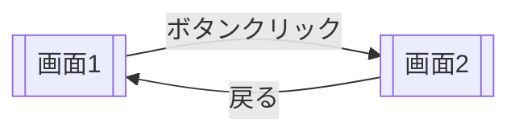
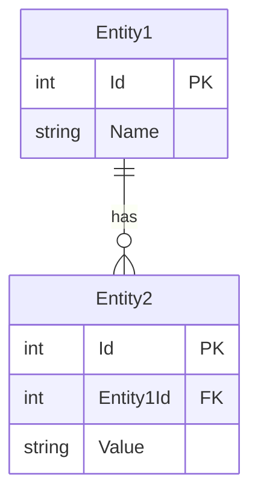

# [機能名] - 外部設計書

## 文書情報
- **作成日**: YYYY-MM-DD
- **最終更新**: YYYY-MM-DD
- **バージョン**: 1.0
- **ステータス**: Draft

## 変更履歴
| 日付 | バージョン | 変更者 | 変更内容 |
|------|----------|--------|---------|
| YYYY-MM-DD | 1.0 | - | 初版作成 |

---

## 1. 画面設計

### 1.1 画面一覧

| No | 画面ID | 画面名 | パス | ステータス |
|----|--------|--------|------|----------|
| 01 | [SCREEN_ID] | [画面名] | /dotnet/[Path] | 🚧 |

---

### 1.2 画面詳細

#### [画面ID]: [画面名]

**概要**: [画面の概要]

**画面項目**:

| No | 項目名 | 型 | 必須 | 説明 |
|----|--------|-----|------|------|
| 01 | [項目1] | Text | ✅ | [説明] |
| 02 | [項目2] | Button | - | [説明] |

**画面動作**:

1. [ボタン名]ボタンクリック時
   - [動作1]
   - [動作2]

**バリデーション**:

| 項目名 | ルール | エラーメッセージ |
|-------|--------|----------------|
| [項目1] | 必須 | [項目1]を入力してください |
| [項目2] | 範囲(0-100) | 0〜100の範囲で入力してください |

**画面遷移**:


---

## 2. API設計

### 2.1 エンドポイント一覧

| No | メソッド | パス | 概要 | レスポンス |
|----|---------|------|------|----------|
| A-01 | GET | /api/[feature]/[action] | [概要] | [Response型] |
| A-02 | POST | /api/[feature]/[action] | [概要] | [Response型] |

---

### 2.2 API詳細仕様

#### A-01: [API名]

**エンドポイント**:
```
GET /api/[feature]/[action]
```

**リクエスト**:
```json
{
  "param1": "value1",
  "param2": 123
}
```

**レスポンス**:
```json
{
  "result": "success",
  "data": {
    "field1": "value1",
    "field2": 123
  }
}
```

**HTTPステータスコード**:

| コード | 意味 | 説明 |
|-------|------|------|
| 200 | OK | 正常終了 |
| 400 | Bad Request | 入力エラー |
| 500 | Internal Server Error | サーバーエラー |

---

## 3. データベース設計（論理）

### 3.1 ER図



---

### 3.2 エンティティ定義

#### [エンティティ名]

**用途**: [用途]

| カラム名 | 型 | NULL | 制約 | 説明 |
|---------|-----|------|------|------|
| Id | INT | NOT NULL | PK | ID |
| Name | VARCHAR(100) | NOT NULL | - | 名前 |
| CreatedAt | TIMESTAMP | NOT NULL | - | 作成日時 |

**リレーション**:
- [関連エンティティ名].Id (1対多)

---

## 4. エラーハンドリング

### 4.1 エラーレスポンス形式

```json
{
  "error": "エラーメッセージ",
  "code": "ERROR_CODE",
  "timestamp": "2025-12-10T12:00:00Z"
}
```

### 4.2 エラーコード一覧

| コード | HTTPステータス | 意味 | 対処方法 |
|-------|--------------|------|---------|
| VALIDATION_ERROR | 400 | 入力エラー | 入力内容を修正 |
| NOT_FOUND | 404 | データ未検出 | データを確認 |
| INTERNAL_ERROR | 500 | サーバーエラー | 管理者に連絡 |

---

## 5. 参考

- [要件定義書](requirements.md)
- [内部設計書](internal-design.md)
