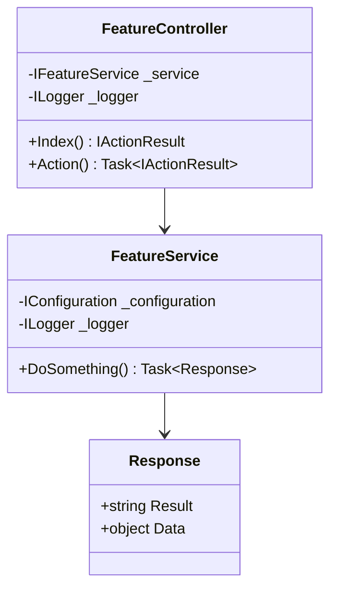
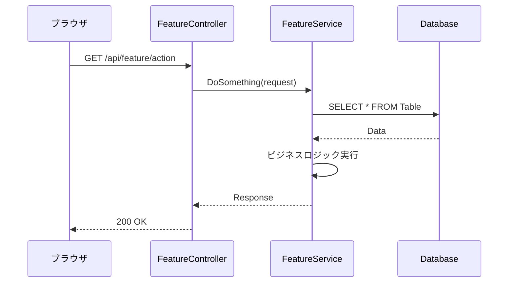

# [機能名] - 内部設計書

## 文書情報
- **作成日**: YYYY-MM-DD
- **最終更新**: YYYY-MM-DD
- **バージョン**: 1.0
- **ステータス**: Draft

## 変更履歴
| 日付 | バージョン | 変更者 | 変更内容 |
|------|----------|--------|---------|
| YYYY-MM-DD | 1.0 | - | 初版作成 |

---

## 1. クラス設計

### 1.1 クラス図



---

### 1.2 インターフェース定義

#### IFeatureService

```csharp
public interface IFeatureService
{
    Task<Response> DoSomething(Request request);
}
```

---

### 1.3 主要クラス詳細

#### FeatureController

**責務**: HTTPリクエスト処理

**依存関係**:
- `IFeatureService`: ビジネスロジック
- `ILogger<FeatureController>`: ログ出力

**主要メソッド**:

| メソッド名 | 戻り値 | 概要 |
|-----------|--------|------|
| Index() | IActionResult | 画面表示 |
| Action() | Task\<IActionResult\> | アクション実行 |

**実装例**:
```csharp
[ApiController]
public class FeatureController : Controller
{
    private readonly IFeatureService _service;
    private readonly ILogger<FeatureController> _logger;

    public FeatureController(IFeatureService service, ILogger<FeatureController> logger)
    {
        _service = service;
        _logger = logger;
    }

    [HttpGet("api/feature/action")]
    public async Task<IActionResult> Action([FromQuery] Request request)
    {
        try
        {
            var result = await _service.DoSomething(request);
            return Ok(result);
        }
        catch (Exception ex)
        {
            _logger.LogError(ex, "Error in action endpoint");
            return StatusCode(500, new { error = ex.Message });
        }
    }
}
```

---

#### FeatureService

**責務**: ビジネスロジック実装

**アルゴリズム**:
```
1. 入力検証
2. データベースアクセス
3. ビジネスロジック実行
4. レスポンス生成
```

**実装例**:
```csharp
/// <summary>
/// [機能名]のビジネスロジック
/// </summary>
/// <remarks>
/// <para><strong>設計書:</strong> .github/docs/features/[機能名]/internal-design.md</para>
/// <para><strong>責務:</strong> [責務の説明]</para>
/// <para><strong>依存関係:</strong></para>
/// <list type="bullet">
/// <item><description>IConfiguration: 設定取得</description></item>
/// <item><description>ILogger&lt;FeatureService&gt;: ログ出力</description></item>
/// </list>
/// </remarks>
public class FeatureService : IFeatureService
{
    private readonly IConfiguration _configuration;
    private readonly ILogger<FeatureService> _logger;

    public FeatureService(IConfiguration configuration, ILogger<FeatureService> logger)
    {
        _configuration = configuration;
        _logger = logger;
    }

    /// <summary>
    /// [メソッドの概要]
    /// </summary>
    /// <param name="request">リクエストパラメータ</param>
    /// <returns>レスポンス</returns>
    /// <remarks>
    /// <para><strong>アルゴリズム:</strong></para>
    /// <list type="number">
    /// <item><description>入力検証</description></item>
    /// <item><description>データベースアクセス</description></item>
    /// <item><description>ビジネスロジック実行</description></item>
    /// <item><description>レスポンス生成</description></item>
    /// </list>
    /// <para><strong>SQL文:</strong></para>
    /// <code>
    /// SELECT * FROM Table WHERE Id = @Id;
    /// </code>
    /// </remarks>
    public async Task<Response> DoSomething(Request request)
    {
        // 実装
        return new Response { Result = "success" };
    }
}
```

---

## 2. シーケンス図



---

## 3. データベース設計（物理）

### 3.1 テーブル定義

#### [テーブル名]

**DDL**:
```sql
CREATE TABLE [TableName] (
    Id INTEGER PRIMARY KEY AUTOINCREMENT,
    Name TEXT NOT NULL,
    CreatedAt TIMESTAMP DEFAULT CURRENT_TIMESTAMP
);
```

**カラム定義**:

| カラム名 | 型 | NULL | デフォルト | インデックス | 説明 |
|---------|-----|------|----------|------------|------|
| Id | INTEGER | NOT NULL | AUTOINCREMENT | PK | ID |
| Name | TEXT | NOT NULL | - | - | 名前 |
| CreatedAt | TIMESTAMP | NOT NULL | CURRENT_TIMESTAMP | - | 作成日時 |

---

### 3.2 インデックス設計

| テーブル名 | インデックス名 | カラム | 種類 | 目的 |
|----------|-------------|--------|------|------|
| [TableName] | PK_TableName | Id | PRIMARY KEY | 主キー |
| [TableName] | IDX_Name | Name | INDEX | 検索高速化 |

---

### 3.3 初期データ

```sql
INSERT INTO [TableName] (Name) VALUES
('Sample1'),
('Sample2'),
('Sample3');
```

---

## 4. エラーハンドリング

### 4.1 例外処理

```csharp
try
{
    var result = await _service.DoSomething(request);
    return Ok(result);
}
catch (ValidationException ex)
{
    _logger.LogWarning(ex, "Validation error");
    return BadRequest(new { error = ex.Message, code = "VALIDATION_ERROR" });
}
catch (NotFoundException ex)
{
    _logger.LogWarning(ex, "Not found");
    return NotFound(new { error = ex.Message, code = "NOT_FOUND" });
}
catch (Exception ex)
{
    _logger.LogError(ex, "Unexpected error");
    return StatusCode(500, new { error = "Internal server error", code = "INTERNAL_ERROR" });
}
```

---

## 5. ログ設計

### 5.1 ログ出力

```csharp
// Information
_logger.LogInformation("Action executed: {RequestId}", request.Id);

// Warning
_logger.LogWarning("Data not found: {Id}", id);

// Error
_logger.LogError(ex, "Error in action");
```

---

## 6. セキュリティ設計

### 6.1 SQLインジェクション対策

```csharp
// ✅ Good: パラメータ化クエリ
var sql = "SELECT * FROM Table WHERE Id = @Id";
command.Parameters.AddWithValue("@Id", id);
```

### 6.2 XSS対策

```csharp
// ✅ Good: HTMLエンコーディング
@Html.Encode(Model.UserInput)
```

---

## 7. 参考

- [外部設計書](external-design.md)
- [テストケース](test-cases.md)
