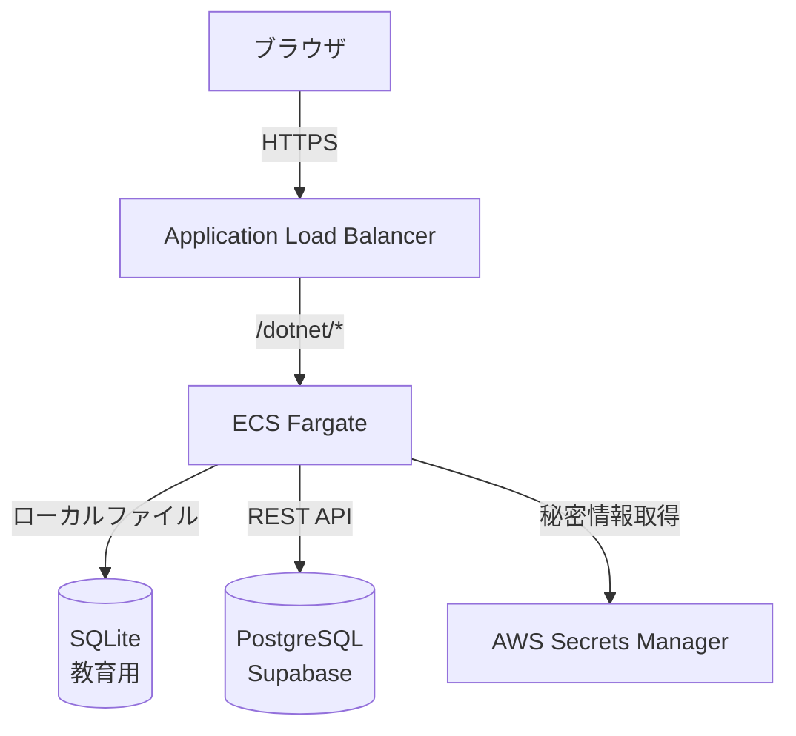
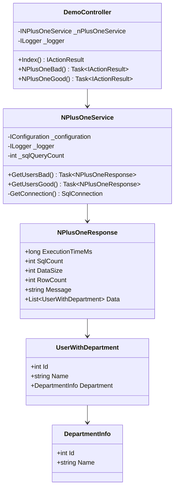
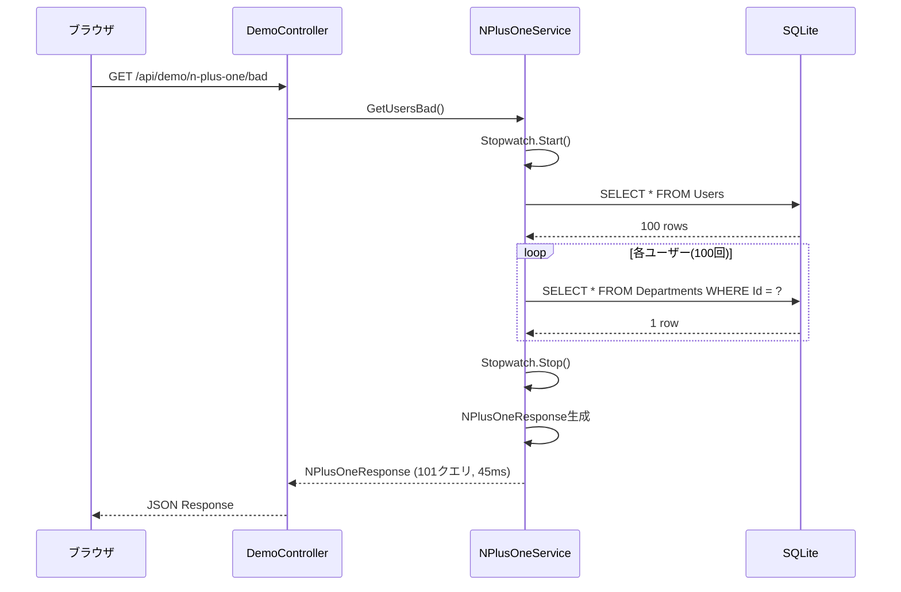

# 内部設計書（詳細設計書）

## 文書情報
- **作成日**: 2025-12-10
- **最終更新**: 2025-12-10
- **バージョン**: 1.0
- **ステータス**: Draft

## 変更履歴
| 日付 | バージョン | 変更者 | 変更内容 |
|------|----------|--------|---------|
| 2025-12-10 | 1.0 | - | 初版作成 |

---

## 1. アーキテクチャ設計

### 1.1 システムアーキテクチャ



### 1.2 レイヤー構成

```
Features/
├── Demo/                      # エンジニア教育用
│   ├── DemoController.cs      # コントローラー
│   ├── Services/
│   │   └── NPlusOneService.cs # ビジネスロジック
│   ├── Models/                # DTO
│   └── Views/                 # Razor View
├── Inventory/                 # 在庫管理
├── Sales/                     # 販売管理
└── Calculator/                # 電卓
```

### 1.3 アーキテクチャパターン
- **MVC**: Model-View-Controller
- **Feature-based**: 機能ごとにフォルダ分割
- **ADO.NET**: 素のSQL（ORM不使用）

---

## 2. クラス設計

### 2.1 クラス図（N+1問題デモ）



### 2.2 インターフェース定義

#### INPlusOneService
```csharp
public interface INPlusOneService
{
    Task<NPlusOneResponse> GetUsersBad();
    Task<NPlusOneResponse> GetUsersGood();
}
```

### 2.3 主要クラス詳細

#### NPlusOneService
**責務**: N+1問題のデモ実装

**主要メソッド**:
| メソッド名 | 戻り値 | 概要 |
|-----------|--------|------|
| GetUsersBad() | Task\<NPlusOneResponse\> | N+1問題版（101回クエリ） |
| GetUsersGood() | Task\<NPlusOneResponse\> | 最適化版（1回クエリ） |
| GetConnection() | SqlConnection | DB接続取得 |

**アルゴリズム（Bad版）**:
```
1. Usersテーブルから全ユーザー取得（1回目のクエリ）
2. 各ユーザーごとにループ:
   2-1. DepartmentsテーブルからDepartmentId一致で取得（N回のクエリ）
   2-2. UserWithDepartmentオブジェクト生成
3. 実行時間、クエリ回数を記録
4. NPlusOneResponseを返却
```

**アルゴリズム（Good版）**:
```
1. UsersとDepartmentsをJOINして一括取得（1回のクエリ）
2. 各行をUserWithDepartmentオブジェクトに変換
3. 実行時間、クエリ回数を記録
4. NPlusOneResponseを返却
```

---

## 3. データベース設計（物理）

### 3.1 テーブル定義

#### Users（ユーザー）
```sql
CREATE TABLE Users (
    Id INTEGER PRIMARY KEY AUTOINCREMENT,
    Name TEXT NOT NULL,
    DepartmentId INTEGER NOT NULL,
    Email TEXT NOT NULL UNIQUE,
    FOREIGN KEY (DepartmentId) REFERENCES Departments(Id)
);
```

| カラム名 | 型 | NULL | デフォルト | インデックス | 説明 |
|---------|-----|------|----------|------------|------|
| Id | INTEGER | NOT NULL | AUTOINCREMENT | PK | ユーザーID |
| Name | TEXT | NOT NULL | - | - | ユーザー名 |
| DepartmentId | INTEGER | NOT NULL | - | FK | 部署ID |
| Email | TEXT | NOT NULL | - | UNIQUE | メール |

#### Departments（部署）
```sql
CREATE TABLE Departments (
    Id INTEGER PRIMARY KEY AUTOINCREMENT,
    Name TEXT NOT NULL
);
```

| カラム名 | 型 | NULL | デフォルト | インデックス | 説明 |
|---------|-----|------|----------|------------|------|
| Id | INTEGER | NOT NULL | AUTOINCREMENT | PK | 部署ID |
| Name | TEXT | NOT NULL | - | - | 部署名 |

### 3.2 インデックス設計

| テーブル名 | インデックス名 | カラム | 種類 | 目的 |
|----------|-------------|--------|------|------|
| Users | PK_Users | Id | PRIMARY KEY | 主キー |
| Users | UQ_Users_Email | Email | UNIQUE | メール重複防止 |
| Users | FK_Users_DepartmentId | DepartmentId | FOREIGN KEY | 部署との関連 |
| Departments | PK_Departments | Id | PRIMARY KEY | 主キー |

### 3.3 初期データ

#### Departments
```sql
INSERT INTO Departments (Id, Name) VALUES
(1, 'Engineering'),
(2, 'Sales'),
(3, 'Marketing'),
(4, 'HR'),
(5, 'Finance');
```

#### Users（100件生成）
```csharp
for (int i = 1; i <= 100; i++)
{
    int deptId = ((i - 1) % 5) + 1;
    string sql = "INSERT INTO Users (Name, DepartmentId, Email) VALUES " +
                 $"('User {i}', {deptId}, 'user{i}@example.com')";
    // 実行
}
```

---

## 4. 処理フロー設計

### 4.1 シーケンス図（N+1問題Bad版）



---

## 5. エラーハンドリング設計

### 5.1 例外処理方針
- **Controller層**: try-catchでラップ、500エラー返却
- **Service層**: 業務例外をスロー
- **DB層**: SqlException をそのままスロー

### 5.2 例外クラス設計

#### DemoController
```csharp
try
{
    var result = await _nPlusOneService.GetUsersBad();
    return Ok(result);
}
catch (Exception ex)
{
    _logger.LogError(ex, "Error in N+1 bad endpoint");
    return StatusCode(500, new { error = ex.Message });
}
```

---

## 6. データアクセス設計

### 6.1 接続文字列管理
- **ファイル**: `appsettings.json`
- **キー**: `ConnectionStrings:DemoDatabase`
- **値**: `Data Source=demo.db`

### 6.2 SQL文管理

#### N+1問題（Bad版）
```sql
-- 1回目
SELECT Id, Name, DepartmentId, Email FROM Users;

-- 2回目以降（ループ内で100回実行）
SELECT Id, Name FROM Departments WHERE Id = @DeptId;
```

#### N+1問題（Good版）
```sql
-- 1回のクエリで完結
SELECT u.Id, u.Name, u.Email, d.Id AS DeptId, d.Name AS DeptName
FROM Users u
INNER JOIN Departments d ON u.DepartmentId = d.Id;
```

### 6.3 トランザクション管理
- 現在のデモは読み取り専用のためトランザクション不要
- 将来の在庫管理等では `SqlTransaction` を使用

---

## 7. 性能設計

### 7.1 性能要件
| 項目 | 目標値 | 測定方法 |
|------|--------|---------|
| レスポンスタイム | < 1秒 | Stopwatch計測 |
| クエリ回数 | 最小化 | カウンター |
| データサイズ | < 10KB | JSON文字列長 |

### 7.2 性能測定
```csharp
var sw = Stopwatch.StartNew();
// 処理実行
sw.Stop();
response.ExecutionTimeMs = sw.ElapsedMilliseconds;
```

---

## 8. セキュリティ実装設計

### 8.1 SQLインジェクション対策
```csharp
// ❌ Bad: 文字列連結
var sql = $"SELECT * FROM Users WHERE Id = {userId}";

// ✅ Good: パラメータ化クエリ
var sql = "SELECT * FROM Users WHERE Id = @UserId";
command.Parameters.AddWithValue("@UserId", userId);
```

### 8.2 秘密情報管理
```csharp
// AWS Secrets Manager から取得
var connectionString = _configuration.GetConnectionString("DemoDatabase");
```

---

## 9. ログ設計

### 9.1 ログレベル
| レベル | 用途 |
|-------|------|
| Error | 例外発生時 |
| Warning | 想定外の状況 |
| Information | 正常処理 |
| Debug | 開発時デバッグ |

### 9.2 ログ出力例
```csharp
_logger.LogError(ex, "Error in N+1 bad endpoint");
_logger.LogInformation("N+1 bad executed: {QueryCount} queries", result.SqlCount);
```

---

## 10. テスト設計

### 10.1 単体テスト

#### テストケース（NPlusOneService）
| No | テストケース名 | 入力 | 期待結果 |
|----|-------------|------|---------|
| T-01 | GetUsersBad_正常系 | なし | SqlCount = 101 |
| T-02 | GetUsersGood_正常系 | なし | SqlCount = 1 |
| T-03 | GetUsersBad_性能比較 | なし | ExecutionTimeMs > GetUsersGood |

### 10.2 テストデータ
- Users: 100件
- Departments: 5件
- テストDB: `demo_test.db`
