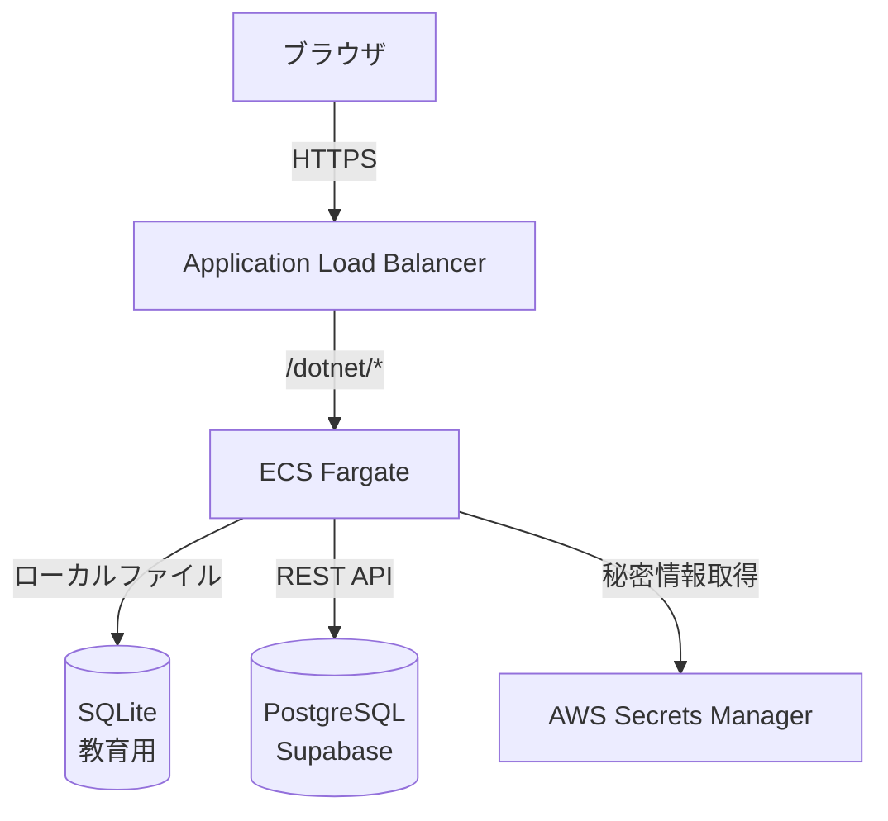

# アーキテクチャ設計

## システムアーキテクチャ



---

## レイヤー構成

### Feature-based アーキテクチャ

```
Features/
├── Demo/                      # エンジニア教育用
│   ├── DemoController.cs      # コントローラー
│   ├── Services/
│   │   └── NPlusOneService.cs # ビジネスロジック
│   ├── Models/                # DTO
│   └── Views/                 # Razor View
├── Inventory/                 # 在庫管理（未実装）
├── Sales/                     # 販売管理（未実装）
├── Production/                # 生産管理（未実装）
└── Calculator/                # 電卓（WinFormsマイグレーション）
```

### 理由
- **機能ごとに凝集**: 関連するコード（Controller, Service, View）を同じフォルダに配置
- **拡張しやすい**: 新機能は新しいフォルダを追加するだけ
- **チーム開発向き**: 機能ごとに担当者を分けやすい

**詳細**: [ADR-003: Feature-based アーキテクチャを採用（未作成）]

---

## アーキテクチャパターン

### MVC (Model-View-Controller)
- **Model**: データ構造（DTO, Response）
- **View**: Razor テンプレート
- **Controller**: HTTP リクエスト処理

### データアクセス
- **ADO.NET（素のSQL）**: ORM不使用
- **理由**: N+1問題を明確にデモするため
- **詳細**: [ADR-002: ORMを使わず素のSQLを採用](../adr/002-avoid-orm-use-raw-sql.md)

---

## 技術スタック

### バックエンド
| 技術 | バージョン | 用途 |
|------|----------|------|
| ASP.NET Core | 8.0 | Webフレームワーク |
| C# | 12 | プログラミング言語 |
| ADO.NET | - | データベースアクセス |

### データベース
| 技術 | 用途 |
|------|------|
| SQLite | 教育用デモ |
| PostgreSQL (Supabase) | 基幹システム |

### インフラ
| 技術 | 用途 |
|------|------|
| ECS Fargate | コンテナ実行 |
| ALB | ロードバランサー |
| ECR | Dockerイメージ保管 |
| CloudWatch Logs | ログ管理 |
| AWS Secrets Manager | 秘密情報管理 |

---

## デプロイメント構成

### 本番環境
```
[GitHub] --push--> [GitHub Actions] --build--> [ECR]
                                              |
                                              v
[ALB] --route--> [ECS Fargate] <--pull-- [ECR]
                      |
                      +---> SQLite (ローカルファイル)
                      +---> Supabase (REST API)
                      +---> Secrets Manager
```

### ローカル開発環境
```
[Visual Studio 2022]
    |
    +---> dotnet run
    |
    +---> SQLite (demo.db)
    +---> Supabase (接続テスト用)
```

---

## 設計原則

### SOLID原則（一部適用）
- **Single Responsibility**: 各Serviceは1つの責務（N+1デモなど）
- **Dependency Inversion**: IServiceをインターフェース化

### 教育用デモの設計方針
1. **透明性**: クエリ回数、実行時間を可視化
2. **比較可能**: Bad版とGood版を並べて比較
3. **シンプル**: 複雑な抽象化を避ける

---

## 非機能要件

### 性能
| 項目 | 目標値 |
|------|--------|
| レスポンスタイム | < 1秒 |
| 同時接続数 | 10（教育用のため小規模） |

### 可用性
| 項目 | 目標値 |
|------|--------|
| 稼働率 | 95%（教育用デモのため緩い） |
| RPO（目標復旧時点） | 1日（デモデータは再生成可能） |
| RTO（目標復旧時間） | 1時間 |

### セキュリティ
- HTTPS必須
- SQLインジェクション対策（パラメータ化クエリ）
- 秘密情報はSecrets Managerで管理

---

## 参考

- [クラス設計](class-design.md)
- [DB物理設計](database-schema.md)
- [ADR-002: ORMを使わず素のSQLを採用](../adr/002-avoid-orm-use-raw-sql.md)
