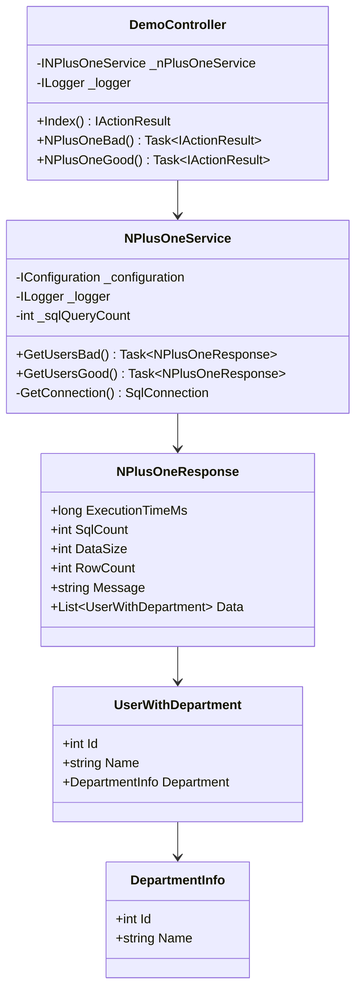

# クラス設計

## クラス図（N+1問題デモ）



---

## インターフェース定義

### INPlusOneService

```csharp
public interface INPlusOneService
{
    Task<NPlusOneResponse> GetUsersBad();
    Task<NPlusOneResponse> GetUsersGood();
}
```

**責務**: N+1問題のデモ実装

**実装クラス**: `NPlusOneService`

---

## 主要クラス詳細

### DemoController

**責務**: HTTPリクエストを受け付け、Serviceを呼び出す

**依存関係**:
- `INPlusOneService`: N+1問題デモ
- `ILogger<DemoController>`: ログ出力

**主要メソッド**:

| メソッド名 | 戻り値 | 概要 |
|-----------|--------|------|
| Index() | IActionResult | デモ画面を表示 |
| NPlusOneBad() | Task\<IActionResult\> | N+1問題（Bad版）API |
| NPlusOneGood() | Task\<IActionResult\> | N+1問題（Good版）API |

**実装例**:
```csharp
[ApiController]
public class DemoController : Controller
{
    private readonly INPlusOneService _nPlusOneService;
    private readonly ILogger<DemoController> _logger;

    public DemoController(INPlusOneService nPlusOneService, ILogger<DemoController> logger)
    {
        _nPlusOneService = nPlusOneService;
        _logger = logger;
    }

    [HttpGet("api/demo/n-plus-one/bad")]
    public async Task<IActionResult> NPlusOneBad()
    {
        try
        {
            var result = await _nPlusOneService.GetUsersBad();
            return Ok(result);
        }
        catch (Exception ex)
        {
            _logger.LogError(ex, "Error in N+1 bad endpoint");
            return StatusCode(500, new { error = ex.Message });
        }
    }
}
```

---

### NPlusOneService

**責務**: N+1問題のデモ実装（Bad版とGood版）

**依存関係**:
- `IConfiguration`: 接続文字列取得
- `ILogger<NPlusOneService>`: ログ出力

**主要メソッド**:

| メソッド名 | 戻り値 | 概要 |
|-----------|--------|------|
| GetUsersBad() | Task\<NPlusOneResponse\> | N+1問題版（101回クエリ） |
| GetUsersGood() | Task\<NPlusOneResponse\> | 最適化版（1回クエリ） |
| GetConnection() | SqlConnection | DB接続取得 |

**アルゴリズム（Bad版）**:
```
1. Stopwatch.Start()
2. _sqlQueryCount = 0
3. Usersテーブルから全ユーザー取得（1回目のクエリ）
   _sqlQueryCount++
4. 各ユーザーごとにループ:
   4-1. DepartmentsテーブルからDepartmentId一致で取得（N回のクエリ）
        _sqlQueryCount++
   4-2. UserWithDepartmentオブジェクト生成
5. Stopwatch.Stop()
6. NPlusOneResponseを生成して返却
```

**アルゴリズム（Good版）**:
```
1. Stopwatch.Start()
2. _sqlQueryCount = 0
3. UsersとDepartmentsをJOINして一括取得（1回のクエリ）
   _sqlQueryCount++
4. 各行をUserWithDepartmentオブジェクトに変換
5. Stopwatch.Stop()
6. NPlusOneResponseを生成して返却
```

**実装例（Bad版）**:
```csharp
public async Task<NPlusOneResponse> GetUsersBad()
{
    var sw = Stopwatch.StartNew();
    _sqlQueryCount = 0;
    var users = new List<UserWithDepartment>();

    using (var connection = GetConnection())
    {
        await connection.OpenAsync();

        // 1回目のクエリ
        var usersCommand = new SqlCommand("SELECT Id, Name, DepartmentId, Email FROM Users", connection);
        _sqlQueryCount++;

        using (var reader = await usersCommand.ExecuteReaderAsync())
        {
            var usersList = new List<(int Id, string Name, int DepartmentId, string Email)>();
            while (await reader.ReadAsync())
            {
                usersList.Add((reader.GetInt32(0), reader.GetString(1), reader.GetInt32(2), reader.GetString(3)));
            }
            reader.Close();

            // N回のクエリ
            foreach (var user in usersList)
            {
                var deptCommand = new SqlCommand("SELECT Id, Name FROM Departments WHERE Id = @DeptId", connection);
                deptCommand.Parameters.AddWithValue("@DeptId", user.DepartmentId);
                _sqlQueryCount++;

                using (var deptReader = await deptCommand.ExecuteReaderAsync())
                {
                    if (await deptReader.ReadAsync())
                    {
                        users.Add(new UserWithDepartment
                        {
                            Id = user.Id,
                            Name = user.Name,
                            Department = new DepartmentInfo
                            {
                                Id = deptReader.GetInt32(0),
                                Name = deptReader.GetString(1)
                            }
                        });
                    }
                }
            }
        }
    }

    sw.Stop();
    return new NPlusOneResponse
    {
        ExecutionTimeMs = sw.ElapsedMilliseconds,
        SqlCount = _sqlQueryCount,
        DataSize = users.Count * 100,
        RowCount = users.Count,
        Message = $"N+1問題あり: ループ内で部署情報を{users.Count}回個別に取得しています（合計{_sqlQueryCount}クエリ）",
        Data = users
    };
}
```

---

## データ転送オブジェクト（DTO）

### NPlusOneResponse

**用途**: N+1問題のAPI レスポンス

**プロパティ**:

| プロパティ名 | 型 | 説明 |
|-------------|-----|------|
| ExecutionTimeMs | long | 実行時間（ミリ秒） |
| SqlCount | int | SQL実行回数 |
| DataSize | int | データサイズ（バイト） |
| RowCount | int | 行数 |
| Message | string | メッセージ |
| Data | List\<UserWithDepartment\> | ユーザーリスト |

---

### UserWithDepartment

**用途**: ユーザー情報（部署情報含む）

**プロパティ**:

| プロパティ名 | 型 | 説明 |
|-------------|-----|------|
| Id | int | ユーザーID |
| Name | string | ユーザー名 |
| Department | DepartmentInfo | 部署情報 |

---

### DepartmentInfo

**用途**: 部署情報

**プロパティ**:

| プロパティ名 | 型 | 説明 |
|-------------|-----|------|
| Id | int | 部署ID |
| Name | string | 部署名 |

---

## 依存性注入（DI）

### Program.cs
```csharp
builder.Services.AddScoped<INPlusOneService, NPlusOneService>();
```

### 理由
- **テストしやすい**: モックを注入できる
- **疎結合**: インターフェースに依存
- **ライフサイクル管理**: ASP.NET Coreが管理

---

## 参考

- [アーキテクチャ設計](architecture.md)
- [シーケンス図](sequence-diagrams.md)
- [ADR-002: ORMを使わず素のSQLを採用](../adr/002-avoid-orm-use-raw-sql.md)
