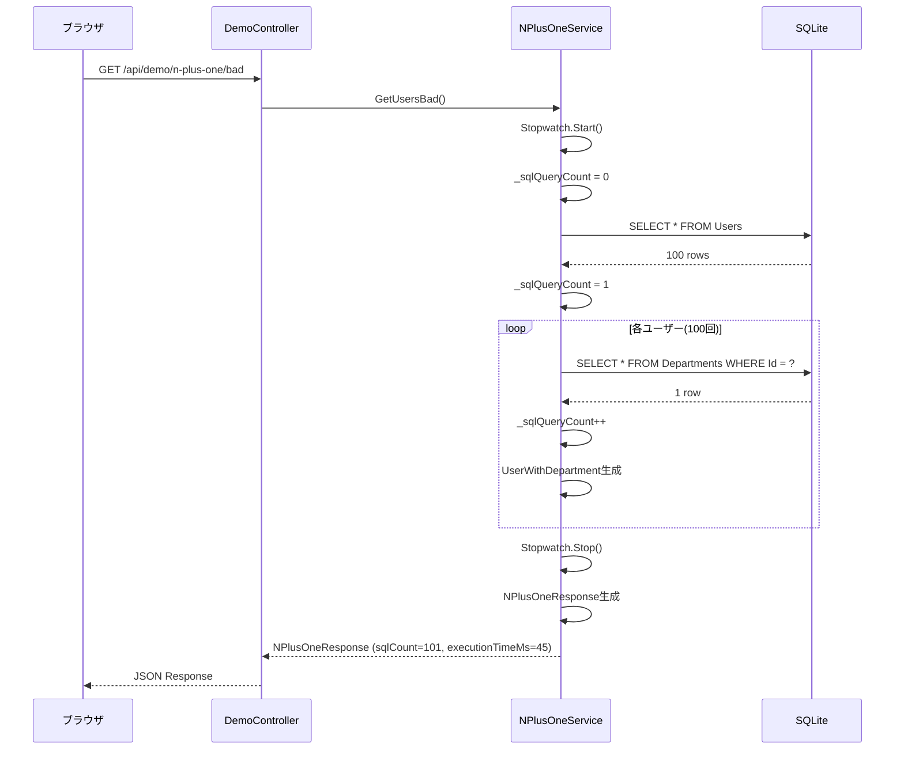
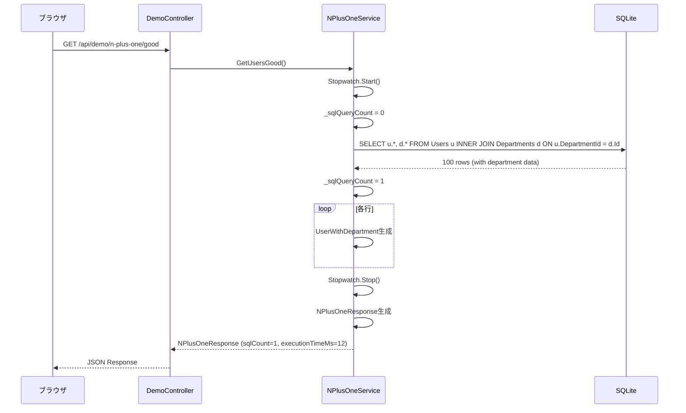
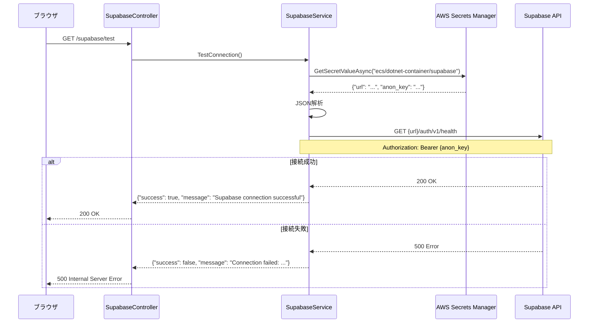
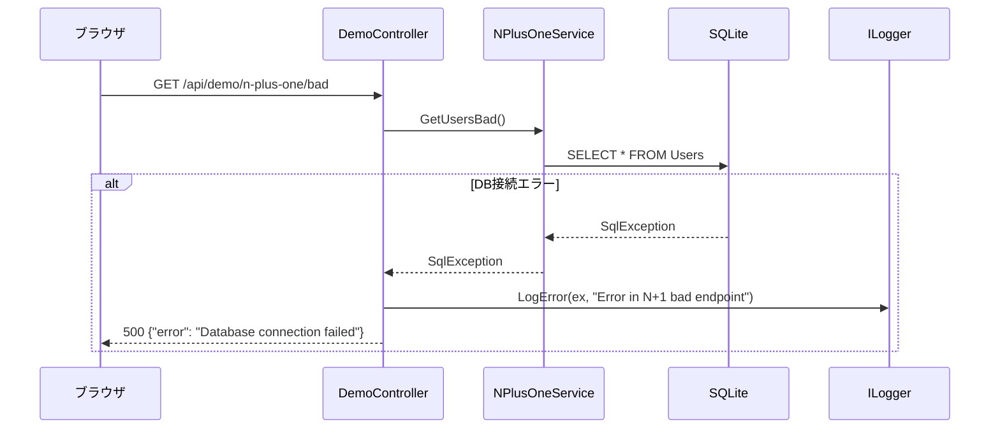
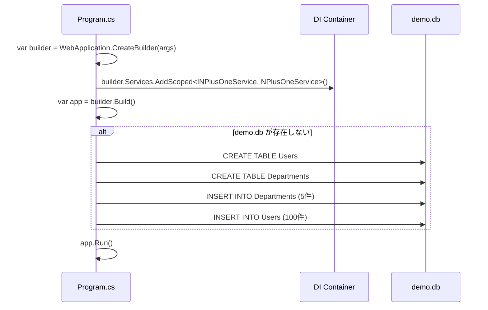

# シーケンス図

## N+1問題（Bad版）

**問題点**:
- **101回のクエリ**: 1回（Users取得）+ 100回（Departments取得）
- **実行時間**: 約45ms（環境により変動）
- **ネットワーク遅延**: 各クエリごとに発生

---

## N+1問題（Good版）

**改善点**:
- **1回のクエリ**: JOINで一括取得
- **実行時間**: 約12ms（Bad版の1/4）
- **ネットワーク遅延**: 1回のみ

---

## Supabase接続テスト

**ポイント**:
- **秘密情報取得**: AWS Secrets Manager から取得
- **ヘルスチェック**: Supabase の `/auth/v1/health` を使用
- **エラーハンドリング**: 接続失敗時は500エラー

---

## エラー発生時のフロー

**エラー処理方針**:
- **Controller層**: try-catchでラップ、500エラー返却
- **Service層**: 例外をそのままスロー
- **ログ出力**: `ILogger.LogError()` で記録

---

## 初期化フロー（アプリ起動時）

**初期化処理**:
- **DI登録**: `AddScoped<INPlusOneService, NPlusOneService>()`
- **DBセットアップ**: demo.db が存在しない場合はテーブル作成とデータ投入

---

## 参考

- [クラス設計](class-design.md)
- [エラー処理設計](error-handling.md)
- [外部IF設計](../external-design/external-interface.md)
