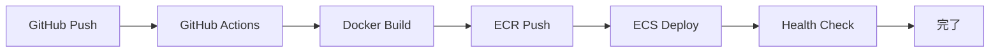
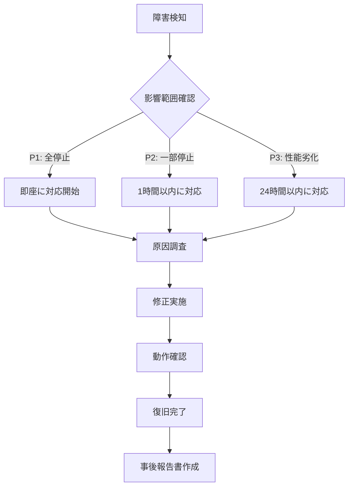

# 運用設計手順書

## 文書情報
- **作成日**: 2025-12-10
- **最終更新**: 2025-12-10
- **バージョン**: 1.0
- **ステータス**: Draft

## 変更履歴
| 日付 | バージョン | 変更者 | 変更内容 |
|------|----------|--------|---------|
| 2025-12-10 | 1.0 | - | 初版作成 |

---

## 1. デプロイ手順

### 1.1 前提条件
- GitHub リポジトリへのプッシュ権限
- AWS アカウント（ECS, ECR へのアクセス権限）
- Docker イメージのビルドとプッシュが完了していること

### 1.2 自動デプロイ（GitHub Actions）

#### トリガー
- `main` ブランチへのプッシュ
- Pull Request のマージ

#### デプロイフロー


#### 手順
1. コードを `main` ブランチにプッシュ
```bash
git push origin main
```

2. GitHub Actions が自動実行
   - `.github/workflows/deploy.yml` が起動
   - Docker イメージビルド
   - ECR にプッシュ
   - ECS タスク定義更新
   - ECS サービス更新

3. デプロイ完了確認
```bash
# ECS タスク状態確認
aws ecs describe-services --cluster app-cluster --services dotnet-service --region ap-northeast-1

# ヘルスチェック
curl https://rya234.com/dotnet/healthz
```

### 1.3 手動デプロイ

#### Docker イメージビルド
```bash
cd c:/Users/mryua/Desktop/github/dotnet_container

# ビルド
docker build -t dotnet-app .

# ECR ログイン
aws ecr get-login-password --region ap-northeast-1 | docker login --username AWS --password-stdin 110221759530.dkr.ecr.ap-northeast-1.amazonaws.com

# タグ付け
docker tag dotnet-app:latest 110221759530.dkr.ecr.ap-northeast-1.amazonaws.com/dotnet-app:latest

# プッシュ
docker push 110221759530.dkr.ecr.ap-northeast-1.amazonaws.com/dotnet-app:latest
```

#### ECS デプロイ
```bash
# 強制的に新しいデプロイを実行
aws ecs update-service \
  --cluster app-cluster \
  --service dotnet-service \
  --force-new-deployment \
  --region ap-northeast-1
```

---

## 2. 監視設計

### 2.1 監視項目

| 監視項目 | 閾値 | 確認方法 | 対応 |
|---------|------|---------|------|
| ECS タスク実行数 | runningCount >= 1 | AWS Console | タスク再起動 |
| ヘルスチェック | HTTP 200 | curl /healthz | ログ確認 |
| CPU使用率 | < 80% | CloudWatch | スケールアップ |
| メモリ使用率 | < 80% | CloudWatch | スケールアップ |
| エラーログ | エラー発生 | CloudWatch Logs | ログ調査 |

### 2.2 CloudWatch Logs 確認

```bash
# 最新ログ確認（10分間）
aws logs tail /ecs/dotnet-app --since 10m --region ap-northeast-1 --format short

# エラーログ検索
aws logs filter-log-events \
  --log-group-name /ecs/dotnet-app \
  --filter-pattern "ERROR" \
  --region ap-northeast-1
```

### 2.3 ヘルスチェック

#### エンドポイント
```bash
# .NET アプリ
curl https://rya234.com/dotnet/healthz
# 期待レスポンス: 200 OK

# Node.js アプリ
curl https://rya234.com/node
# 期待レスポンス: 200 OK
```

### 2.4 アラート設定（将来実装）
- CloudWatch Alarm
  - ECS タスク停止時
  - CPU/メモリ高負荷時
  - エラーログ急増時

---

## 3. バックアップ・リカバリ手順

### 3.1 バックアップ対象

| 対象 | 方法 | 頻度 | 保管場所 |
|------|------|------|---------|
| ソースコード | Git | 随時 | GitHub |
| SQLite DB | ファイルコピー | 不要（デモ用） | - |
| Supabase DB | 自動バックアップ | 日次 | Supabase |
| Secrets | Secrets Manager | 随時 | AWS |

### 3.2 Supabase バックアップ確認
```bash
# Supabase CLI でバックアップ確認
# （管理画面から手動ダウンロードも可能）
```

### 3.3 リカバリ手順

#### アプリケーションリカバリ
```bash
# 1. 前バージョンのイメージタグを確認
aws ecr describe-images \
  --repository-name dotnet-app \
  --region ap-northeast-1

# 2. タスク定義を前バージョンに戻す
aws ecs register-task-definition \
  --cli-input-json file://task-definition-previous.json \
  --region ap-northeast-1

# 3. サービス更新
aws ecs update-service \
  --cluster app-cluster \
  --service dotnet-service \
  --task-definition dotnet-app:previous-version \
  --region ap-northeast-1
```

#### データベースリカバリ
```bash
# Supabase 管理画面からバックアップポイントを選択して復元
# https://app.supabase.com/project/[project-id]/database/backups
```

---

## 4. インシデント対応手順

### 4.1 障害レベル定義

| レベル | 影響範囲 | 対応時間 | 対応者 |
|-------|---------|---------|--------|
| P1 | 全サービス停止 | 即座 | 全員 |
| P2 | 一部機能停止 | 1時間以内 | 担当者 |
| P3 | 性能劣化 | 24時間以内 | 担当者 |

### 4.2 障害発生時の対応フロー



### 4.3 障害パターン別対応

#### ケース1: ECS タスクが起動しない

**症状**:
- `runningCount = 0`
- `desiredCount = 1`

**調査手順**:
```bash
# 1. サービス状態確認
aws ecs describe-services \
  --cluster app-cluster \
  --services dotnet-service \
  --region ap-northeast-1 \
  --query 'services[0].events[0:5]'

# 2. タスク停止理由確認
aws ecs describe-tasks \
  --cluster app-cluster \
  --tasks <task-arn> \
  --region ap-northeast-1

# 3. CloudWatch Logs 確認
aws logs tail /ecs/dotnet-app --since 10m --region ap-northeast-1
```

**対応**:
- Secrets Manager のキー名確認
- Docker イメージの確認
- タスク定義の確認

**実例**: 2025-12-10 に発生した `anon_key` 問題
```bash
# 原因: Secrets Manager のキー名が anonKey だったが、タスク定義では anon_key を参照
# 対応: Secrets Manager を更新
aws secretsmanager update-secret \
  --secret-id ecs/typescript-container/supabase \
  --secret-string '{"url":"...","anon_key":"..."}' \
  --region ap-northeast-1

# 強制再デプロイ
aws ecs update-service \
  --cluster app-cluster \
  --service nodejs-service \
  --force-new-deployment \
  --region ap-northeast-1
```

#### ケース2: 503 Service Unavailable

**症状**:
- ヘルスチェック失敗
- ALB が 503 を返す

**調査手順**:
```bash
# 1. ターゲットグループのヘルス状態確認
aws elbv2 describe-target-health \
  --target-group-arn <target-group-arn> \
  --region ap-northeast-1

# 2. ECS タスク状態確認
aws ecs list-tasks \
  --cluster app-cluster \
  --service-name dotnet-service \
  --region ap-northeast-1
```

**対応**:
- タスクが起動していない場合: ケース1 の対応
- タスクは起動しているが unhealthy: アプリケーションログ確認

#### ケース3: パフォーマンス劣化

**症状**:
- レスポンスが遅い
- タイムアウトが発生

**調査手順**:
```bash
# CPU/メモリ使用率確認
aws cloudwatch get-metric-statistics \
  --namespace AWS/ECS \
  --metric-name CPUUtilization \
  --dimensions Name=ClusterName,Value=app-cluster Name=ServiceName,Value=dotnet-service \
  --start-time 2025-12-10T00:00:00Z \
  --end-time 2025-12-10T23:59:59Z \
  --period 3600 \
  --statistics Average \
  --region ap-northeast-1
```

**対応**:
- CPU/メモリ不足: タスク定義でリソース増加
- N+1問題: SQL クエリ最適化

---

## 5. 保守・メンテナンス手順

### 5.1 定期メンテナンス

| 項目 | 頻度 | 内容 |
|------|------|------|
| Docker イメージ更新 | 月次 | セキュリティパッチ適用 |
| ログ削除 | 週次 | 古いログの削除 |
| コスト確認 | 月次 | AWS コスト分析 |

### 5.2 ログ保持期間設定

```bash
# CloudWatch Logs の保持期間を1日に設定（コスト削減）
aws logs put-retention-policy \
  --log-group-name /ecs/dotnet-app \
  --retention-in-days 1 \
  --region ap-northeast-1
```

### 5.3 不要リソース削除

```bash
# 停止中の ECS タスク削除（自動削除されるため不要）

# 古い Docker イメージ削除
aws ecr list-images \
  --repository-name dotnet-app \
  --region ap-northeast-1 \
  --query 'imageIds[?type==`null`]'

# イメージ削除
aws ecr batch-delete-image \
  --repository-name dotnet-app \
  --image-ids imageTag=old-tag \
  --region ap-northeast-1
```

---

## 6. スケーリング

### 6.1 手動スケーリング

```bash
# タスク数を増やす
aws ecs update-service \
  --cluster app-cluster \
  --service dotnet-service \
  --desired-count 2 \
  --region ap-northeast-1
```

### 6.2 自動スケーリング（将来実装）
- CloudWatch メトリクスに基づく Auto Scaling
- CPU 使用率 > 70% でスケールアウト
- CPU 使用率 < 30% でスケールイン

---

## 7. セキュリティ運用

### 7.1 Secrets ローテーション

```bash
# 1. 新しいシークレット値を生成
# 2. Secrets Manager 更新
aws secretsmanager update-secret \
  --secret-id ecs/dotnet-container/supabase \
  --secret-string '{"url":"...","anon_key":"新しい値"}' \
  --region ap-northeast-1

# 3. ECS サービス再起動
aws ecs update-service \
  --cluster app-cluster \
  --service dotnet-service \
  --force-new-deployment \
  --region ap-northeast-1
```

### 7.2 セキュリティパッチ適用

```bash
# 1. Docker イメージを最新版に更新
# 2. ビルド・デプロイ
# 3. 動作確認
```

---

## 8. トラブルシューティング

### 8.1 よくある問題と解決策

| 問題 | 原因 | 解決策 |
|------|------|--------|
| タスクが起動しない | Secrets Manager のキー名不一致 | キー名を確認・修正 |
| 503 エラー | タスクが unhealthy | ヘルスチェックパス確認 |
| メモリ不足 | メモリ設定が小さい | タスク定義でメモリ増加 |
| コスト増加 | ログ保持期間が長い | 保持期間を短縮 |

### 8.2 ログ分析

```bash
# エラーログのパターン分析
aws logs filter-log-events \
  --log-group-name /ecs/dotnet-app \
  --filter-pattern "ERROR" \
  --region ap-northeast-1 \
  | jq '.events[].message'
```

---

## 9. 連絡先

| 役割 | 連絡先 |
|------|--------|
| 開発担当 | - |
| AWS 管理者 | - |
| 緊急連絡先 | - |

---

## 10. 参考リンク

- [AWS ECS ドキュメント](https://docs.aws.amazon.com/ecs/)
- [CloudWatch Logs](https://docs.aws.amazon.com/cloudwatch/)
- [GitHub Actions](https://docs.github.com/actions)
- [Supabase ドキュメント](https://supabase.com/docs)
