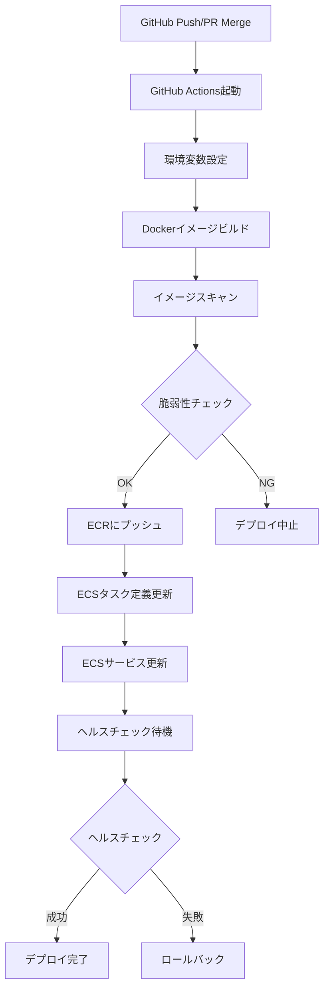

# 自動デプロイメント（GitHub Actions）

## 概要
GitHub Actionsを使用した自動デプロイメントの詳細手順と設定方法を説明します。

## 前提条件

### 必須要件
- [x] GitHubリポジトリへのプッシュ権限
- [x] AWSアカウント（ECS, ECRへのアクセス権限）
- [x] GitHub Secretsの設定完了
- [x] ECS Cluster, Service, Task Definitionの作成完了

### 事前準備チェックリスト
- [ ] AWS認証情報がGitHub Secretsに登録されている
- [ ] ECRリポジトリが作成されている
- [ ] ECSクラスタとサービスが稼働している
- [ ] `.github/workflows/deploy.yml` が存在する

## トリガー条件

### 1. mainブランチへのプッシュ
```yaml
on:
  push:
    branches:
      - main
```

### 2. Pull Requestのマージ
Pull Requestがmainブランチにマージされると、自動的にデプロイが開始されます。

### 3. 手動トリガー（workflow_dispatch）
```yaml
on:
  workflow_dispatch:
    inputs:
      environment:
        description: 'デプロイ環境'
        required: true
        default: 'production'
```

## デプロイフロー



## デプロイ手順詳細

### ステップ1: コードのプッシュ

```bash
# 作業ブランチで開発
git checkout -b feature/new-feature
# ... 開発作業 ...
git add .
git commit -m "feat: 新機能の追加"
git push origin feature/new-feature
```

### ステップ2: Pull Request作成

```bash
# GitHub CLIを使用する場合
gh pr create --title "新機能の追加" --body "機能の説明..."

# ブラウザで作成する場合
# https://github.com/RYA234/dotnet_container/compare
```

### ステップ3: コードレビューとマージ

1. Pull Requestのレビューを依頼
2. CI/CDチェックが全てパスすることを確認
3. 承認後、mainブランチにマージ

```bash
# マージ（GitHub UI推奨）
# または、CLIでマージ
gh pr merge <PR番号> --squash
```

### ステップ4: 自動デプロイの実行

マージ後、GitHub Actionsが自動的に起動します。

```bash
# デプロイ状況の確認
gh run list --workflow=deploy.yml

# 特定のワークフロー実行の詳細確認
gh run view <run-id>

# ログのリアルタイム監視
gh run watch
```

## GitHub Actions ワークフロー設定

### 主要ステップの説明

#### 1. チェックアウト
```yaml
- name: Checkout code
  uses: actions/checkout@v4
```

#### 2. AWS認証
```yaml
- name: Configure AWS credentials
  uses: aws-actions/configure-aws-credentials@v4
  with:
    aws-access-key-id: ${{ secrets.AWS_ACCESS_KEY_ID }}
    aws-secret-access-key: ${{ secrets.AWS_SECRET_ACCESS_KEY }}
    aws-region: ap-northeast-1
```

#### 3. ECRログイン
```yaml
- name: Login to Amazon ECR
  id: login-ecr
  uses: aws-actions/amazon-ecr-login@v2
```

#### 4. Dockerイメージのビルドとプッシュ
```yaml
- name: Build and push Docker image
  env:
    ECR_REGISTRY: ${{ steps.login-ecr.outputs.registry }}
    ECR_REPOSITORY: dotnet-app
    IMAGE_TAG: ${{ github.sha }}
  run: |
    docker build -t $ECR_REGISTRY/$ECR_REPOSITORY:$IMAGE_TAG .
    docker tag $ECR_REGISTRY/$ECR_REPOSITORY:$IMAGE_TAG $ECR_REGISTRY/$ECR_REPOSITORY:latest
    docker push $ECR_REGISTRY/$ECR_REPOSITORY:$IMAGE_TAG
    docker push $ECR_REGISTRY/$ECR_REPOSITORY:latest
```

#### 5. ECSタスク定義の更新
```yaml
- name: Update ECS task definition
  id: task-def
  uses: aws-actions/amazon-ecs-render-task-definition@v1
  with:
    task-definition: task-definition.json
    container-name: dotnet-app
    image: ${{ steps.login-ecr.outputs.registry }}/dotnet-app:${{ github.sha }}
```

#### 6. ECSサービスのデプロイ
```yaml
- name: Deploy to Amazon ECS
  uses: aws-actions/amazon-ecs-deploy-task-definition@v1
  with:
    task-definition: ${{ steps.task-def.outputs.task-definition }}
    service: dotnet-service
    cluster: app-cluster
    wait-for-service-stability: true
```

## デプロイ完了確認

### 1. GitHub Actionsでの確認
```bash
# ワークフロー実行状況確認
gh run list --workflow=deploy.yml --limit 1

# 最新の実行ログ確認
gh run view --log
```

### 2. ECSタスク状態確認
```bash
# サービス状態確認
aws ecs describe-services \
  --cluster app-cluster \
  --services dotnet-service \
  --region ap-northeast-1 \
  --query 'services[0].[serviceName,status,runningCount,desiredCount]' \
  --output table

# タスク一覧確認
aws ecs list-tasks \
  --cluster app-cluster \
  --service-name dotnet-service \
  --region ap-northeast-1

# タスク詳細確認
aws ecs describe-tasks \
  --cluster app-cluster \
  --tasks <task-arn> \
  --region ap-northeast-1
```

### 3. アプリケーションヘルスチェック
```bash
# ヘルスチェックエンドポイント確認
curl -i https://rya234.com/dotnet/healthz

# 期待されるレスポンス
# HTTP/1.1 200 OK
# Content-Type: text/plain
# Healthy
```

### 4. ログ確認
```bash
# 最新ログの確認（10分間）
aws logs tail /ecs/dotnet-app \
  --since 10m \
  --region ap-northeast-1 \
  --format short \
  --follow

# エラーログの検索
aws logs filter-log-events \
  --log-group-name /ecs/dotnet-app \
  --filter-pattern "ERROR" \
  --region ap-northeast-1 \
  --start-time $(date -d '10 minutes ago' +%s)000
```

## トラブルシューティング

### デプロイが失敗する場合

#### 1. GitHub Actionsのログを確認
```bash
gh run view --log-failed
```

#### 2. よくあるエラーと対処法

| エラー | 原因 | 対処法 |
|-------|------|--------|
| `ECR: Access Denied` | AWS認証情報が不正 | GitHub Secretsを確認 |
| `Docker build failed` | Dockerfileに問題 | ローカルでビルドテスト |
| `ECS task failed to start` | タスク定義に問題 | タスク定義を確認 |
| `Health check timeout` | アプリが起動しない | ログを確認、リソース不足確認 |

#### 3. 緊急時のロールバック
デプロイが失敗した場合は、すぐに前のバージョンにロールバックします。
詳細は [rollback.md](rollback.md) を参照してください。

## GitHub Secretsの設定

### 必須Secret一覧

| Secret名 | 説明 | 取得方法 |
|---------|------|---------|
| `AWS_ACCESS_KEY_ID` | AWS アクセスキーID | IAMユーザーから取得 |
| `AWS_SECRET_ACCESS_KEY` | AWS シークレットアクセスキー | IAMユーザーから取得 |
| `GEMINI_API_KEY` | Gemini APIキー | Google AI Studioから取得 |
| `SUPABASE_URL` | Supabase プロジェクトURL | Supabaseダッシュボードから取得 |
| `SUPABASE_ANON_KEY` | Supabase 匿名キー | Supabaseダッシュボードから取得 |

### Secretの設定方法

```bash
# GitHub CLIで設定
gh secret set AWS_ACCESS_KEY_ID
gh secret set AWS_SECRET_ACCESS_KEY
gh secret set GEMINI_API_KEY
gh secret set SUPABASE_URL
gh secret set SUPABASE_ANON_KEY

# または、GitHub UIで設定
# Settings > Secrets and variables > Actions > New repository secret
```

## ベストプラクティス

### 1. デプロイタイミング
- 業務時間外のデプロイを推奨
- 金曜日の夜のデプロイは避ける
- 重要なイベント前のデプロイは慎重に

### 2. デプロイ前チェック
- [ ] すべてのテストがパスしている
- [ ] ステージング環境での動作確認済み
- [ ] データベースマイグレーションの必要性確認
- [ ] ロールバック手順の確認

### 3. デプロイ後チェック
- [ ] ヘルスチェックが成功
- [ ] エラーログが出ていない
- [ ] 主要機能の動作確認
- [ ] パフォーマンスメトリクスの確認

### 4. コミュニケーション
- デプロイ前に関係者に通知
- デプロイ完了後に結果を報告
- 問題が発生した場合は即座にエスカレーション

## 関連ドキュメント

- [手動デプロイ手順](manual-deployment.md)
- [ロールバック手順](rollback.md)
- [デプロイチェックリスト](deployment-checklist.md)
- [トラブルシューティング](../troubleshooting/common-issues.md)

---

**最終更新日**: 2025-12-17
