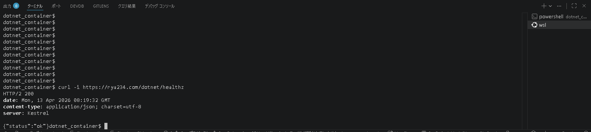
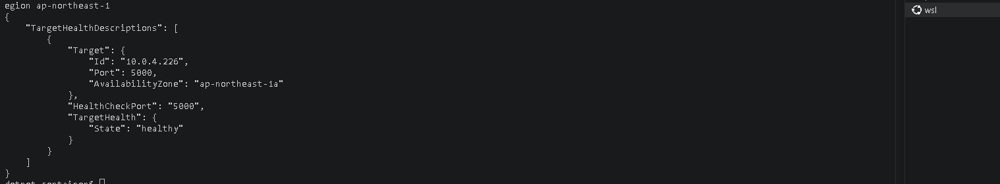

# ヘルスチェック

## 概要

ALBとECSがアプリの稼働状態を自動確認する。エンドポイントは実装済み。

---

## エンドポイント

| URL | 用途 |
|---|---|
| `https://rya234.com/dotnet/healthz` | ALB・ECSのヘルスチェック |

実装箇所: `src/BlazorApp/Program.cs`

```csharp
app.MapGet("/healthz", () => Results.Ok(new { status = "ok" }));
```

---

## 手動確認

```bash
curl -i https://rya234.com/dotnet/healthz
```

期待されるレスポンス:

```
HTTP/1.1 200 OK
{"status":"ok"}
```

> 📸 **スクショ①**: 上記コマンドの実行結果（200 OK が返っている）

---

## ALBターゲットのヘルス確認

```bash
aws elbv2 describe-target-health \
  --target-group-arn arn:aws:elasticloadbalancing:ap-northeast-1:<account-id>:targetgroup/dotnet-tg/826e94728763a9d3 \
  --region ap-northeast-1
```

> 📸 **スクショ②**: `"State": "healthy"` が返っている結果

---

## トラブルシューティング

| 症状 | 原因 | 対処 |
|---|---|---|
| 503が返る | ECSタスクが起動していない | ECSサービスのタスク数を確認 |
| 404が返る | パスが間違っている | ALBのヘルスチェックパスを `/dotnet/healthz` に設定 |
| タイムアウト | セキュリティグループの問題 | ALB→ECSのインバウンドルールを確認 |

---

## 関連ドキュメント

- [監視概要](monitoring-overview.md)
- [CloudWatch Logs](cloudwatch-logs.md)

---

**最終更新日**: 2026-04-13
