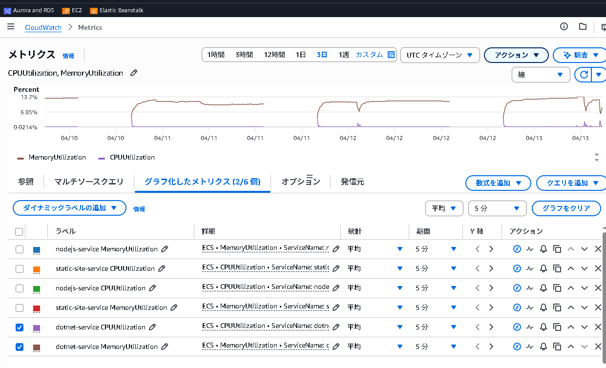
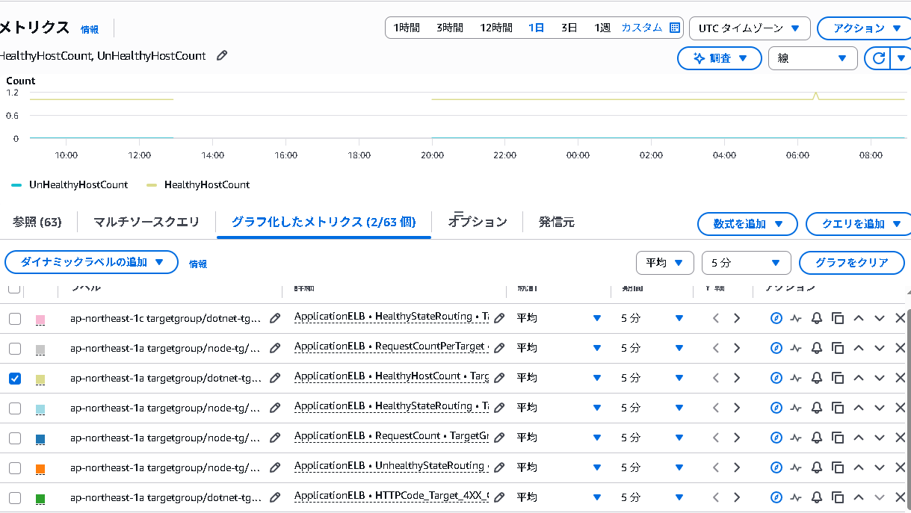
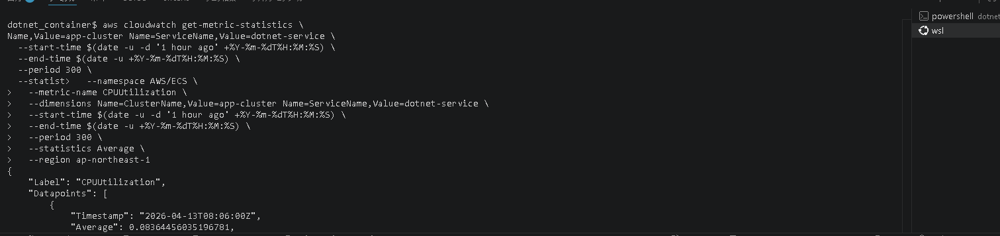

# メトリクス監視

## 概要

ECS・ALBの標準メトリクスは CloudWatch に自動収集される。追加設定不要。

> **アラーム・ダッシュボード・カスタムメトリクス**の設定は `my_web_infra` の Terraform で管理する。

---

## 確認できる主要メトリクス

### ECS

| メトリクス名 | 説明 |
|---|---|
| CPUUtilization | CPU使用率 |
| MemoryUtilization | メモリ使用率 |

### ALB

| メトリクス名 | 説明 |
|---|---|
| RequestCount | リクエスト数 |
| TargetResponseTime | レスポンスタイム |
| HTTPCode_Target_5XX_Count | 5xxエラー数 |
| HealthyHostCount | 正常なターゲット数 |

---

## 確認方法

### AWS Management Console

1. CloudWatch Console を開く
2. 左メニュー「メトリクス」→「すべてのメトリクス」
3. 名前空間を選択（`AWS/ECS` または `AWS/ApplicationELB`）
4. メトリクスを選択してグラフ化

> 📸 **スクショ①**: ECS の CPUUtilization または MemoryUtilization のグラフが表示されている画面

> 📸 **スクショ②**: ALB の HealthyHostCount が 1 以上になっている画面



### AWS CLI（ECS CPU使用率の例）

```bash
aws cloudwatch get-metric-statistics \
  --namespace AWS/ECS \
  --metric-name CPUUtilization \
  --dimensions Name=ClusterName,Value=app-cluster Name=ServiceName,Value=dotnet-service \
  --start-time $(date -u -d '1 hour ago' +%Y-%m-%dT%H:%M:%S) \
  --end-time $(date -u +%Y-%m-%dT%H:%M:%S) \
  --period 300 \
  --statistics Average \
  --region ap-northeast-1
```

> 📸 **スクショ③**: 上記コマンドの実行結果


---

## 関連ドキュメント

- [監視概要](monitoring-overview.md)
- [CloudWatch Logs](cloudwatch-logs.md)

---

**最終更新日**: 2026-04-13
