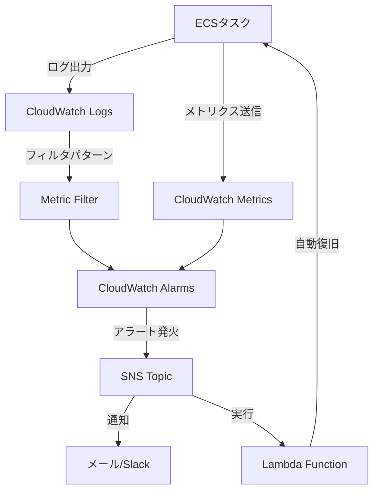
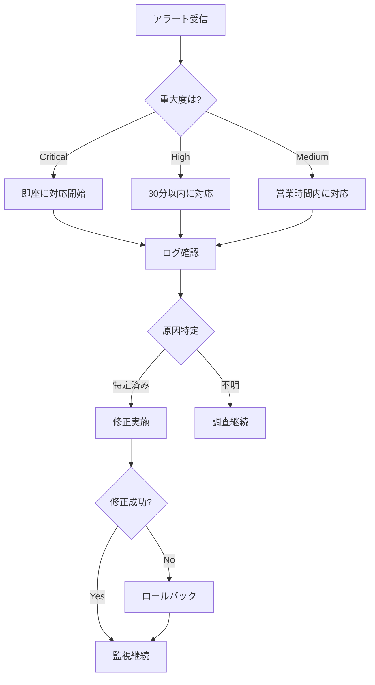

# 監視概要

## 概要
本番環境の監視戦略と監視項目の全体像を説明します。

## 監視の目的

### 1. サービス可用性の確保
- アプリケーションの稼働状態を常時監視
- 障害の早期検知と迅速な対応
- SLA（Service Level Agreement）の遵守

### 2. パフォーマンスの維持
- レスポンスタイムの監視
- リソース使用率の最適化
- ボトルネックの特定と解消

### 3. 問題の予防と早期発見
- 異常の兆候を事前に検知
- トレンド分析による容量計画
- セキュリティインシデントの検知

## 監視レイヤー

```
┌─────────────────────────────────────┐
│    ユーザーエクスペリエンス監視      │  ← 外形監視、エンドポイント監視
├─────────────────────────────────────┤
│    アプリケーション監視              │  ← ログ、エラー率、レスポンスタイム
├─────────────────────────────────────┤
│    インフラストラクチャ監視          │  ← ECS、CPU、メモリ、ネットワーク
├─────────────────────────────────────┤
│    データベース監視                  │  ← クエリパフォーマンス、接続数
└─────────────────────────────────────┘
```

## 主要監視項目

### 1. サービスヘルス

| 監視項目 | 説明 | 閾値 | 確認頻度 |
|---------|------|------|---------|
| ECSタスク実行数 | runningCount = desiredCount | = 1以上 | 1分ごと |
| ヘルスチェック | /healthz エンドポイント | HTTP 200 | 30秒ごと |
| タスク再起動回数 | 異常終了による再起動 | 0回/時間 | 5分ごと |
| デプロイ状態 | デプロイの成功/失敗 | 100%成功 | デプロイ時 |

### 2. パフォーマンス

| 監視項目 | 説明 | 閾値 | 確認頻度 |
|---------|------|------|---------|
| CPU使用率 | ECSタスクのCPU使用率 | < 80% | 1分ごと |
| メモリ使用率 | ECSタスクのメモリ使用率 | < 80% | 1分ごと |
| レスポンスタイム | APIのレスポンスタイム | < 2秒 | リクエストごと |
| スループット | 秒間リクエスト数 | 監視のみ | 1分ごと |

### 3. エラーと例外

| 監視項目 | 説明 | 閾値 | 確認頻度 |
|---------|------|------|---------|
| エラーログ | ERRORレベルのログ | 0件/5分 | 5分ごと |
| HTTP 5xxエラー | サーバーエラー | < 1% | 1分ごと |
| HTTP 4xxエラー | クライアントエラー | < 5% | 1分ごと |
| 例外発生率 | アプリケーション例外 | 0件/5分 | 5分ごと |

### 4. リソース

| 監視項目 | 説明 | 閾値 | 確認頻度 |
|---------|------|------|---------|
| ネットワークI/O | ネットワーク転送量 | 監視のみ | 1分ごと |
| ディスクI/O | ディスク読み書き | 監視のみ | 1分ごと |
| 接続数 | アクティブな接続数 | 監視のみ | 1分ごと |
| スレッド数 | 実行中のスレッド数 | 監視のみ | 1分ごと |

## 監視ツール

### AWS CloudWatch

#### CloudWatch Logs
- アプリケーションログの集約
- ログの検索とフィルタリング
- エラーログのアラート設定

ドキュメント: [cloudwatch-logs.md](cloudwatch-logs.md)

#### CloudWatch Metrics
- ECSメトリクスの収集
- カスタムメトリクスの送信
- メトリクスのグラフ化とダッシュボード

ドキュメント: [metrics.md](metrics.md)

#### CloudWatch Alarms
- 閾値ベースのアラート
- 異常検知とアクションの自動実行
- SNS/Lambda連携

ドキュメント: [alerts.md](alerts.md)

### ALB (Application Load Balancer)
- ヘルスチェック
- ターゲットグループの監視
- アクセスログ

### ECS Container Insights
- コンテナレベルのメトリクス
- リソース使用率の可視化
- パフォーマンス分析

## 監視フロー



## アラート設計

### アラートレベル

#### Critical（重大）
- サービスダウン
- 全ユーザーに影響
- 即座に対応が必要

**通知方法**: メール + Slack + 電話

#### High（高）
- 一部機能の障害
- パフォーマンス大幅低下
- 早急な対応が必要

**通知方法**: メール + Slack

#### Medium（中）
- リソース使用率が高い
- エラー率の上昇
- 対応が望ましい

**通知方法**: Slack

#### Low（低）
- 軽微な警告
- トレンド分析用
- 記録のみ

**通知方法**: ログのみ

### アラートテンプレート

```
【Critical】本番環境障害発生

サービス: dotnet-service
クラスタ: app-cluster
時刻: 2025-12-17 15:30:45 JST

問題: ECSタスクが0になりました

詳細:
- RunningCount: 0
- DesiredCount: 1
- LastEvent: Task failed to start

対応:
1. CloudWatch Logsを確認
2. タスク起動の失敗原因を調査
3. 必要に応じてロールバック

ログ: https://console.aws.amazon.com/cloudwatch/...
```

## 監視ダッシュボード

### 推奨ダッシュボード構成

#### 1. オーバービューダッシュボード
- サービス稼働状態
- 主要メトリクスのサマリー
- 最近のアラート履歴

#### 2. パフォーマンスダッシュボード
- CPU/メモリ使用率
- レスポンスタイム
- スループット

#### 3. エラー監視ダッシュボード
- エラーログの件数
- HTTP エラー率
- 例外の種類別集計

#### 4. リソース監視ダッシュボード
- ECS タスク数
- ネットワークトラフィック
- ターゲットヘルス

### ダッシュボード作成例

```bash
# CloudWatch ダッシュボードの作成（JSON定義）
aws cloudwatch put-dashboard \
  --dashboard-name dotnet-app-overview \
  --dashboard-body file://dashboard-definition.json \
  --region ap-northeast-1
```

## 監視のベストプラクティス

### 1. ゴールデンシグナル
以下の4つのメトリクスを重点的に監視：

- **Latency（レイテンシ）**: リクエストの処理時間
- **Traffic（トラフィック）**: システムの需要
- **Errors（エラー）**: 失敗したリクエストの割合
- **Saturation（飽和度）**: リソースの使用率

### 2. アラート疲れを防ぐ
- 適切な閾値設定
- ノイズの多いアラートは調整
- アラートのグルーピング
- メンテナンス時のアラート抑制

### 3. 可観測性の向上
- 構造化ログの活用
- トレースIDの付与
- カスタムメトリクスの活用
- 分散トレーシング（将来実装）

### 4. 定期的なレビュー
- 週次：アラート履歴のレビュー
- 月次：監視項目と閾値の見直し
- 四半期：監視戦略の改善

## 監視コスト最適化

### CloudWatch Logs
```bash
# ログ保持期間の設定（コスト削減）
aws logs put-retention-policy \
  --log-group-name /ecs/dotnet-app \
  --retention-in-days 7 \
  --region ap-northeast-1

# 不要なログストリームの削除
aws logs delete-log-stream \
  --log-group-name /ecs/dotnet-app \
  --log-stream-name <old-stream-name> \
  --region ap-northeast-1
```

### CloudWatch Metrics
- 標準メトリクスの活用（追加料金なし）
- カスタムメトリクスは必要最小限に
- メトリクスの集約期間を適切に設定

## トラブル時の対応フロー



## 監視メトリクスの追加方法

### カスタムメトリクスの送信

```csharp
// ASP.NET Coreアプリケーションからカスタムメトリクスを送信
using Amazon.CloudWatch;
using Amazon.CloudWatch.Model;

public class MetricsService
{
    private readonly IAmazonCloudWatch _cloudWatch;

    public async Task PutCustomMetricAsync(string metricName, double value)
    {
        var request = new PutMetricDataRequest
        {
            Namespace = "DotNetApp/Custom",
            MetricData = new List<MetricDatum>
            {
                new MetricDatum
                {
                    MetricName = metricName,
                    Value = value,
                    Timestamp = DateTime.UtcNow,
                    Unit = StandardUnit.Count
                }
            }
        };

        await _cloudWatch.PutMetricDataAsync(request);
    }
}
```

## 関連ドキュメント

- [CloudWatch Logs運用](cloudwatch-logs.md)
- [ヘルスチェック](health-checks.md)
- [メトリクス監視](metrics.md)
- [アラート設定](alerts.md)
- [トラブルシューティング](../troubleshooting/common-issues.md)

---

**最終更新日**: 2025-12-17
