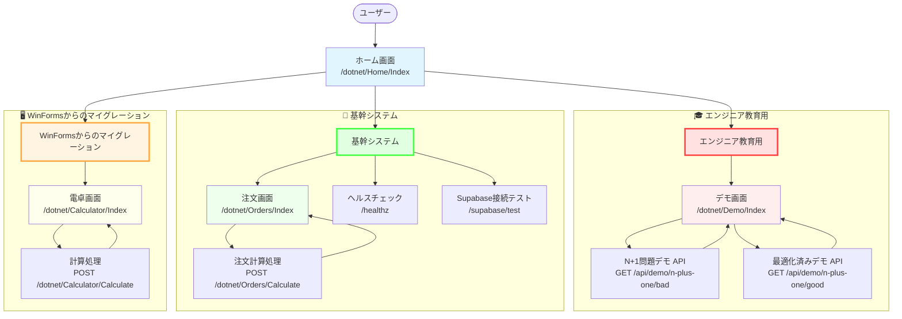
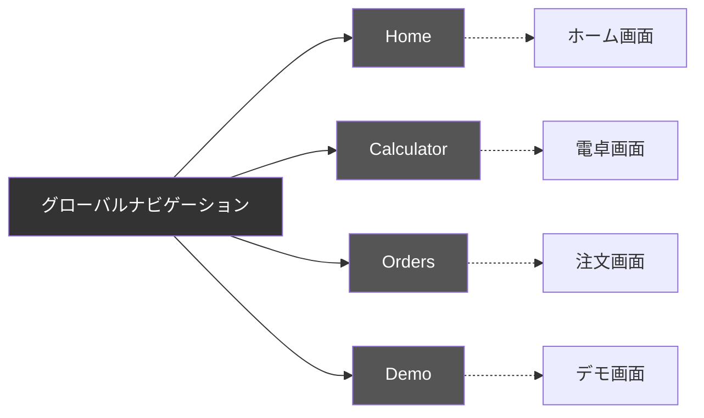
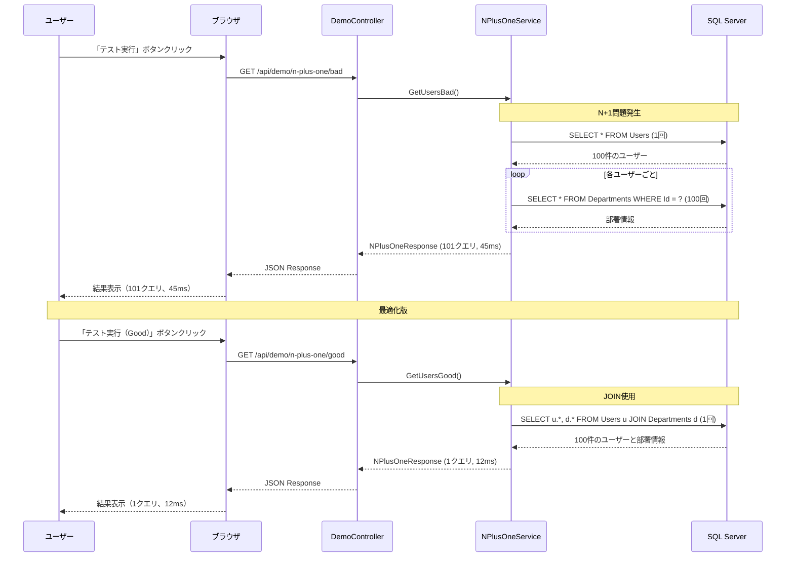

# 画面遷移図

## 概要
ASP.NET Core MVCアプリケーションの画面遷移を3つの大分類で整理

## システム構成

## 大分類ごとの機能詳細

### 🎓 エンジニア教育用

#### 目的
- データベース性能問題の学習
- N+1問題の理解と解決方法の習得
- 実際のSQLクエリの違いを体感

#### デモ画面 (`/dotnet/Demo/Index`)
- **機能**: データベース性能問題（N+1問題）のデモ
- **表示内容**:
  - N+1問題の説明
  - エンドポイント比較表
  - テスト実行ボタン（Bad/Good）
  - 実行結果表示エリア
  - 性能比較表
  - 学習ポイント
  - コード例
- **API エンドポイント**:
  - `GET /api/demo/n-plus-one/bad`: N+1問題ありの実装（101回クエリ）
  - `GET /api/demo/n-plus-one/good`: 最適化済みの実装（1回クエリ）
- **操作フロー**:
  1. 「テスト実行」ボタンをクリック
  2. 対応するAPIを呼び出し
  3. レスポンス（実行時間、SQL発行回数、データ）を表示
- **学習内容**:
  - N+1問題の発生原因（ループ内でのクエリ実行）
  - 最適化手法（JOINクエリの使用）
  - パフォーマンス測定（クエリ回数、実行時間）
  - 素のSQL（ADO.NET）の使い方

### 🏢 基幹システム

#### 目的
- 業務システムの基本機能
- 外部サービス連携
- システム監視とヘルスチェック

#### 注文画面 (`/dotnet/Orders/Index`)
- **機能**: 商品の価格計算とディスカウント適用
- **表示内容**:
  - 単価入力フィールド
  - 数量入力フィールド
  - 計算ボタン
  - 合計金額表示
  - ディスカウント適用情報表示
- **操作フロー**:
  1. 単価と数量を入力
  2. 「Calculate」ボタンをクリック
  3. POST /dotnet/Orders/Calculate
  4. 合計金額とディスカウント情報を表示
- **ビジネスロジック**:
  - 数量10個以上で10%ディスカウント
  - 価格 × 数量 × (1 - ディスカウント率) の計算

#### ヘルスチェック (`/healthz`)
- **機能**: アプリケーションの稼働状態確認
- **レスポンス**: `{ "status": "healthy" }`
- **用途**:
  - ECS タスクのヘルスチェック
  - 監視システムからの死活監視
  - ロードバランサーの振り分け判定

#### Supabase接続テスト (`/supabase/test`)
- **機能**: Supabaseへの接続テスト
- **レスポンス**: 接続成功/失敗情報
- **設定取得元**: AWS Secrets Manager
- **用途**:
  - 外部サービス連携の確認
  - 設定値の検証
  - デプロイ後の疎通確認

### 🖥️ WinFormsからのマイグレーション

#### 目的
- レガシーWinFormsアプリケーションのWeb化
- 既存機能のクラウド移行
- 操作性の維持とモダン化

#### 電卓画面 (`/dotnet/Calculator/Index`)
- **機能**: 四則演算を行う電卓
- **表示内容**:
  - 数値入力フィールド (a, b)
  - 演算子選択 (+, -, *, /)
  - 計算ボタン
  - 計算結果表示
- **操作フロー**:
  1. 数値と演算子を入力
  2. 「=」ボタンをクリック
  3. POST /dotnet/Calculator/Calculate
  4. 結果を画面に表示
- **マイグレーション内容**:
  - WinFormsのFormをRazor Viewに変換
  - イベントハンドラーをMVCコントローラーアクションに変換
  - クライアントサイドのロジックをサーバーサイドに移行

### ホーム画面 (`/dotnet/Home/Index`)
- **機能**: アプリケーションのトップページ
- **表示内容**:
  - アプリケーション紹介
  - 3つの大分類へのナビゲーション
  - 各機能の説明
- **遷移先**:
  - エンジニア教育用: Demo画面
  - 基幹システム: Orders画面、ヘルスチェック、Supabase接続テスト
  - WinFormsマイグレーション: Calculator画面

## ナビゲーション構造

## APIエンドポイント一覧（大分類別）

### 共通

| メソッド | パス | 種類 | 説明 |
|---------|------|------|------|
| GET | `/dotnet/Home/Index` | MVC | ホーム画面 |

### 🎓 エンジニア教育用

| メソッド | パス | 種類 | 説明 |
|---------|------|------|------|
| GET | `/dotnet/Demo/Index` | MVC | デモ画面 |
| GET | `/api/demo/n-plus-one/bad` | REST API | N+1問題デモ（非効率・101クエリ） |
| GET | `/api/demo/n-plus-one/good` | REST API | N+1問題デモ（最適化・1クエリ） |

### 🏢 基幹システム

| メソッド | パス | 種類 | 説明 |
|---------|------|------|------|
| GET | `/dotnet/Orders/Index` | MVC | 注文画面 |
| POST | `/dotnet/Orders/Calculate` | MVC | 注文計算実行 |
| GET | `/healthz` | REST API | ヘルスチェック |
| GET | `/supabase/test` | REST API | Supabase接続テスト |

### 🖥️ WinFormsからのマイグレーション

| メソッド | パス | 種類 | 説明 |
|---------|------|------|------|
| GET | `/dotnet/Calculator/Index` | MVC | 電卓画面 |
| POST | `/dotnet/Calculator/Calculate` | MVC | 計算実行 |

## データフロー図（N+1問題デモ）

## 技術スタック

- **フロントエンド**: Razor Views (MVC), HTML, CSS, JavaScript
- **バックエンド**: ASP.NET Core 8.0 MVC
- **データベース**: SQL Server (LocalDB for development)
- **データアクセス**: ADO.NET (Raw SQL)
- **外部サービス**: Supabase
- **設定管理**: AWS Secrets Manager, .env

## 備考

- 全ての画面は共通レイアウト (`_Layout.cshtml`) を使用
- ナビゲーションバーは全画面で表示
- APIエンドポイントはJSON形式でレスポンスを返す
- デモ画面ではJavaScriptでAPIを呼び出し、結果を動的に表示
