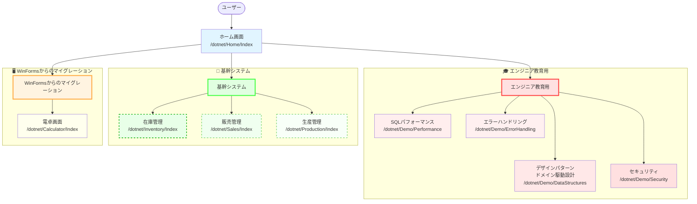

# 画面遷移図

## 概要
ASP.NET Core MVCアプリケーションの画面遷移を3つの大分類で整理

## システム構成

---

## 🏠 ホーム画面

**パス**: `/dotnet/Home/Index`

### 機能
- アプリケーションのエントリーポイント
- 3つの大分類へのナビゲーション提供

### 表示内容
- アプリケーション紹介
- エンジニア教育用デモへのリンク
- 基幹システムへのリンク
- WinFormsマイグレーション機能へのリンク

---

## 🎓 エンジニア教育用

### 目的
- **将来教育担当になったときに、このデモを使って自分の負担を減らす**
  - 口頭説明より実際に動くコードで理解してもらう
  - 繰り返し使える教材として整備
  - 新人教育の時間短縮と品質向上
- データベース性能問題の学習
- エラーハンドリングのベストプラクティス習得
- データ構造とアルゴリズムの基礎理解
- セキュリティの脆弱性と対策の体験

### 実装予定順序
1. **SQLパフォーマンス** ✅ 実装済み
2. **エラーハンドリング** ← 次に実装
3. **セキュリティ**
4. **データ構造とアルゴリズム**

---

### 1️⃣ SQLパフォーマンス

**パス**: `/dotnet/Demo/Performance`
**ステータス**: ✅ 実装済み
**データベース**: SQLite（軽量・セットアップ不要）

#### 機能
N+1問題のデモと最適化手法の比較

#### デモ内容
| パターン | クエリ数 | 実装方法 |
|---------|---------|---------|
| ❌ Bad | 101回 | ループ内でクエリ実行 |
| ✅ Good | 1回 | JOINクエリで一括取得 |

#### 学習ポイント
- N+1問題の発生原因
- JOINによる最適化
- 実行時間・クエリ回数の測定
- 素のSQL（ADO.NET）の書き方

#### API
- `GET /api/demo/n-plus-one/bad` - 非効率版
- `GET /api/demo/n-plus-one/good` - 最適化版

---

### 2️⃣ エラーハンドリング

**パス**: `/dotnet/Demo/ErrorHandling`
**ステータス**: 🚧 未実装（次に実装予定）

#### 機能
例外処理のベストプラクティスデモ

#### デモ内容
- ❌ **Bad**: try-catch乱用、例外握りつぶし
- ✅ **Good**: 適切な例外処理、カスタム例外、ログ出力
- リトライ戦略（Exponential Backoff）
- Circuit Breaker パターン

#### 学習ポイント
- try-catch-finally の正しい使い方
- 例外の種類と使い分け
- カスタム例外の設計
- ログ出力のベストプラクティス

---

### 3️⃣ セキュリティ

**パス**: `/dotnet/Demo/Security`
**ステータス**: 🚧 未実装

#### 機能
OWASP Top 10に基づく脆弱性デモ

#### デモ内容

| 脆弱性 | Vulnerable | Secure |
|-------|-----------|--------|
| SQLインジェクション | 文字列連結 | パラメータ化クエリ |
| XSS | 生出力 | HTMLエンコード + CSP |
| CSRF | トークンなし | Anti-CSRFトークン |

#### 学習ポイント
- OWASP Top 10の理解
- SQLインジェクションの仕組みと対策
- XSSの種類（Reflected, Stored, DOM-based）
- セキュアコーディングの原則

---

### 4️⃣ データ構造とアルゴリズム

**パス**: `/dotnet/Demo/DataStructures`
**ステータス**: 🚧 未実装

#### 機能
データ構造のパフォーマンス比較デモ

#### デモ内容
- **検索**: List.Contains() vs HashSet.Contains()
- **ソート**: バブルソート vs クイックソート
- **選択**: List vs LinkedList、Dictionary vs SortedDictionary

#### 学習ポイント
- 時間計算量（Time Complexity）
- Big O記法（O(1), O(n), O(log n), O(n²)）
- ハッシュテーブルの仕組み
- 適切なデータ構造の選択基準

---

## 🏢 基幹システム

### 目的
- 業務システムの基本機能構築
- 外部サービス連携の実装
- システム監視とヘルスチェック

### 実装予定順序
1. **在庫管理** ← 次に実装
2. **販売管理**
3. **生産管理**

---

### 1️⃣ 在庫管理

**パス**: `/dotnet/Inventory/Index`
**ステータス**: 🚧 未実装（次に実装予定）

#### 機能（予定）
- 商品マスタ管理
- 在庫数量管理
- 入出庫履歴
- 在庫アラート

---

### 2️⃣ 販売管理

**パス**: `/dotnet/Sales/Index`
**ステータス**: 🚧 未実装

#### 機能（予定）
- 売上伝票入力
- 請求書発行
- 売上集計レポート

---

### 3️⃣ 生産管理

**パス**: `/dotnet/Production/Index`
**ステータス**: 🚧 未実装

#### 機能（予定）
- 生産計画立案
- 製造指示書発行
- 進捗管理

---

## 🖥️ WinFormsからのマイグレーション

### 目的
- レガシーWinFormsアプリケーションのWeb化
- クラウド移行
- 操作性の維持とモダン化

---

### 1️⃣ 電卓画面

**パス**: `/dotnet/Calculator/Index`
**ステータス**: ✅ 実装済み

#### 機能
四則演算を行うシンプルな電卓

#### 操作フロー
1. 数値 a, b を入力
2. 演算子を選択 (+, -, *, /)
3. 「=」ボタンクリック
4. POST `/dotnet/Calculator/Calculate`
5. 結果表示

#### マイグレーション内容
- WinForms Form → Razor View
- イベントハンドラー → MVC Controller Action
- クライアントロジック → サーバーサイド処理

---

---

## 🛠️ 技術スタック

### フロントエンド
- Razor Views (MVC)
- HTML, CSS, JavaScript

### バックエンド
- ASP.NET Core 8.0 MVC
- ADO.NET (Raw SQL)

### データベース
- **SQLite**: 教育用デモ（軽量・セットアップ不要）
- **postgres**: 基幹システム（LocalDB for development）

### インフラ
- AWS ECS Fargate
- AWS Secrets Manager
- Supabase

---

## 📝 備考

### レイアウト
- 全画面共通レイアウト: `_Layout.cshtml`
- グローバルナビゲーションバー常時表示

### API設計
- REST API: JSON形式レスポンス
- デモ画面: JavaScriptでAPI呼び出し、動的表示

### 命名規則
- MVC View: `/dotnet/{Feature}/Index`
- REST API: `/api/{feature}/{action}`

### ステータス凡例
- ✅ 実装済み
- 🚧 未実装（計画中）
- ← 次に実装予定
